# garmin-wf-builder

Describe a Garmin Connect IQ watch face in one YAML file, and `wfb` builds a
signed `.prg` for each target watch, ready to sideload.

Connect IQ is Garmin's platform for third-party watch apps and faces. A `.prg`
is a compiled Connect IQ app. Sideloading means copying it onto the watch over
USB yourself instead of installing it from the Connect IQ Store. `wfb` writes
the Monkey C code (Garmin's programming language) for you and runs Garmin's
compiler, so you don't need to know Monkey C.

**Targets:** fēnix 8 Solar 47 mm / 51 mm, Forerunner 955. **Distribution:**
personal sideload, not the Connect IQ Store. **Status:** early (`wfb` 0.1.0), a
personal project that works end to end and is still changing. The format is
versioned (`format: 1`). [`docs/limitations.md`](docs/limitations.md) lists
what isn't built yet.

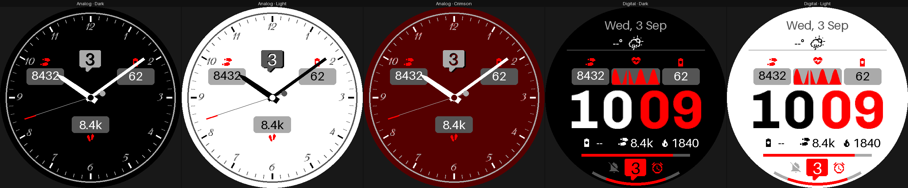

*[`examples/showcase`](examples/showcase/face.yaml): one file, five on-device
styles made from two layouts and three colour schemes.*

This page is a tour by example. Section 1 gets you from nothing to a face on
your watch. Sections 2–10 follow the showcase face, and section 11 covers
features from the other examples. Each snippet sits next to what it draws.
[`docs/format.md`](docs/format.md) is the full reference.

The screenshots come from `wfb preview`, which draws the face on your computer.
Positions match the watch; glyph shapes and some data values are approximate
([preview caveats](#preview-caveats)).

**A few terms used below:**

| Term | Meaning |
|---|---|
| complication | a piece of data the watch publishes for faces to show, such as Body Battery or sunrise time. A *complication slot* lets the wearer choose which one appears. |
| glance | Garmin's full-screen view of one metric, which a face can open |
| MIP / AMOLED | the two kinds of watch screen. MIP (all three targets) is always on and has 64 colours. AMOLED needs a sparse always-on layout to avoid burn-in. |
| active / low power | the watch is *awake* (right after you raise your wrist) or *asleep* (the rest of the time) |
| `%r` | a length as a percentage of the screen's radius (§3) |

---

## 1. Getting started

### What you need

| | |
|---|---|
| **Linux** | Tested. `tools/setup-env.sh` installs everything else. You need `bash`, `curl`, `unzip`, `openssl`, Python 3 with `venv` (or `uv`), and Java 21 or newer (Garmin's compiler is a Java program). The script checks for all of these first. |
| **macOS** | Use the Docker image. It is tested with [OrbStack](https://orbstack.dev). `setup-env.sh` fetches the Linux SDK, so it doesn't work on a Mac itself. |
| **Windows** | Not tested. |
| **A Garmin account** | Needed once, to download the device definitions (step 1). |
| **A watch** | fēnix 8 Solar 47 mm / 51 mm or Forerunner 955, and its USB cable. Other Connect IQ watches can work too: list your face's watches under `targets:`, and `wfb devices` shows which ones you have definitions for. Only these three are tested. |

### Step 1: get the device definitions

The compiler needs Garmin's description of each watch, and a script can't
download it because Garmin's server requires you to sign in. So get it once by
hand:

1. Install Garmin's
   [Connect IQ SDK Manager](https://developer.garmin.com/connect-iq/sdk/), sign
   in, and download the devices you build for.
2. The SDK Manager saves them here:
   - macOS: `~/Library/Application Support/Garmin/ConnectIQ/Devices`
   - Linux: `~/.Garmin/ConnectIQ/Devices`
   - Windows: `%APPDATA%\Garmin\ConnectIQ\Devices`
3. Where to put them depends on how you run `wfb`:
   - **Linux, downloaded on this machine:** nothing to do. `setup-env.sh` finds
     them in `~/.Garmin/ConnectIQ/Devices`.
   - **Linux, downloaded on another machine:** copy that folder's contents
     into `vendor/devices/` in this repository. That folder is gitignored,
     because the files are your licensed copy.
   - **Docker:** nothing to copy. Step 2 mounts the folder into the container.

**Optional:** the same SDK Manager install also has Garmin's own font files
(next to `Devices`, in a `Fonts` directory). Free stand-ins work without
them, but if you have them, put them at `vendor/fonts/` the same way (or
mount `Fonts` at `/fonts` for Docker) — `wfb doctor` says which one a build
would use.

### Step 2: install

**Linux:**

```sh
./tools/setup-env.sh                # SDK, signing key, device files, icon + system fonts, .venv
alias wfb="$PWD/wfb.py"             # put this in your shell profile
```

The script is safe to re-run. It also prints two `export` lines (`CIQ_SDK`
and `PATH`); add them to your shell profile too. `wfb.py` runs
under the project's `.venv` on its own, so you don't need to activate it. Run
`wfb doctor` to check that everything is in place.

**macOS (Docker):**

```sh
docker build -t garmin-wf-builder .
alias wfb='docker run --rm -v "$PWD:/work" -v "$HOME/Library/Application Support/Garmin/ConnectIQ/Devices:/devices:ro" -v wfb-keys:/keys garmin-wf-builder'
```

The container sees only the current directory, so run `wfb` from the folder
that holds your face. The `wfb-keys` volume keeps your signing key between
runs. See [`docs/container.md`](docs/container.md) for details.

### Step 3: make a face and build it

```sh
wfb new "My Face"                   # writes my-face.yaml from a template (--list for more)
wfb preview my-face.yaml            # draws it to build/preview/<watch>.png
wfb validate my-face.yaml           # schema, semantic checks and lints; no SDK needed
wfb build my-face.yaml              # generate Monkey C and compile
```

```
generated  /home/you/faces/build/my-face
built      my-face-fenix8solar47mm.prg  2,775 B / 131,072 B (2.1%)
built      my-face-fenix8solar51mm.prg  2,775 B / 131,072 B (2.1%)
built      my-face-fr955.prg            2,775 B / 131,072 B (2.1%)
```

While you edit, `wfb preview my-face.yaml --watch` redraws the PNG every time
you save; it keeps running until you press Ctrl-C. Three commands list what a
face can use: `wfb sources` (data you can show), `wfb series` (data you can
plot) and `wfb complications` (what touch-and-hold can open).

The smallest complete face is a clock. Everything else on this page adds to
this:

```yaml
format: 1
face: { id: 6f1c2b7e-3d4a-4e5f-9a1b-2c3d4e5f6a7b, name: Minimal Clock, version: 1.0.0 }
targets: [fenix8solar47mm, fenix8solar51mm, fr955]

palette:
  fg: "#FFFFFF"                      # MIP screens: each channel 00, 55, AA or FF

elements:
  clock:
    type: text
    value: time.clock
    format: "{:%H:%M}"
    font: FONT_NUMBER_HOT
    at: { anchor: center }
    align: center
    vertical_align: center
    color: palette.fg
```

`face.id` identifies the app to the watch: two faces with the same id replace
each other. `wfb new` generates a fresh one for you.

### Step 4: put it on the watch

1. Connect the watch over USB. These watches connect over MTP, not as a USB
   drive. On macOS, use [OpenMTP](https://openmtp.ganeshrvel.com). On Linux,
   your file manager handles MTP.
2. Copy the `.prg` for your model, for example
   `build/my-face/my-face-fenix8solar47mm.prg`, into the watch's
   `GARMIN/APPS/` folder.
3. Unplug the watch, then choose the face in its watch-face list.

To update the face, copy a new build over the old file. To remove it, delete
the file.

**What the build produces** (in `build/<name>/`):

| Output | What it is |
|---|---|
| `<name>-<device>.prg` | the signed face, to copy to `GARMIN/APPS/` |
| `source/*View.mc`, `*Delegate.mc`, `Palette.mc`, … | generated Monkey C, shared by all devices |
| `source-<device>/Layout.mc` | every `%` and `%r` resolved to pixels for that screen |
| `resources-<device>/fonts/` | your TTFs baked to bitmap fonts, holding only the glyphs you use |
| `manifest.xml`, `monkey.jungle` | permissions and API floor, derived from what you bind |
| `runtime-lib/` | only the helper modules the face needs |

The memory figure comes from the compiler's own measurement, not an estimate.
Every watch face gets 128 KB.

### If something goes wrong

- **Start with `wfb doctor`.** It lists what is installed and what to do about
  anything missing.
- **`Invalid device id specified`** from the compiler means the device
  definitions are missing (step 1).
- **`unknown data source`** from `wfb validate` means a `value:` or `color:`
  names something that doesn't exist. The error suggests close matches, and
  `wfb sources` lists them all.
- **Warnings** fail nothing, but each one explains itself and says how sure
  it is. §10 shows how to keep a design that a warning flags on purpose.

## 2. File skeleton

```yaml
format: 1                                              # required
face: { id: <uuid>, name: Showcase, version: 1.1.0 }   # required
targets: [fenix8solar47mm, fenix8solar51mm, fr955]     # required

# optional
fonts:    { ... }   # TTF files -> device fonts
palette:  { ... }   # named colours (MIP: each channel 00/55/AA/FF)
color_scheme: { ... }   # named sets of colour roles: bg, fg, dim, ...
config:   { ... }   # what the wearer can change on the watch
hands:    { ... }   # analog hand sets

static:   { ... }   # optional: drawn once, then copied: backgrounds, cards
elements: { ... }   # required: redrawn every update
layouts:  { ... }   # optional: alternative static/elements sets, picked by a style
```

You can write element lists as a mapping, where the key is the id (as the
showcase does), or as a list of items that each carry an `id:`. Both mean the
same thing.

The snippets below refer to values by prefix. `palette.<name>` and
`font.<name>` point to your own `palette:` and `fonts:`. `config.*` are values
the wearer picks on the watch (§9), such as `config.colors.fg` from the chosen
colour scheme or `config.accent_color`. Everything else, such as `time.*`,
`activity.*` or `weather.*`, is live watch data; `wfb sources` lists it all.

## 3. Placement: `at:`, anchors and units

```yaml
date_line:
  type: text
  value: date.today
  format: "{:%a, %e %b}"
  font: FONT_XTINY
  at: { anchor: top, dy: 10% }     # 10 % of the screen height below the top edge
  color: config.colors.dim

weather_icon:
  type: icon
  icon_for: weather.condition_today   # the glyph follows the condition
  size: 16%r
  at: { anchor: top, dy: 20% }
```


- `anchor:` can be `center`, `top`, `bottom`, `left`, `right`, or a corner
  such as `top_left`. `dx`/`dy` offset from it. Polar placement works too:
  `at: { anchor: center, angle: 45deg, radius: 27%r }` (§11).
- `%` is a fraction of the parent box: its width for `dx`, its height for `dy`.
  `%r` is a fraction of the screen's **radius**, so a round dial stays round on
  every watch. `px` also works.
- `align:` / `vertical_align:` choose which way a box grows from its point
  (§6, §11).
- A value that is absent (no weather yet) shows `placeholder:`. Here that is
  `--°`.

## 4. Custom fonts and a monospaced clock

```yaml
fonts:
  digitalclock:
    source: assets/ChivoMono-Bold.ttf
    size: 60%r            # scales with each watch's screen
    monospace: true       # "11" and "00" take the same width: no jitter
    antialias: true

elements:
  hours:   { type: text, value: time.hour,   format: "{:02d}", font: font.digitalclock,
             at: { anchor: center, dx: -1%, dy: 7% }, align: right, color: config.colors.fg,
             modes: [active, low_power] }        # also redrawn every second while asleep
  minutes: { type: text, value: time.minute, format: "{:02d}", font: font.digitalclock,
             at: { anchor: center, dx: 1%,  dy: 7% }, align: left,  color: config.accent_color,
             modes: [active, low_power] }
```


`FONT_XTINY` … `FONT_NUMBER_THAI_HOT` name the watch's built-in fonts. A
`font.<name>` reference uses one of your own from `fonts:`.

`modes:` says when an element is redrawn. The default, `[active]`, redraws it
every second while the watch is awake and once a minute while it is asleep.
Adding `low_power` also redraws it every second while asleep. That works on
MIP screens only, and it costs battery, so `wfb` warns when the redrawn area
gets large.

### Icons from Nerd Fonts

Icons are glyphs from the [Nerd Fonts](https://www.nerdfonts.com) "Symbols
Only" font, about 10,000 of them. `tools/setup-env.sh` downloads the font; it
isn't stored in this repository. The build bakes only the glyphs you use into
the face, the same way it bakes a custom text font. Each icon costs one small
bitmap, and no image files ship.

```yaml
steps_icon:                          # a named icon: `wfb sources` lists the names
  type: icon
  icon: steps
  size: 9%r                          # px or %r
  color: config.colors.fg

hr_graph_icon:                       # any Nerd Fonts glyph, by codepoint
  type: icon
  glyph: "U+F21E"                    # nf-fa-heartbeat
  size: 9%r

weather_icon:                        # chosen on the watch from live data
  type: icon
  icon_for: weather.condition_today
```

The §5 screenshot shows the steps icon and the heartbeat glyph, and the §3
screenshot shows the weather icon.

- **Named icons** (`icon:`) cover the common metrics: steps, heart, flame,
  battery, notification, alarm, and so on, plus a `weather_*` set.
- **Any other glyph:** find it on the
  [Nerd Fonts cheat sheet](https://www.nerdfonts.com/cheat-sheet), then write
  its code as `glyph: "U+XXXX"`. The build checks that the font has it.
- **`icon_for:`** picks the weather glyph on the watch at runtime.

**Your own icon font** also works, through a plain `text` element. Add any TTF,
such as a full Nerd-patched font, to `fonts:`, and write the glyph as a YAML
escape:

```yaml
fonts:
  myicons: { source: assets/MyIcons.ttf, size: 20%r }
elements:
  github:
    type: text
    text: "\uF09B"                   # use "\U000F140B" above U+FFFF
    font: font.myicons
```

A text element doesn't get the icon's size correction or the build's
glyph-exists check. Also avoid spaces between glyphs: a symbols-only font has
no space character, and the preview draws it as an empty box.

More detail: [`docs/format.md` § icon](docs/format.md#icon), and
[`wfb/assets/icons/README.md`](wfb/assets/icons/README.md) for licensing and
for adding a name.

## 5. Data slots, cards and a graph

```yaml
static:
  left_card: { type: shape, shape: rounded_rectangle, corner_radius: 3%r,
               at: { anchor: center, dx: -50%r, dy: -23%r },
               size: { width: 42%r, height: 19%r }, color: config.colors.dark }

elements:
  left_register:
    type: complication_slot          # the wearer picks what it shows
    slot: config.data.left_register
    at: { anchor: center, dx: -50%r, dy: -30%r }
    icon_position: top
    icon_color: config.data_color
    when_absent: placeholder
    placeholder: "--"
    on_hold: auto                    # touch and hold opens that complication

  hr_graph:
    type: graph
    series: heart_rate               # `wfb series` lists what can be plotted
    range: 4h
    style: area                      # line | area | bars (§11)
    size: { width: 52%r, height: 17%r }
    color: config.data_color
    on_hold: heart_rate
```

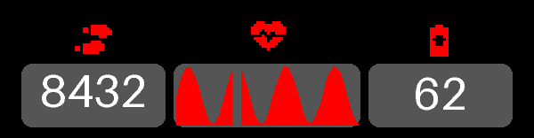

- **`static:`** holds things that never change, like the dark cards behind
  each slot. The watch draws them once and copies the result on every update.
- **A `complication_slot`** shows whichever complication the wearer picked for
  it (§9), with that complication's icon and reading. When the reading is
  missing, `when_absent: placeholder` shows the `placeholder:` text instead of
  leaving it blank.
- **`on_hold:`** makes the element a touch-and-hold target that opens a Garmin
  glance. On a slot, `auto` opens the glance for whatever the slot currently
  shows. Elsewhere, name one, such as `heart_rate`; `wfb complications` lists
  the names.
- **A `graph`** plots recent history. Here it is the last four hours of heart
  rate.

## 6. Groups, touch-and-hold, progress bar

```yaml
steps_cluster:
  type: group                        # draws nothing itself; positions its children
  size: { width: 38%r, height: 12%r }
  at: { anchor: top, dy: 75% }
  on_hold: steps                     # one hold target for the whole cluster
  children:
    steps_icon:  { type: icon, icon: steps, size: 9%r, at: { anchor: left }, align: left }
    steps_value: { type: text, value: "activity.steps / 1000.0", format: "{:.1f}k",
                   font: FONT_XTINY, at: { anchor: left, dx: 13%r }, align: left }

steps_bar:
  type: progress
  style: bar
  value: activity.steps
  max: activity.step_goal            # max can be data too
  size: { width: 60%, height: 3%r }
  color: config.accent_color
  track_color: config.colors.dark
```

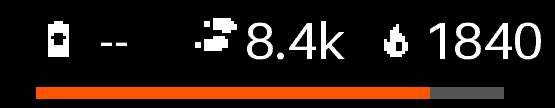

`value:` takes an **expression**. The compiler turns it into Monkey C, and
nothing is interpreted on the watch. A live watch face gets exactly one
gesture, touch and hold, so `on_hold:` is the only way to interact.

## 7. Conditional colour, `visible:`, arc progress

```yaml
notification_badge:
  type: icon
  icon: notification
  color: "device.notification_count > 0 ? config.accent_color : config.colors.dark"

notification_count:
  type: text
  value: device.notification_count
  visible: device.notification_count > 0

battery_arc_l:
  type: progress
  style: arc
  value: system.battery
  max: 100
  radius: 97%r
  thickness: 3%r
  start_angle: 180deg                # 6 o'clock
  sweep: 30deg                       # a negative sweep mirrors it (battery_arc_r)
```

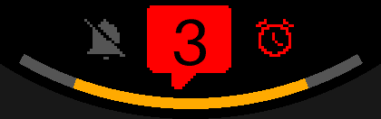

## 8. Analog: hands and patterns

```yaml
hands:
  classic:
    hour:                            # drawn pointing at 12, axis at (0, 0)
      color: config.colors.fg
      parts:
        - shape: polygon
          points: [{dx: -3%r, dy: 8%r}, {dx: -2%r, dy: -38%r}, {dy: -46%r},
                   {dx: 2%r, dy: -38%r}, {dx: 3%r, dy: 8%r}]
    minute: { ... }                  # rectangle + circle
    second: { ... }                  # line + circles, accent-coloured tip

layouts:
  analog:
    static:
      minute_ticks:
        type: pattern
        pattern: radial
        count: 60
        skip_every: 5                # leave room for the hour ticks
        parts: [{ shape: line, at: { dy: -90%r }, to: { dy: -86%r }, thickness: 1px }]
      hour_numerals:
        type: pattern                # 12 numerals, one element
        pattern: radial
        count: 12
        parts:
          - { shape: text, value: "(copy + 11) % 12 + 1", font: font.dialfont, at: { dy: -78%r } }
    elements:
      analog_hands: { type: hands, hands: classic, at: { anchor: center },
                      seconds: awake, antialias: true }
```

| Awake (`--time 03:41:17`, light style) | Asleep (`--asleep`): no second hand |
|---|---|
| 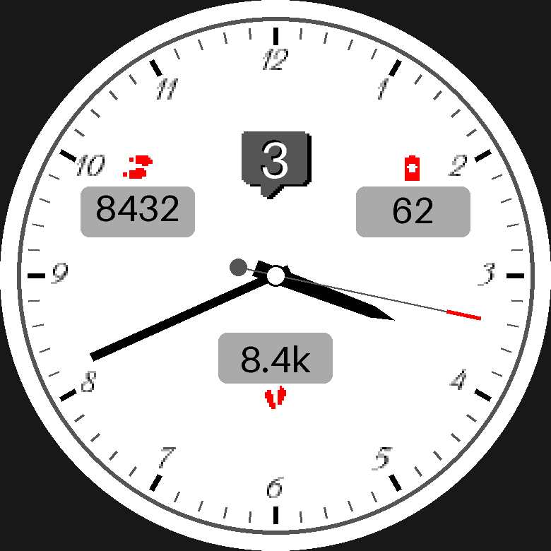 | 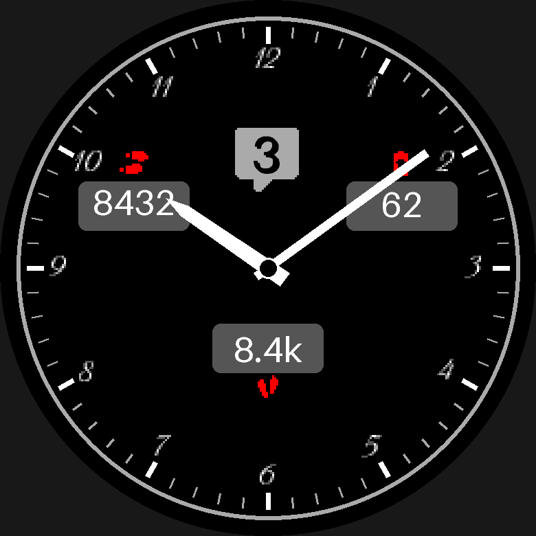 |

The numerals stay upright as they go around the dial. Hands take four part
shapes: `polygon`, `rectangle`, `line` and `circle`. The ticks and numerals
are in `static:`, so the watch draws them once and then copies them.

## 9. On-device configuration: styles, colours, data

```yaml
color_scheme:
  dark:  { label: "Dark",  colors: { bg: palette.black, fg: palette.white, ... } }
  light: { label: "Light", colors: { bg: palette.white, fg: palette.black, ... } }

config:
  style:                             # layout × colour scheme, as named entries
    default: digital_dark
    choices:
      analog_dark:  { label: "Analog · Dark",  layout: analog,  colors: dark }
      digital_dark: { label: "Digital · Dark", layout: digital, colors: dark }
  accent_color: { default: palette.red,   choices: [palette.red, palette.lime_green, ...] }
  data_color:   { default: palette.amber, choices: [palette.amber, palette.magenta, ...] }
  data:
    left_register:
      default: complication.steps
      choices: [complication.steps, complication.heart_rate,
                { type: complication.calories, icon: none }]
    right_register: { default: complication.body_battery, choices: any }
```

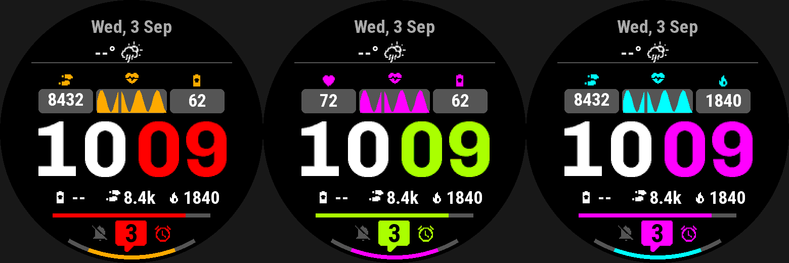

*Left: the defaults (red accent, amber data colour). Middle: lime accent,
magenta data colour, and the left slot set to heart rate. Right: magenta
accent, cyan data colour, and the right slot set to calories.*

The wearer picks these in the fēnix 8's native face editor, which saves up to
four configurations. The fr955 has no on-device editor, so it always shows the
defaults.

## 10. Lints and suppressions

`wfb validate` and `wfb build` check the design against each device for:
- text overflow
- the round screen's safe area
- contrast
- palette and anti-aliasing dither
- the power cost of low-power updates

Each warning states how confident the check is. When a warning is intended,
keep the design and record why:

```yaml
lint:
  allow: [safe-area]
  reason: "hugs the bezel by design"
```

## 11. More features, from the other examples

### Alignment around a point: [`examples/align`](examples/align/face.yaml)

```yaml
steps_slot:
  type: complication_slot
  at: { anchor: center, angle: 45deg, radius: 27%r }   # polar placement
  align: left              # grow rightwards from the point...
  vertical_align: bottom   # ...and upwards
heart_group:
  type: group
  at: { anchor: center, angle: 135deg, radius: 27%r }
  align: left
  vertical_align: top      # the lower-right readout grows downwards
```

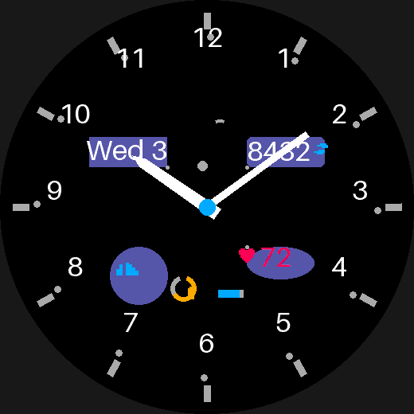

Each diagonal readout sits on a point at the same distance from the centre and
grows away from it, so the four corners stay symmetric whatever their content.
`align:` is `left`/`center`/`right` and `vertical_align:` is
`top`/`center`/`bottom`. Both work on:
- groups, text, progress bars and arcs, graphs, icons and complication slots
- shapes other than `polygon` and `line`
- rectangle, circle and text parts of hands and patterns

### Pattern repeats: [`examples/patterns`](examples/patterns/face.yaml)

```yaml
hour_ticks:
  type: pattern
  pattern: radial
  count: 12
  skip: [0]                          # no tick at 12: a doubled marker goes there
twelve:
  type: pattern
  pattern: linear                    # copies step in a straight line
  count: 2
  step: { dx: 6%r }
week_dots:
  type: pattern
  pattern: linear
  count: 7
  step: { dx: 10%r }
  parts:
    - shape: circle
      radius: 2%r
      color: "copy == (date.weekday + 5) % 7 ? palette.cyan : palette.black"  # today lit
test_visibility:                     # a move-bar meter
  type: pattern
  pattern: linear
  count: 5
  when_absent: hide                  # no move-bar reading: hide the whole row
  parts:
    - { shape: rectangle, size: { width: 4%r, height: 4%r },
        visible: "copy <= activity.move_bar_level - 1" }   # per-copy visibility
```

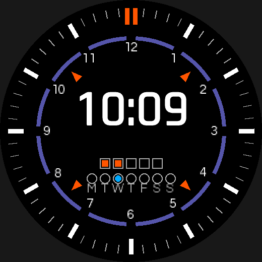

A pattern draws one template many times: `radial` turns each copy about the
centre, and `linear` steps it by whole pixels. `copy` is the copy's index. You
can use it in a colour, a part's `visible:`, or a text part's `value:`. Parts
may also be an `arc` centred on the pattern (the slate ring segments).
`start:` rotates the first copy (the orange diagonal triangles).

### Graph styles and series: [`examples/graph`](examples/graph/face.yaml)

```yaml
hr_graph:    { type: graph, series: heart_rate, range: 4h, buckets: 32,
               style: line, thickness: 2px }
steps_graph: { type: graph, series: steps, range: 7d,
               style: bars, bar_width: 6px, min: 0 }
temp_graph:  { type: graph, series: forecast_temperature, range: 24h,
               style: area }
```

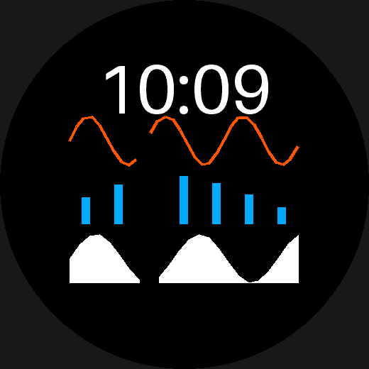

Four families of series can be plotted:
- heart-rate history
- daily activity (steps, calories, distance, floors, active minutes)
- the hourly forecast
- the daily forecast

The platform keeps pressure, stress and Body Battery history away from watch
faces. The preview draws a stand-in curve, not real data.

### Shapes: [`examples/shapes`](examples/shapes/face.yaml)

```yaml
card:    { type: shape, shape: rounded_rectangle, corner_radius: 6px,
           filled: false, thickness: 2px }
pill:    { type: shape, shape: ellipse, size: { width: 22%, height: 11% } }
chevron: { type: shape, shape: polygon,
           points: [{ anchor: center, dy: 26% },
                    { anchor: center, dx: -9%, dy: 34% },
                    { anchor: center, dx: 9%, dy: 34% }] }
rule:    { type: shape, shape: line, at: { ... }, to: { ... } }
```

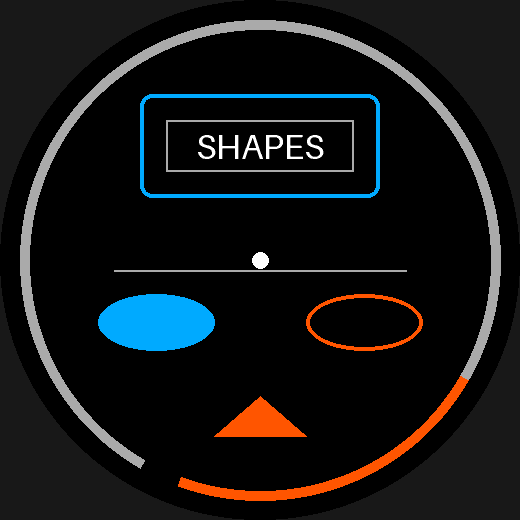

The shapes are `rectangle`, `rounded_rectangle`, `circle`, `ellipse`, `line`,
`arc` and `polygon`. Closed shapes can be filled or outlined (`filled: false`
plus `thickness:`). An arc is a stroke only. The platform has no filled arc, no
rounded caps and no gradients.

### Several hand sets and a subdial: [`examples/analog`](examples/analog/face.yaml)

```yaml
hands:
  sport:                   # no `second:` at all: this set never shows seconds
    hour:   { parts: [...] }
    minute: { parts: [...] }
  small_seconds:
    second: { parts: [{ shape: line, at: { dy: 3%r }, to: { dy: -20%r } }] }

layouts:
  classic_generated:
    elements:
      main_hands: { type: hands, hands: classic_generated, at: { anchor: center } }
      small_secs: { type: hands, hands: small_seconds,
                    at: { anchor: center, dy: 45%r } }   # an off-centre axis
```

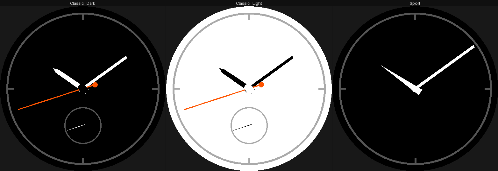

Each style can use its own hand set. A set can omit any hand, and a `type:
hands` element can sit anywhere, such as a small-seconds subdial at 6 o'clock
(fourth panel).

In the first three panels, "Wed" spills out of its date window. That is the
preview, not the watch: the window's text uses the system font `FONT_TINY`, and
the preview draws system fonts with a stand-in whose letter widths differ
from Garmin's own face ([Preview caveats](#preview-caveats)).

### Features with no example face yet

- **`antialias:` at every level.** Set it on the face, a group, an element, or
  a font. The nearest setting wins, in either direction. The examples only set
  it per element or per font.
- **`min_1px:`.** Stops a thin relative length (`thickness: 0.4%r`) from
  rounding to 0 px on a smaller screen. It's off by default. You can switch it
  on or off per face, group, element or hand/pattern part. Without it, the
  build warns with `sub-pixel-length`.
  ```yaml
  min_1px: true            # face-wide; a group, element or part can override it
  ```
- **`modes: [always_on]`.** A separate element set for AMOLED watches, which
  can't use low-power updates. None of the three targets is AMOLED (they all
  have MIP screens), so no example uses it.
- **`seconds:` on the analog dial.** `seconds: awake` (the default) hides the
  second hand while the watch sleeps. `seconds: always` isn't built yet.
- **`wfb new -t <template>`.** Starts from a known-good design (`--list` shows
  the templates).

## Preview caveats

`wfb preview` runs on your computer, without the watch's fonts or data, so
it isn't what the watch or the Connect IQ simulator shows. Positions are exact,
because the preview uses the same resolved geometry as the compiled face.
Glyphs and data are not:

- **System fonts (`FONT_*`) are stand-ins.** Garmin doesn't ship its watch
  typefaces, and it publishes only each font's height. The preview draws
  system-font text in a generic face scaled to that height, so its width is an
  estimate. Text can look wider or narrower than on the watch, and can spill
  out of a box even where it would fit on the watch (the "Wed" in §11's
  analog panels). The text-overflow lint uses the same estimate. Custom fonts from
  `fonts:` are baked from your TTF and do match the watch. To check
  system-font text exactly, use the simulator or the watch.
- **`complication.*` read by a `text` or `progress` element has no sample
  value.** It shows as absent. For example, the showcase's Body Battery
  readout shows `--` right next to a slot showing `62`, and
  [`examples/sun`](examples/sun/face.yaml) renders as a blank screen.
- **An `icon_for:` weather icon always draws.** Weather has no sample value,
  so the readout beside it shows `--°`. On the watch, the icon is hidden when
  there is no weather data.
- **Graphs always draw a synthetic curve**, even for a series whose other
  readings are absent (the forecast).

The screenshots on this page were drawn on a fēnix 8 47 mm with sample data at
10:09:42. To regenerate them, run `./.venv/bin/python tools/readme-shots.py`.

---

## Further reading

| If you want… | Read |
|---|---|
| every key, rule and default | [`docs/format.md`](docs/format.md), and the schema in [`schema/`](schema/) |
| what the platform will not do, and what isn't built yet | [`docs/limitations.md`](docs/limitations.md) |
| setup details, the generated code, repository layout, tests | [`docs/development.md`](docs/development.md) |
| to run it without installing anything | [`docs/container.md`](docs/container.md) |
| the decisions and why | [`docs/adr/README.md`](docs/adr/README.md) |
| to maintain the project (the handoff notes, written for Claude Code) | [`CLAUDE.md`](CLAUDE.md) |

## License

The code is MIT-licensed ([`LICENSE`](LICENSE)). The example fonts keep their
own licences: the SIL Open Font License, in an `OFL.txt` next to each set of
fonts, and Apache-2.0 for the test fixture's Open Sans. The Nerd Fonts icon
font isn't in the repository; setup downloads it with its licence.

Previews and width/height estimates for Garmin's own system fonts use free
stand-ins — Roboto, DejaVu, Bebas Neue, Rajdhani, and others, each an
`exact`/`family`/`substitute` match recorded in
[`wfb/fonts/registry.json`](wfb/fonts/registry.json) with its own pinned
source, licence (mostly Apache-2.0 or OFL-1.1) and rationale
([`docs/research/10-system-fonts.md`](docs/research/10-system-fonts.md)).
None of them is in the repository either; setup (or
`tools/fetch-system-fonts.py`) downloads whichever ones your build targets
need, each with a licence file alongside it. If you have Garmin's own font
files — from the SDK Manager's `Fonts` directory — they take priority over
these stand-ins; put them at `vendor/fonts/` (gitignored, like
`vendor/devices/`: it's your own licensed copy, never committed) or point
`WFB_FONTS` at them.

Garmin's SDK and device definitions are not part of this project, and
Garmin's own terms cover them.
