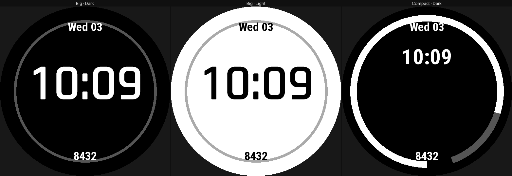

# garmin-wf-builder

**Describe a Garmin watch face in one YAML file; `wfb` builds a signed `.prg`
for every watch you list, ready to sideload.**

You write the layout, the data it shows and what the wearer may change. `wfb`
checks it against each watch's own limits, generates the Monkey C code
(Garmin's programming language) and runs Garmin's compiler, so you never need
to write Monkey C yourself. It can also draw a preview of the face on your
computer.


*[`examples/showcase`](examples/showcase/face.yaml): one YAML file, seven
styles the wearer switches between on the watch.*

- **Watches:** any Connect IQ watch that runs faces at API 3.2 or newer (the
  fēnix 6 / Forerunner 245 generation onwards). Every limit is read from
  Garmin's own device files, not hardcoded. The examples are tested on the
  fēnix 8 Solar and the Forerunner 955.
- **Distribution:** personal sideloading over USB, not the Connect IQ Store.
- **Status:** early (`wfb` 0.1.0, `format: 1`). It works end to end and is
  still changing. See [what isn't built yet](docs/limitations.md#2-not-implemented-yet).

## Quick start

```sh
./tools/setup-env.sh              # SDK, signing key, fonts, .venv (Linux; macOS uses Docker)
alias wfb="$PWD/wfb.py"
wfb new "My Face"                 # a working face from a template
wfb preview my-face.yaml --watch  # a PNG that redraws every time you save
wfb build my-face.yaml            # one signed .prg per watch
```

A complete face (a clock) is under 20 lines:

```yaml
format: 1
face: { id: 6f1c2b7e-3d4a-4e5f-9a1b-2c3d4e5f6a7b, name: Minimal Clock, version: 1.0.0 }
targets: [fenix8solar47mm, fenix8solar51mm, fr955]
palette:
  fg: "#FFFFFF"                    # MIP screens: each channel 00, 55, AA or FF
elements:
  clock:
    type: text
    value: time.clock
    format: "{:%H:%M}"
    font: FONT_NUMBER_HOT
    at: { anchor: center }
    align: center
    vertical_align: center
    color: palette.fg
```

[**Getting started**](docs/guide/getting-started.md) covers setup, the
device files you need, and how to copy the face onto your watch.

## What you can build

| | |
|---|---|
| <br>**Analog dials.** Hands built from polygons, lines and circles, plus a second hand that hides while the watch sleeps. → [Analog hands](docs/guide/analog-hands.md) | <br>**Ticks, numerals and repeats.** One template repeated around a dial or along a line: 60 ticks or 12 numerals as a single element. → [Patterns](docs/guide/patterns.md) |
| <br>**Styles the wearer picks.** Layouts and colour schemes combined into named styles, chosen in the watch's own face editor. → [Styles and layouts](docs/guide/styles-and-layouts.md) | <br>**On-device settings.** Accent and data colours, and data slots the wearer points at any Garmin metric. → [Configuration](docs/guide/configuration.md) |
| <br>**Your own fonts.** A TTF is converted to a bitmap font at build time, sized relative to each screen, with an option to make digits monospaced so the clock doesn't jitter. → [Fonts](docs/guide/fonts.md) | <br>**Rotated and curved text.** Text that follows the bezel, using the fonts built into newer watches. → [Text](docs/guide/text.md) |
| <br>**Live data and history graphs.** Steps, heart rate, weather, battery, Garmin complications, and line, area or bar graphs. → [Data](docs/guide/data.md), [Graphs](docs/guide/progress-and-graphs.md) | <br>**Icons, groups and progress.** About 10,000 Nerd Fonts glyphs, groups that move together, and progress bars and arcs. → [Icons](docs/guide/icons.md), [Elements](docs/guide/elements.md) |
| <br>**Placement that scales.** Anchors, polar coordinates and screen-relative units, so one design fits every screen size. → [Placement](docs/guide/placement.md) | <br>**Sleep mode and touch and hold.** Choose what redraws while the watch sleeps, and what a touch and hold opens. → [Modes and interaction](docs/guide/modes-and-interaction.md) |

Every build is also **checked against each watch**: text that won't fit,
colours the screen can only dither, shapes outside the visible area, APIs a
watch lacks, and the memory budget. → [Lints](docs/guide/lints.md)

## Documentation

| | |
|---|---|
| [**The guide**](docs/README.md) | every feature, one chapter each, with examples and every YAML key |
| [Example faces](examples/README.md) | complete faces to copy from, plus one test face per feature |
| [Limitations](docs/limitations.md) | what the platform can't do, and what isn't built yet |
| [Running in Docker](docs/container.md) · [Developing `wfb`](docs/development.md) | installing without setup, and working on the compiler itself |
| [Design decisions](docs/adr/README.md) · [Research](docs/research/00-summary.md) | why it works the way it does |

## License

The code is MIT-licensed ([`LICENSE`](LICENSE)). The example fonts keep their
own licences: the SIL Open Font License, in an `OFL.txt` next to each set of
fonts, and Apache-2.0 for the test fixture's Open Sans. The Nerd Fonts icon
font isn't in the repository; setup downloads it with its licence.

Previews and width/height estimates for Garmin's own system fonts use free
stand-ins — Roboto, DejaVu, Bebas Neue, Rajdhani, and others, each an
`exact`/`family`/`substitute` match recorded in
[`wfb/fonts/registry.json`](wfb/fonts/registry.json) with its own pinned
source, licence (mostly Apache-2.0 or OFL-1.1) and rationale
([`docs/research/10-system-fonts.md`](docs/research/10-system-fonts.md)).
None of them is in the repository either; setup (or
`tools/fetch-system-fonts.py`) downloads whichever ones your build targets
need, each with a licence file alongside it. If you have Garmin's own font
files — from the SDK Manager's `Fonts` directory — they take priority over
these stand-ins; put them at `vendor/fonts/` (gitignored, like
`vendor/devices/`: it's your own licensed copy, never committed) or point
`WFB_FONTS` at them. Decoding those files' own `.cft` bitmap format
([`wfb/fonts/cft.py`](wfb/fonts/cft.py)) is a port of the decode logic in
[`markw65/monkeyc-optimizer`](https://github.com/markw65/monkeyc-optimizer)
(`src/cftinfo.ts`, MIT licence), pinned at commit
`cea919a92da74de1f5d277064caa6f7920554af7`.

Garmin's SDK and device definitions are not part of this project, and
Garmin's own terms cover them.
