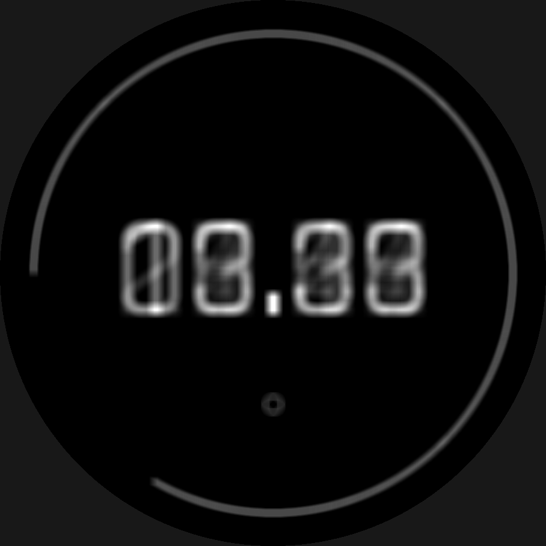
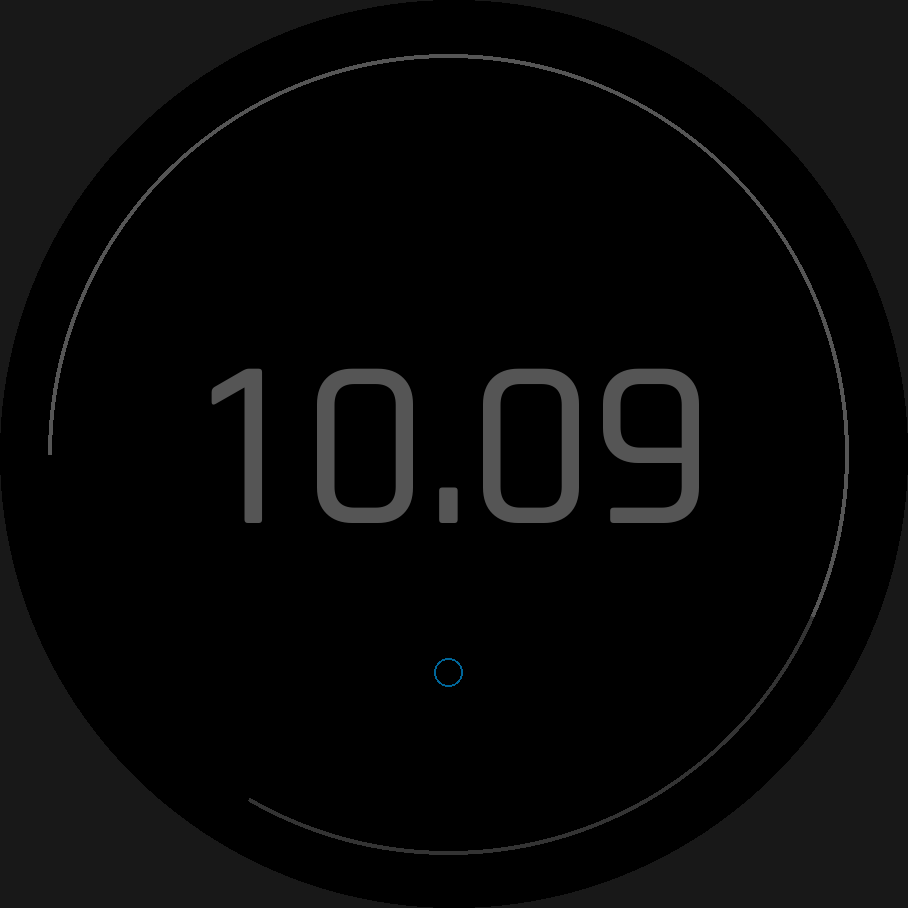

# Always-on display

**AMOLED forbids `onPartialUpdate` outright** (`modes-and-interaction.md`),
so a MIP-style low-power layout is not an option there. Instead, an
AMOLED target draws a constrained **always-on-display (AOD)** frame while
asleep, and Garmin's own guidance treats an absent one as a defect, not an
optional extra (`docs/research/11-always-on-display.md` §1.3). `aod:` is
how a design says what that frame looks like: overrides on the *one*
design, not a second layout to maintain.

`aod:` replaces the earlier `modes: [always_on]` outright (no shim):
`modes:` now means only the two MIP partial-update modes,
`active`/`low_power` (see [Power modes and touch-and-hold](modes-and-interaction.md)).

## At a glance

| Key | Where | Values | Default | Meaning |
|---|---|---|---|---|
| `aod:` | any element, `group` | `hide` \| `show` \| an override block | inherited (see [Resolution](#resolution)) | this element's AOD behaviour |
| `aod:` | top level, beside `elements:` | `{default, dim, jitter, lint}` | — | face-wide AOD defaults |

## Per element or group

```yaml
aod: hide                          # not drawn in AOD
aod: show                          # drawn, unchanged (same as an empty block)
aod:                               # an override block: drawn, restyled
  color: "#555555"
  visible: battery.level < 20
```

An override block reuses the element's **own property names** — there is
no second vocabulary — restricted to a per-kind allowlist:

| Kind | Overridable |
|---|---|
| every kind | `visible` (conjoined with the element's own `visible:`, not replacing it) |
| `text` | `color`, `font`, `format` |
| `shape` | `color`, `thickness`, `filled` |
| `progress` | `color`, `track_color`, `thickness` |
| `icon` | `color` |
| `graph` | `color`, `thickness`, `bar_width` |
| `complication_slot` | `color`, `icon_color`, `font` |
| `hands` | `color`, `thickness` — applied to **every part of every hand** in the set |
| `pattern` | `color`, `thickness`, `font` — applied to **every part** |
| `group` | the union of whatever its descendants allow, pushed down |

An unknown or disallowed key for that kind is a schema error on the
author's own line — the schema reuses each kind's own property `$ref`s, so
there is nothing new to typo. `group` also accepts `jitter:` (not listed in
the table above: it is a *position* key, not a restyling one, resolved
separately — see "Jitter" below), on top of whatever its descendants allow.

**Out of scope on purpose:** individual geometry (`at:`, `size:`, `radius:`
— moving one element on its own would break relationships with its
neighbours, exactly `jitter:`'s own reason for being group/face-only rather
than per-element; see "Jitter" below for the one geometry change `aod:`
does allow) and data bindings (`value:`, `series:`, `text:` — they would
change what the sleep frame reads, and so its cost).

**Hands and patterns restyle uniformly, not per part.** `hands.hour.parts[…]`
and `pattern.parts[…]` are lists, and merging an override into a list by
index is fragile — reordering the parts in the design would silently
re-target the override. If per-part AOD control ever proves necessary, the
next step is **wholesale list replacement** (`aod: {parts: [...]}`), never
per-index patching. The awake-only second hand (`seconds: awake`) is
unaffected by any of this: it is already hidden in AOD, the same as every
other `awake`-only frame.

## Face level

```yaml
aod:                  # top-level, beside elements:
  default: hide        # hide (default) | show — for elements whose ancestry says nothing
  dim: 0.4              # scale every drawn colour's luminance, 0-1 (exclusive of 0) — see "Dimming" below
  jitter: 4               # shift every still-shown element by up to 4px a minute — see "Jitter" below
  lint:                   # suppress a face-level AOD lint (aod-empty)
    allow: [aod-empty]
    reason: "prototype face, AOD comes later"
```

`default: hide` is the safe choice: an unconverted design lights nothing
extra in AOD. It fills an element's AOD visibility **only where nothing in
that element's own ancestry — itself, every ancestor group — ever mentions
`aod:` at all.**

## Resolution

Three rules, checked in order, for **each key independently** (`color`,
`thickness`, `visible`, …):

1. **The element's own `aod:` wins**, key by key, over its ancestors'.
2. **Otherwise the nearest ancestor group's `aod:` applies** — the nearest
   one that actually wrote something, walking up past a silent group.
3. **Otherwise the face's `aod: default:`** fills in — `hide` unless the
   face says `show`.

```yaml
aod: {default: hide}      # face-wide: hidden by default
elements:
  - id: clock
    type: text
    value: time.clock
    format: "{:%H:%M}"
    color: palette.white
    aod: {color: palette.dim}   # the one element turned back on
```

That's the whole shape of "everything off but the time" — one line.

**One deliberate asymmetry.** An explicit `aod: hide` on a `group` hides
its **whole subtree unconditionally**, and no descendant can undo it — the
same way a group's `visible:` conjoins into everything beneath it, one
step stricter (nothing below can turn it back on). The face `default:` is
different: it is not explicit, so it only ever fills silence. This is what
lets a `default: hide` design still show a stray element with its own
`aod: show`, while a group's explicit `hide` really means it.

```yaml
elements:
  - id: complications
    type: group
    aod: hide              # sticky: nothing inside can override this
    children:
      - id: hr
        type: complication_slot
        slot: config.data.top
        aod: show            # has no effect -- warns: aod-unreachable
```

`visible:` follows the same conjunction it always did: `aod: {visible:
...}` is **ANDed with the element's own `visible:`**, not a replacement for
it — an element hidden while awake stays hidden in AOD too.

## Restyling (slice 2)

Every override key actually restyles the generated AOD frame, as an inline
`_aod ? <aod value> : <awake value>` ternary in the element's existing draw
method — measured against a second, per-element AOD method and kept for
being smaller (`docs/lore/codegen.md`) — or, for `filled:`, an
`if (_aod) { ... } else { ... }` around the two different draw calls a
filled/outlined shape takes. `color:`/`track_color:`/`icon_color:` follow
`color_scheme:`/`config.colors` at runtime exactly as the element's own
`color:` does — an override colour is resolved through the same machinery,
not a second, narrower one. A `static:` element with an AOD override skips
its buffer while `_aod` and draws directly, through the very same
per-element method the buffer itself calls to fill in.

**A resource font used only by an `aod: {font: ...}` override is a second
resource**: loaded in `onEnterSleep`, only when `_aod` turns out true, and
released (nulled) again in `onExitSleep`, so it never sits in memory while
awake (measured cheap, `docs/lore/codegen.md`). A font used both awake and
in an override is loaded once, not twice.

**Not implemented yet** (`docs/limitations.md` §2): a `pattern`'s own
`font:` override, a `complication_slot`'s `font:` override, and any `font:`
override naming a `face:` (vector) font rather than a baked one — each is
rejected outright by the builder with a friendly "not implemented yet"
error, the same house style per-device `overrides:` already follows: never
a silent no-op. `aod: {filled: ...}` on `shape: polygon` gets
the same treatment, for the same reason the awake element's own `filled:
false` already does — there is no outline primitive (Dc has fillPolygon,
not drawPolygon) for either one to switch to. `wfb preview --aod` matches
this exact scope, element for element — none of these four cases can ever
reach it, since the build fails first.

## Dimming (`aod: {dim: ...}`, slice 3)

```yaml
aod:
  dim: 0.6              # scale every AOD colour's luminance to 60%
elements:
  - id: clock
    type: text
    value: time.clock
    color: palette.white
    aod: {color: palette.white}   # explicit -- never dimmed
  - id: date
    type: text
    value: time.date
    color: palette.white
    aod: show                      # dimmed to 60% -- no override of its own
```

`dim` reaches **every** colour the AOD frame draws — `color:`, `track_color:`,
`icon_color:`, a hand or pattern part's own colour, an icon's glyph colour —
whether or not that element has an `aod:` override of its own. A `show`-only
element, or one that inherits its AOD set purely from a face default or an
ancestor group, is dimmed exactly like an overridden one.

**The one exception is an explicit override colour.** `color:`/
`track_color:`/`icon_color:` written inside an element's own (or an
inherited group's) `aod:` block is the author's final word and is never
dimmed — the `clock` example above stays full white in AOD; `date`, which
opts in with a bare `aod: show`, dims to 60%.

**The formula.** Each 8-bit RGB channel is multiplied by `dim` and rounded
to the nearest integer: `round(channel * dim)`, clamped to 0–255. Hue is
unchanged; luminance scales linearly. `dim: 1` and omitting `dim:` entirely
are identical — both mean "no dimming," and neither emits a single dimming
ternary, so a `dim: 1` face's generated source is byte-identical to one with
no `dim:` at all. `dim: 0` is rejected by the schema (`exclusiveMinimum: 0`):
it would turn every undimmed colour black, which is indistinguishable from
`aod: hide` and almost certainly not what was meant.

**Where the arithmetic runs.** A colour fixed at build time — a bare hex
literal, or a `palette.<name>` reference — is pre-dimmed into a second
literal in Python, once, at compile time: no runtime cost at all. A colour
that follows `color_scheme:`/`config.colors` at runtime (the wearer's own
on-device pick) cannot be precomputed the same way, since its value is not
known until the device resolves it; that case is dimmed on-device instead,
by a small generated helper (`WfbColor.dim`, `runtime-lib/WfbColor.mc`) doing
plain integer channel arithmetic — the exact same rounding formula, so a
colour dims to the identical value whichever path codegen took for it, and
`wfb preview --aod` (below) renders that same value a third time, in Python,
for the same reason.

**The alpha route stays unverified.** AMOLED supports `alphaBlendingSupport`
and `Dc.setStroke` takes `0xAARRGGBB`, which could in principle dim by
blending toward black instead of pre-computing a darker colour. Plan 14 §4.5
left this route open but unbuilt: it depends on the burn-in lint (slice 4)
confirming the meter counts the *blended* result, not the nominal colour,
and that has not been checked. Pre-computed/on-device channel arithmetic is
what ships, and works on every device regardless of alpha support.

**Palette lint.** The 64-colour MIP palette rule (`docs/limitations.md` §2,
constraint 13) never fires on a dimmed colour: a dimmed value is a new,
synthetic literal that is never entered into `palette:`/`config:`/
`color_scheme:`, so it is invisible to that check by construction — and
since `dim` only ever reaches the `_aod` branch, which only ever runs on an
AMOLED device (constraint 13's rule is MIP-only to begin with), there is
nothing there to warn about anyway.

## Jitter (`aod: {jitter: ...}`, slice 5)

```yaml
aod:
  jitter: 3                  # face-wide: shift everything still shown, ±3px
elements:
  - id: ticks
    type: group
    aod: {jitter: 1}          # replaces the face default for this subtree only
    children:
      - id: tick_0
        type: shape
        shape: line
        aod: show
  - id: clock
    type: text
    value: time.clock
    aod: show                 # inherits the face-wide jitter: 3
```

Garmin's own guidance (research 11 §1.3): "consider moving elements up to
four pixels in any direction every minute while in always-on mode." `jitter:`
is that shift, deterministic from the clock alone — the host preview and the
device compute the identical offset with no shared state.

**Where it can be written.** Only at **face level** (beside `elements:`) and
on a **`group`**'s own `aod:` block. Writing `aod: {jitter: ...}` on any
other kind is a build error explaining why: per-element jitter would break a
design's own relationships — a clock hand's own centre against the tick ring
it has to stay concentric with, for instance — so jitter always moves a whole
group, or the whole face, as one rigid unit. The schema accepts the key on
every kind (so the builder, not a generic "unexpected property" message, can
give the real reason); the schema itself only bounds the *value*, an integer
1–4 (Garmin's own cap).

**Resolution: nearest wins, and offsets never accumulate.** A group's own
`jitter:` replaces whatever its ancestry — an enclosing group, or the face's
own `aod: {jitter: ...}` — would otherwise have supplied, for its *whole*
subtree. A nested group with its own `jitter:` replaces its parent's again,
the same way; it never adds to it. In the example above, every part of the
`ticks` group moves by up to 1px, while `clock`, outside that group, moves by
up to 3px — never 1 + 3. This is the same "nearest declaration simply wins"
rule `min_1px:`/`antialias:` already use, applied to a position instead of a
boolean, and it is independent of `aod:`'s own colour/thickness/etc.
resolution (§"Resolution" above): a jittered scope reaches every element
drawn in AOD regardless of whether that element (or its group) also
restyles anything.

**The sequence.** For a magnitude `n`, the offset walks the `(2n+1)×(2n+1)`
grid of reachable pixels as a deterministic function of the minute of day
(`hour * 60 + min`, from `System.getClockTime()` — the same clock reading
any `time.*`-bound element already uses), in integer arithmetic only:

```
w = 2n + 1
stride = 2w + 1
cell = (m * stride) mod (w * w)      # a bijection: w is odd, so stride is
dx = (cell mod w) - n                # coprime with w*w -- every cell is
dy = (cell div w) - n                # visited exactly once per w*w minutes
```

The 3-minute rule is about *pixels*, not about the `(dx, dy)` pair as a
number: a 1px horizontal line (a ring's own top/bottom edge, a progress
bar, a text baseline) only cares about `dy` — a sequence that changes `dx`
every minute but leaves `dy` sitting still for several minutes at a stretch
(a plain raster scan, `dx = m mod w - n`, `dy = (m div w) mod w - n`,
tried and rejected: `docs/lore/codegen.md`) leaves that whole line's own
interior lit for as long as `dy` stays put — up to `w` minutes, well past
the rule, even though the pair itself never repeats. The stride above
moves `dx` **and** `dy` together every single minute (a step of `(+1,
+2)`, with the usual carry when a column wraps), so a horizontal, vertical
*or* 45° line all move along their own axis every minute — checked
directly in `tests/test_aod_jitter.py` with plain set arithmetic on three
long 1px lines' own offset pixel sets, not just that the pair changes.
Confirmed a full-period bijection over any `w²`-minute window (never mind
"no 3 in a row" on any one pixel — this never even repeats 2 in a row on
the pair itself, and sweeps the whole grid over a day rather than tracing
a narrow line through it), so a heatmap (below) does not show one pixel
dominating. One implementation, `wfb/aod_jitter.py`, and one Monkey C twin,
`runtime-lib/WfbJitter.mc`, kept bit-for-bit identical — `tests/
test_aod_jitter.py` checks the Python half against a hand-derived table for
every minute of the day, and a slow test compiles the Monkey C module
warning-free (there is no simulator in this environment to run it and
compare — `docs/limitations.md`).

**Codegen.** Every position a jittered element's draw call uses —
`Layout.FOO_X`/`_Y`, a hand or pattern's own rotation centre, a
`complication_slot`'s box anchor, a `curve:`d or `outline:`d text
element's own anchor — gets `+ _aodDxN<n>`/`+ _aodDyN<n>` appended, for the
one distinct magnitude `n` that element resolves to (one field pair per
magnitude actually used anywhere in the design, not one per jittered
group: the offset is a pure function of `(minute, n)`, so two groups
sharing the same `n` always move identically). The two fields are computed
once, at the top of the AOD branch, from the current minute of day, and
reset to `0` in `onExitSleep` — appended **unconditionally**, with no `_aod
? ... : ...` branch, because the fields are `0` at every moment except
while that computed frame is the one actually drawing, which makes this
free while awake (measured: `docs/lore/codegen.md`). A `static:` element
with a jittered override is no different from any other override here — it
already bypasses its buffer and draws through this same per-element method
while `_aod` (`static:` above), so it picks up the offset exactly like an
unbuffered element does; there is no second buffer to blit at an offset
because, today, nothing in this codebase's AOD path buffers anything to
begin with.

**Preview and the heatmap.**

```sh
wfb preview face.yaml --aod --minute 517     # render minute 517's own offset
wfb preview face.yaml --aod --heatmap        # sum every minute into one PNG
```

`--minute N` (0–1439) is sugar for computing `--time` from `N`, so a
jittered element's offset renders exactly as it would at that minute of the
day. `--heatmap` sums the jittered AOD frame over all 1,440 minutes into one
normalised PNG — a pixel lit on every rendered minute is white — and prints
the max fraction of minutes any single pixel was lit, standing in for the
simulator's own Screen Heat Map (research 11 §1.5), which is unreachable in
this environment. This is an *approximation* of a different thing than the
burn-in lint measures: `aod-burn-in` scores one worst-case frame's own
lit-pixel/luminance fractions against Garmin's 10% rule; the heatmap scores
*persistence* — how much of the day any one pixel stays lit — closer to the
3-minute same-pixel rule than to the 10% one. The burn-in lint keeps using
one sampled frame and does not fold the heatmap's own figure into its
message: the two measure different things, at very different cost (two
renders against 1,440), and conflating them would blur which threshold a
build actually failed.



## When the AOD frame runs

`_aod` (an internal field in the generated view) is true while the watch is
asleep **and** the device requires burn-in protection
(`System.getDeviceSettings().requiresBurnInProtection`, checked at
runtime, per device — never by API level). Two gates, from two different
moments:

- **Build time:** the AOD field, its sleep-hook bookkeeping and the
  `onUpdate` branch are emitted at all only when **some target in the
  build is AMOLED**. A face whose targets are all MIP generates the exact
  same source with or without `aod:` keys present — checked by a
  byte-identical test (`tests/test_aod.py`).
- **Runtime:** with a mixed target list (an AMOLED device alongside MIP
  ones, since the generated view is shared across every target in one
  build), the same generated code runs on every device, and
  `requiresBurnInProtection` is what tells them apart at runtime. A MIP
  device's sleep frame therefore stays **exactly the awake design** — AOD
  simply never applies there.

The AOD frame always starts by clearing the screen to black before drawing
anything, since `Dc` keeps its contents between `onUpdate` calls and the
awake frame's own background (if any) never draws there — **unless the
display itself is off** (below), in which case nothing is drawn at all, not
even that clear.

### The `getDisplayMode` ladder

`_aod` only narrows "asleep, on a burn-in-protected device" — it says
nothing about *which* of Garmin's own three display modes the panel is
actually in right now. On a device that has `System.getDisplayMode`
(`fenix847mm`/`fenix947mm`; research 11 §2), the AOD frame checks it before
drawing anything:

```monkeyc
if (System.getDisplayMode() == System.DISPLAY_MODE_OFF) {
    return;
}
```

`DISPLAY_MODE_OFF` means the panel itself is unlit (`Toybox/System.html`:
"Display is off"), so nothing this frame could draw would ever become
visible — not even the black clear that would otherwise come next, which is
why the check runs first and returns immediately, skipping the clear too.
The next call that finds the mode back at `DISPLAY_MODE_LOW_POWER` clears
and redraws fresh, so nothing is left stale by skipping a frame here.
`DISPLAY_MODE_LOW_POWER` itself needs no separate handling: it is exactly
the frame this project already draws while `_aod`, so the check above is an
early exit added to the existing path, not a second one.

**Guarded per device**, the same way `requiresBurnInProtection` already is:
a mixed build (an AMOLED target alongside MIP ones — the common case, since
`examples/features/aod/face.yaml` targets both) wraps the call in `System
has :getDisplayMode`, because `monkeyc` compiles the one shared view once
per device and a MIP target's own symbol table lacks it entirely (research
11 §2). Only a build whose every target has the symbol — today, only an
AMOLED-only build of `fenix847mm`/`fenix947mm` — emits the bare call. A
device with neither `getDisplayMode` (every MIP device, and any older
AMOLED device that predates it) keeps drawing the resolved `aod:` set on
every asleep frame exactly as before this ladder existed:
`requiresBurnInProtection` is the only signal such a device has ever had.

`DISPLAY_MODE_*`'s own constants need no `has` guard of their own — unlike
`getDisplayMode` (a method call), they are plain compile-time fields, and
research 11 §2 confirms all three move together with `getDisplayMode` on
every device checked so far. `Application.AppBase.onDisplayModeChanged` is
deliberately **not** wired to request an update: `WatchFace.onUpdate`
already runs once a minute while asleep regardless of which display mode
that minute lands in, so a transition away from `DISPLAY_MODE_OFF` is
picked up by the next scheduled update within that same minute either way.

## Preview

```sh
wfb preview face.yaml --aod
```

Renders the resolved `aod:` set, restyled exactly as codegen restyles it —
colour, thickness, filled, font (baked, non-vector only) and format all
apply — with every `awake`-only second hand hidden (AOD only ever runs
asleep). A design with no `aod:` anywhere renders blank under the face
default (`hide`). `dim:` applies with the exact same formula and rounding
codegen uses (`wfb.palette.dim_channel`, shared by both), so a colour that
this preview draws and a colour the generated `WfbColor.dim` computes on
the device agree to the pixel.

`--asleep` is the narrower, older flag: it only hides an `awake`-only
second hand (`seconds: awake`), on any device shape, without touching AOD
set membership at all — useful for previewing analog hands with no `aod:`
declared. `--aod` implies it.

`--minute N` and `--heatmap` (both `--aod`-only, plan 14 slice 5) render a
`jitter:`-shifted frame — see "Jitter" above.

## Lints

- **`aod-unreachable`** (warning, suppressible) — an element's own `aod:`
  (a `show` or an override) that can never draw because an ancestor group
  already writes `aod: hide`.
- **`aod-empty`** (warning, suppressible on the face's own `aod: {lint:
  ...}`) — an AMOLED target where nothing in the design draws in AOD at
  all. Since the face default is `hide`, an unconverted design triggers
  this on every AMOLED target until at least one element opts in.
- **`aod-burn-in`** (plan 14 slice 4, research 11 §6 D) — is the rendered
  AOD frame within Garmin's rule of thumb? *Measured*, not estimated: it
  renders the resolved `aod:` set the same way `wfb preview --aod` does
  (`wfb.preview.render`), at device resolution, with the round bezel
  excluded from both sides of the fraction on a round screen, and scores
  two things over that rendered frame:

  - **lit-pixel fraction** — the share of in-mask pixels that are not pure
    black. Garmin's own FAQ (research 11 §1.1): "a pixel is considered on
    when rendering any color other than black" — so lit is *any*
    non-`(0, 0, 0)` pixel, never a brightness threshold of this compiler's
    own invention.
  - **luminance fraction** — the mean relative luminance across the same
    pixels (`wfb.palette.Color.relative_luminance`, WCAG-style: Rec. 709
    primaries over sRGB-decoded channels), already a 0–1 fraction of full
    white by construction. Garmin's own integral is unpublished (research
    11 §5) — this is a stated, reused choice (the same formula the
    contrast lint already uses), not a claim of matching Garmin's firmware
    bit for bit.

  Garmin's 10% rule differs by device generation — the original Venu
  counts lit pixels, Venu 2 and later count luminance (research 11 §1.2) —
  and the device files don't say which generation a target is, so this
  check compares **both** fractions against 10% and fires if either one
  is over: the conservative reading that can never pass a design that
  would fail on either generation's own rule.

  **Worst case, not every frame.** The AOD frame depends on the clock and
  on data, so this renders at two sample times, `10:08` and `20:08`, with
  full battery (`wfb.preview.SAMPLE`'s other defaults unchanged), and
  reports the worse of the two — a cheap stand-in for scanning every
  minute, which is what the simulator's own Screen Heat Map does
  (research 11 §1.5) and is unreachable in this environment.

  **Reported per element.** Every AOD-shown element is re-rendered *alone*
  (the same renderer, given just that one element — the cheapest correct
  attribution, and no second renderer) to rank how many of the frame's lit
  pixels each one contributes. The diagnostic is anchored at the biggest
  contributor's own source line, and names the top few with their share.

  **Over 10% (either fraction) is an `error`**, code `aod-burn-in` — but,
  unusually for an error in this project, it **is suppressible**
  (`lint: {allow: [aod-burn-in], reason: "..."}` on the named top
  contributor): unlike this project's other AMOLED hard error
  (`partial-update`, which describes generated code that would not run at
  all on the device), exceeding this rule does not break anything the
  compiler emits — at worst, Garmin's own OS turns always-on off for the
  app, a product-quality guideline the watch enforces, not a structural
  platform limit. **Under 10% is an informational `note`** stating both
  measured figures, the same "the author sees the number on every build"
  shape `graphics-pool` already uses. On a MIP target this check never
  runs at all (D5: `aod:` doesn't apply there).

  **What it cannot see:** the 3-minute static-pixel rule (a property of a
  *sequence* of frames, not the one this renders), any time or data
  combination other than the two sampled, and Garmin's actual luminance
  formula, which is unpublished. See
  [`docs/limitations.md`](../limitations.md) §3.

See [Lints and suppression](lints.md) for the general mechanism.

## See also



- [`examples/features/aod/face.yaml`](../../examples/features/aod/face.yaml) — the "everything off but the time" shape, restyled, on `fenix847mm` (`wfb preview --aod`, above).
- [Power modes and touch-and-hold](modes-and-interaction.md) — `modes:`, the orthogonal MIP partial-update axis.
- `docs/research/11-always-on-display.md` — Garmin's own AMOLED rules and the design options this plan chose between.
- Plan 14 is what built this chapter, slice by slice; it is deleted now that
  every slice has shipped — `docs/CLAUDE.md`'s "Built plans are deleted"
  table has the `git show` incantation to read it as proposed.
