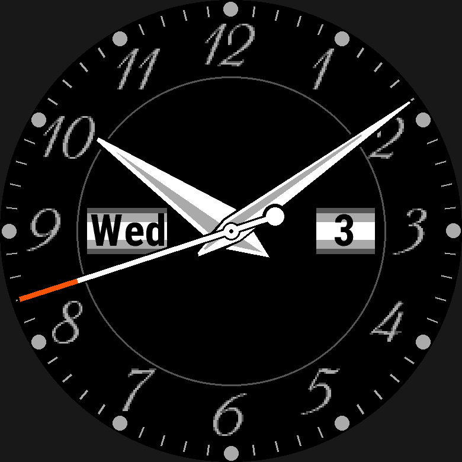

# Analog hands

An analog dial places a set of rotating hands on screen. This chapter covers
the `hands:` block that declares a set's shapes, the `type: hands` element
that places one, and how a hand's parts are authored and rotated live on the
watch. Ticks and numerals around the dial are `pattern` elements, covered in
[Patterns](patterns.md).


*[`examples/analog-custom`](../../examples/analog-custom/face.yaml): a custom numeral font, hour numerals and date windows.*

## At a glance

| Key | Where | Values | Default | Meaning |
|---|---|---|---|---|
| `hands:` | top-level, beside `fonts:`/`palette:` | named hand sets | — | declares hand shapes; a `type: hands` element places one on screen |
| `hour:` / `minute:` / `second:` | inside a hand set | `{color?, parts}` | — | at least one required; always drawn hour, then minute, then second |
| `parts` | a hand | 1–16 of `polygon`\|`rectangle`\|`line`\|`circle` | — | drawn in list order — keys per shape below |
| `color` | a hand, or a part | palette entry, literal, `config.*`, conditional (no data) | — | a part with neither its own nor its hand's colour is an error |
| `hands` | `type: hands` element | a `hands:` entry's name | required | which set this element places |
| `at` | `type: hands` element | anchor / `dx`,`dy` / `angle`,`radius` | — | the axis every hand in the set turns about |
| `seconds` | `type: hands` element | `awake`\|`never` | `awake` | whether the second hand draws — see below |
| `antialias` | `type: hands` element | `true`\|`false` | face default (`false`) | brackets the whole set's drawing |
| `min_1px` | `type: hands` element, or a part | `true`\|`false` | face default (`false`) | clamps a part's own length — see [Elements](elements.md#min_1px--never-let-a-relative-length-round-to-nothing) |
| `modes` | `type: hands` element | `active` only (not `low_power`) | `[active]` | — |
| `aod` | `type: hands` element | `hide`\|`show`\|`{color, thickness, visible}` | inherited | AMOLED sleep frame — see [Always-on display](always-on-display.md) |

## Example

```yaml
hands:
  classic:
    hour:                            # drawn pointing at 12, axis at (0, 0)
      color: config.colors.fg
      parts:
        - shape: polygon
          points: [{dx: -3%r, dy: 8%r}, {dx: -2%r, dy: -38%r}, {dy: -46%r},
                   {dx: 2%r, dy: -38%r}, {dx: 3%r, dy: 8%r}]
    minute: { ... }                  # rectangle + circle
    second: { ... }                  # line + circles, accent-coloured tip

layouts:
  analog:
    static:
      minute_ticks:
        type: pattern
        pattern: radial
        count: 60
        skip_every: 5                # leave room for the hour ticks
        parts: [{ shape: line, at: { dy: -90%r }, to: { dy: -86%r }, thickness: 1px }]
      hour_numerals:
        type: pattern                # 12 numerals, one element
        pattern: radial
        count: 12
        parts:
          - { shape: text, value: "(copy + 11) % 12 + 1", font: font.dialfont, at: { dy: -78%r } }
    elements:
      analog_hands: { type: hands, hands: classic, at: { anchor: center },
                      seconds: awake, antialias: true }
```

| Awake (`--time 03:41:17`, light style) | Asleep (`--asleep`): no second hand |
|---|---|
|  |  |

The numerals stay upright as they go around the dial. Hands take four part
shapes: `polygon`, `rectangle`, `line` and `circle`. The ticks and numerals
are in `static:`, so the watch draws them once and then copies them.

### Analog hands

```yaml
hands:                                   # top-level, beside fonts:/palette:
  classic:                               # a named hand set
    hour:
      color: config.colors.fg            # default for this hand's parts
      parts:                             # drawn in this order
        - shape: polygon                 # pointing at 12; origin = the axis
          points:
            - {dx: -3%r, dy: 6%r}        # 6%r *behind* the axis: a tail
            - {dx: -2%r, dy: -38%r}
            - {dy: -44%r}                # the tip, straight up
            - {dx: 2%r, dy: -38%r}
            - {dx: 3%r, dy: 6%r}
    minute:
      color: config.colors.fg
      parts:
        - {shape: rectangle, at: {dy: -30%r}, size: {width: 3%r, height: 70%r}}
        - {shape: circle, radius: 4%r}   # a hub; `at:` defaults to the axis
    second:
      color: config.accent_color
      parts:
        - {shape: line, at: {dy: 15%r}, to: {dy: -82%r}, thickness: 2px}
        - {shape: circle, at: {dy: 15%r}, radius: 3%r}    # counterweight
        - {shape: circle, radius: 2%r, color: palette.black}

elements:
  - id: main_hands
    type: hands
    hands: classic                       # names a `hands:` entry
    at: {anchor: center}                 # THE AXIS, on the screen
    seconds: awake                       # the default: hidden while asleep
```

`hands:` is a top-level block of named **hand sets**, exactly like `fonts:`
is a block of named fonts — a set declares no position, it is a shape,
placed on screen by a `type: hands` element naming it (`hands: classic`
above). Several sets may exist and switch with Styles the same way
[`layouts:`](styles-and-layouts.md#styles-and-layouts) already switches widget content — see
below.

A set has any of `hour:`, `minute:`, `second:`, and needs at least one — a
set with only `second:` is a valid small-seconds subdial. Each hand is
`{color?, parts}`: 1 to 16 primitives (`polygon`/`rectangle`/`line`/`circle`,
the four `Dc` calls this compiler can rotate — see the table below), drawn in
list order. A part with no `color:` of its own inherits its hand's; a part
with neither is an error.

**The axis is the origin; that is the whole convention.** A hand is
authored **as it looks at 12 o'clock**, and every coordinate in it is
measured **from the axis**, which is the frame's origin — there is no second
convention. The format's usual screen convention still applies: `dx` is
positive to the right and `dy` is positive *down*, so a tip sits at *negative*
`dy`, exactly as `at: {dy: -18%}` means "up" everywhere else. `anchor:` is
rejected inside a part's position — there is no box to anchor to; the axis
*is* the anchor. A part position may also be polar, `{angle, radius}`,
measured clockwise from 12 o'clock, so `{angle: 0deg, radius: 40%r}` is the
tip.

Draw order is fixed within a hand set: **hour, then minute, then second**,
regardless of how you order the keys — never author order, because the
platform has no notion of drawing a minute hand under an hour hand on
purpose. A pin that sits *above* every hand is an ordinary `shape: circle`
element placed after the `type: hands` element that draws them; a hub
*between* hands is a circle part at the origin of the hand below it.

**Units are `px` and `%r` only.** `%r` is the screen's minor radius, so a
hand scales between a 260 px and a 280 px screen the same way the dial does;
`%` is rejected (a hand frame has no parent box) and `pt` is rejected (a hand
has no font). Everything resolves to whole pixels at build time, **rounded
half away from zero** — a mirrored `dx: -1.5px`/`dx: 1.5px` pair resolves to
`-2`/`2`, so a symmetric hand stays symmetric on the panel. The one thing
that is *not* a build-time constant is the rotation itself: the watch turns
the resolved geometry by the time every frame — the one piece of layout
arithmetic this compiler lets the device do (ADR 0004) — through
one `sin`/`cos` pair per hand and the `runtime-lib/WfbHands.mc` barrel.

| `shape:` | keys | on the watch | why it is allowed |
|---|---|---|---|
| `polygon` | `points` (3–64) | rotate each vertex, `fillPolygon` | vertices rotate exactly |
| `rectangle` | `at` (its centre, default the axis), `size`, `align`, `vertical_align` | **becomes a 4-point polygon at build time**, then as above | a rotated rectangle is a polygon |
| `line` | `at` (start, default the axis), `to`, `thickness` (default 1px) | rotate both ends, `setPenWidth`, `drawLine` | end points rotate exactly |
| `circle` | `at` (centre, default the axis), `radius`, `filled` (default true), `thickness` (only when `filled: false`), `align`, `vertical_align` | rotate the centre, `fillCircle`/`drawCircle` | a circle is its own rotation |

`rounded_rectangle` and `ellipse` are rejected (no `Dc` call draws either
rotated — approximate with a `polygon`), as is `arc` (its start angle would
need to rotate with the hand too, which is not implemented yet — see
[Not yet implemented](../limitations.md#2-not-implemented-yet)) and `text`/`icon` (a bitmap font
cannot rotate). `filled: false` is rejected on `polygon`/`rectangle` — there
is no `drawPolygon`. A key a part's shape does not read is an error, the
same `SHAPE_GEOMETRY_KEYS` precedent the main `shape:` element uses —
including `align`/`vertical_align` on `polygon`/`line`, rejected for the same
reasons as the main `shape:` element's (see
[Placement: `at:` and `align:`](placement.md#placement-at-and-align), which also covers
`rectangle`/`circle`'s own alignment, resolved in the part's own frame
before it turns with the hand).

**A part may also declare its own `min_1px:`**, overriding whatever it
would otherwise inherit from its `type: hands` element — the one level
deeper than `antialias:` that this key alone reaches (a part has no
`antialias:` of its own). It governs exactly the `%`/`%r` lengths in the
table above: a `rectangle` part's `size:`, a `line`/`circle`'s
`thickness:`, a `circle`'s `radius:`. See [`min_1px:`](elements.md#min_1px--never-let-a-relative-length-round-to-nothing).

**Colours** take what a `shape`'s `color:` does — palette entries, literal
colours, `config.*` (`accent_color`, `data_color`, `colors.<role>`), and
conditionals over those — **except that a hand colour may not read data**: a
hand has no `when_absent:`, and a hand is about the time, not a reading.

**Motion is automatic — there is no author angle expression.** Hands
read the clock themselves:

| hand | angle, clockwise from 12 | moves |
|---|---|---|
| hour | `((hour % 12) × 60 + min) × 0.5°` | every minute, so at 10:30 it sits halfway between 10 and 11 |
| minute | `min × 6°` | every minute |
| second | `sec × 6°` | every second while awake |

The hour hand advancing by the minute is not optional — parked on the
numeral until the hour strikes, it would look broken at 10:59. There is no
sweep: the face redraws at most once a second.

**`seconds:` on the `type: hands` element** governs the set's second hand:

| value | meaning |
|---|---|
| `awake` (default) | drawn while awake; **not drawn while asleep** |
| `never` | the set's second hand is not drawn at all |
| `always` | **not implemented** — a friendly error naming why (see [Not yet implemented](../limitations.md#2-not-implemented-yet)) |

- **`seconds:` on the analog dial.** `seconds: awake` (the default) hides the
  second hand while the watch sleeps. `seconds: always` isn't built yet.

`seconds:` on an element whose set has no `second:` hand is an error — it
would do nothing — and so is `seconds: never` on a set that has *only* a
second hand, which would draw nothing at all.

Why `awake` needs its own switch rather than `modes:`: `onUpdate` draws the
same `active` element set both awake (once a second) and asleep (once a
minute) on a MIP device, so a second hand drawn in `modes: [active]` would
sit frozen asleep on whatever second that update landed on. An `awake`
second hand therefore gets its own `_sleeping` field, set by
`onEnterSleep`/`onExitSleep`, and only its parts are wrapped in `if
(!_sleeping)` inside the element's draw method — the hour and minute hands
are unaffected, and a design with no `awake` second hand generates no
`_sleeping` field at all. (Before plan 14, `modes: [always_on]` shared this
same field for an unrelated reason — which AMOLED element set to draw. That
mode is gone; `_sleeping` is `_sleeping`'s own concern alone now, and an
AMOLED sleep frame is `aod:`'s own `_aod` field instead — see
[Always-on display](always-on-display.md).)

`modes:` on a `type: hands` element accepts only `active` —
**`low_power` is an error.** The hour and minute hands never need it (they
change once a minute, and the sleeping `onUpdate` already redraws them), a
second hand while asleep is `seconds: always`, not implemented yet, and the
AMOLED sleep frame is `aod:`'s own concern, independent of `modes:`.

**The axis can be anywhere, including off centre.** `at:` on the
element *is* the axis, resolved exactly like any element's `at:` — an
anchor, `dx`/`dy` or polar, relative to a group's box when the element sits
inside one. There is no `size:` — the element's extent is the **disc it
sweeps**: the axis plus the *reach*, the farthest ink of any part of any
*drawn* hand from the axis. `circular_extent()` (the same mechanism that
already keeps a full-screen ring from warning) reasons about that real disc
rather than its bounding square, so an off-centre axis needs nothing special
beyond the ordinary visible-area check, per device.

**Several sets switch with Styles, with no new mechanism** — a set is
chosen per style by putting a `type: hands` element in each `layouts:`
entry, the same way any other widget switches (see
[Styles and layouts](styles-and-layouts.md#styles-and-layouts)):

```yaml
layouts:
  classic: {elements: {hands: {type: hands, hands: classic}}}
  sport:
    elements:
      hands: {type: hands, hands: sport}
config:
  style:
    default: classic_dark
    choices:
      classic_dark:  {label: "Classic · Dark",  layout: classic, colors: dark}
      sport:         {label: "Sport",            layout: sport,   colors: dark}
```

```yaml
hands:
  sport:                   # no `second:` at all: this set never shows seconds
    hour:   { parts: [...] }
    minute: { parts: [...] }
  small_seconds:
    second: { parts: [{ shape: line, at: { dy: 3%r }, to: { dy: -20%r } }] }

layouts:
  classic:
    elements:
      main_hands: { type: hands, hands: classic, at: { anchor: center } }
      small_secs: { type: hands, hands: small_seconds,
                    at: { anchor: center, dy: 45%r } }   # an off-centre axis
```


Each style can use its own hand set. A set can omit any hand, and a `type:
hands` element can sit anywhere, such as the small-seconds subdial below the
centre in the two `classic` panels. `sport` has no `second:` at all, so the
third panel never shows seconds.

[`examples/analog-custom`](../../examples/analog-custom/face.yaml) takes the same
pieces further into a face you would wear: a custom numeral font, hour
numerals and date windows.

A `type: hands` element takes `id`, `type`, `hands`, `at`, `seconds`,
`modes`, `z`, `visible`, `antialias`, `min_1px`, `lint` and `overrides` —
every common key **except** `on_hold:` (a moving hand has no fixed box to
hold — hold a `group` around it instead), `static:` (rejected: a hand's
angle is the time, and a static buffer is painted once and never
refilled), and `align`/`vertical_align` (rejected with a friendly reason:
`at:` is the axis every hand turns about, not a box — see
[Placement: `at:` and `align:`](placement.md#placement-at-and-align); align a part
instead, or move `at:`). `antialias:`
is accepted and inherited exactly like a shape's own, and counts toward the
`antialias-dither` check the same way: the whole hand set draws soft, since
the toggle brackets the element's one draw method. `min_1px:` is accepted the same
way, inherited from the element's group or the face — but, unlike
`antialias:`, a hand's individual part may also declare its own
`min_1px:`, overriding the element's, since a part's `radius:`/
`thickness:`/rectangle `size:` are exactly the lengths the switch clamps.
See [`min_1px:`](elements.md#min_1px--never-let-a-relative-length-round-to-nothing).

See `examples/features/analog/face.yaml` for a design exercising two hand sets, an
off-centre small-seconds subdial, all four part shapes, a `config.*` hand
colour, a pin above the hands, and anti-aliased hands in one layout only
(`classic`), together. It builds warning-free on all
three targets at 4,669–4,670 B on `--build-stats` (3.6% of 131,072 B; it was
4,561–4,562 B before `classic`'s hands turned `antialias:` on), most
of it the dial and the Styles machinery rather than the hands:
`docs/research/probes/analog-hands/` measured a whole app with two hands
elements at about 2 KB.

**What is verified, and what is not.** Verified: warning-free builds under
`-l 3` strict typing on all three targets, and `wfb preview` (which rotates
with the same formulas — `--time HH:MM[:SS]` sets the time, `--asleep`
renders the sleeping frame without `awake` second hands). **Not verified on a
watch or simulator** (neither runs in this project's container): that the
hands point where the preview says, that the second hand disappears on the
first sleeping frame, whether a face that loads while already asleep
starts with its second hand hidden (`_sleeping` starts `false`), what
rotated polygon edges look like on the 64-colour panel, and the per-frame
CPU cost of the rotation. See [`docs/limitations.md`](../limitations.md).

## Not built yet

Still open for [analog hands](#analog-hands): `seconds: always` (a second
hand while asleep), `arc` hand parts, data-driven hand colours and 24-hour
hands. `wfb new -t analog` starts a three-hand dial. A needle driven by a
reading rather than the clock is a [gauge
needle](progress-and-graphs.md#gauge-needles), `progress` with `style:
needle`, which authors its parts the same way.

See [`docs/limitations.md`](../limitations.md) §2 for all of it.

## See also

- [`examples/features/analog/face.yaml`](../../examples/features/analog/face.yaml) — two hand sets, an off-centre small-seconds subdial, all four part shapes and a `config.*` hand colour.
- [`examples/analog-custom/face.yaml`](../../examples/analog-custom/face.yaml) — a hand-tuned dial with a custom numeral font, hour numerals and date windows.
- [Always-on display](always-on-display.md) — `aod:` on a `type: hands` element, applied uniformly to every part of every hand in the set.
- [Patterns](patterns.md) — the ticks and numerals around a dial.
- [Styles and layouts](styles-and-layouts.md#styles-and-layouts) — switching hand sets per style.
- [Placement: `at:` and `align:`](placement.md#placement-at-and-align) — why a hand element refuses `align`/`vertical_align`.
