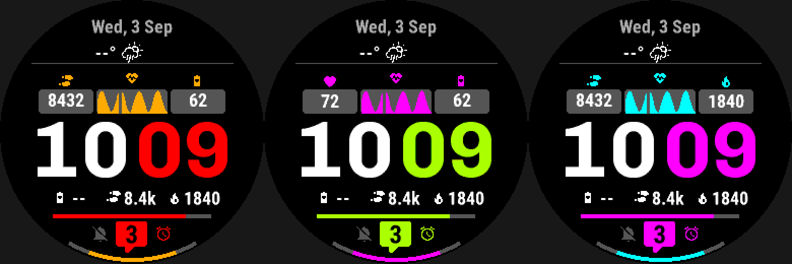

# On-device configuration

Garmin's fēnix 8 watches have a native on-device face editor with four
user-editable axes: an accent colour, a data colour, Styles (author-named
entries), and Data (named complication slots the wearer repoints at any
Garmin metric). The wearer can save up to four configurations. `config:`
declares which of these axes a design uses.

A watch without the native editor, such as `fr955`, gets the same axes in a
generated **settings menu** instead, opened from its Watch Face menu (see
[below](#the-settings-menu-on-a-watch-without-the-native-editor)). A watch
with neither (`fenix5`/`fenix5x`) shows the compiled-in defaults.

## At a glance

| Key | Where | Values | Default | Meaning |
|---|---|---|---|---|
| `accent_color:` | `config:` | `default:` + `choices: any` or a list | — | the one native accent-colour axis |
| `data_color:` | `config:` | `default:` + `choices: any` or a list | — | the one native data-colour axis |
| `style:` | `config:` | ordered mapping of named entries | — | [the Styles axis](#all-four-axes-are-wired-up) |
| `slots:` | `config:` | mapping of named slots | — | [the Data axis](#the-data-axis) |
| `label:` | a `slots:` entry | string | the slot's name, humanised | the slot's title in the [settings menu](#the-settings-menu-on-a-watch-without-the-native-editor); the native editor shows none |
| `default:` | a `config:` axis/entry | hex or `color.<swatch>`, entry name, or complication type | — | starting value; must be in `choices:` when explicit |
| `choices:` | a `config:` axis/entry | `any`, or an explicit list | — | the editor's picklist |
| `label:` | a `style:` entry | string | falls back to the scheme's own `label:` | shown in the editor's Styles list |
| `scheme:` | a `style:` entry | bare `theme: schemes:` name | — | required unless `layout:` given; all-or-none per `choices:` list |
| `layout:` | a `style:` entry | bare `layouts:` name | — | see [Styles and layouts](styles-and-layouts.md) |
| `slot:` | `data` | a `slots:` name | required | which declared slot this element draws |
| `icon: {size:}` | `data` | length, px or `%r` | omit `icon:` = no icon | icon height, chosen on-device |
| `icon: {position:, gap:, color:}` | `data` | `left`/`right`/`top`/`bottom`; px/`%r`; colour | `left`; `4px`; = `color:` | icon placement, gap and colour |
| `label:` | `data` | `none`/`short`/`long` | `none` | `Complication.shortLabel`/`.longLabel` before the reading |
| `unit:` / `short:` | `data` | boolean | `false` | the reading's own unit (`%`, `hPa`, `km`, `/km`, ...); 7-character forms |
| `absent:` | `data` | `hide` / a string | `hide` | blanks only the reading; the icon still draws |
| `on_hold:` | `data` | `auto` only | — | resolves to the wearer's current pick, on every hold |

## Example

```yaml
theme:
  schemes:
    dark:  { label: "Dark",  colors: { bg: color.black, fg: color.white, ... } }
    light: { label: "Light", colors: { bg: color.white, fg: color.black, ... } }

config:
  style:                             # layout × colour scheme, as named entries
    default: digital_dark
    choices:
      analog_dark:  { label: "Analog · Dark",  layout: analog,  scheme: dark }
      digital_dark: { label: "Digital · Dark", layout: digital, scheme: dark }
  accent_color: { default: color.red,   choices: [color.red, color.lime_green, ...] }
  data_color:   { default: color.amber, choices: [color.amber, color.magenta, ...] }
  slots:
    left_register:
      default: steps
      choices: [steps, heart_rate, { type: calories, icon: none }]
    right_register: { default: body_battery, choices: any }
```



*Left: the defaults (red accent, amber data colour). Middle: lime accent,
magenta data colour, and the left slot set to heart rate. Right: magenta
accent, cyan data colour, and the right slot set to calories.*

The wearer picks these in the fēnix 8's native face editor, which saves up to
four configurations. On fr955, the same picks come from the settings menu.

## Configuration

```yaml
resources:
  palette:
    aqua: { value: "#00FFFF", label: "Aqua" }
    amber: { value: "#FFAA00", label: "Amber" }

theme:
  schemes:
    dark:
      label: "Dark"
      colors: { bg: "#000000", fg: "#FFFFFF" }
    light:
      label: "Light"
      colors: { bg: "#FFFFFF", fg: "#000000" }

config:
  accent_color:
    default: "#FF8000"
    choices: any                       # the editor's own full colour picker
  data_color:
    default: color.aqua                # a palette swatch, or a literal hex
    choices:                           # or an explicit list
      - color.aqua                     # a bare swatch ...
      - color.amber
      - { color: "#FFFFFF", label: "White" }   # ... or the inline form
  style:
    default: dark                      # names a choices: entry, not a scheme
    choices:                           # an ORDERED mapping -- index = styleId
      dark: { scheme: dark }           # a bare theme: schemes: name
      light: { label: "Light!", scheme: light }
  slots:
    top:
      default: steps                   # a complication type (wfb complications) -- see below
      choices:
        - steps
        - heart_rate
        - calories
    bottom:
      default: body_battery
      choices: any                     # the editor's own full complication picker
```

Four user-editable axes, read through the fēnix 8's **native on-device watch
face editor** (`Core_Topics/Editing_Watch_Faces_On_Device.html`, API 5.1.0).
All four keys are optional, and `accent_color`/`data_color`/`style`/`slots`
are the **only** keys this block accepts -- Garmin's editor offers exactly one
accent colour, one data colour, one Styles axis and one Data axis, and
nothing else. Declaring anything else is a schema error naming what is
accepted.

`style` is shaped differently from the two colour keys: `choices:` is an
**ordered mapping of author-chosen entry name -> entry**, not a list, so
`default:` names one *entry* (a `choices:` key), not a colour or a scheme --
and an entry's own `scheme:` is what names a declared `theme: schemes:`
entry, as a **bare name** (`scheme: dark`). Editor order is
declaration order, and it is also the `<style id="N">` numbering
`resolveStyle` decodes `styleId` against (index 0 first) -- see [Colour
schemes](colors.md#colour-schemes). Every entry needs at least one of `scheme:`/`layout:` -- the
second names a declared `layouts:` entry, the same bare-name spelling; see
[Styles and layouts](styles-and-layouts.md#styles-and-layouts). **`scheme:` is all-or-none across every entry in
one `choices:`**, independent of `layout:` -- a design cannot mix an entry
that has `scheme:` with one that does not; the first entry that violates
this is one error, not one per offending entry. `slots` is shaped differently
again: it is a **mapping of
named slots**, each with its own `default:`/`choices:` naming complication
types by their bare names (`steps`: the same table `on_hold:` and the
`complication.*` data-source namespace already resolve against -- run `wfb
complications` for the full list); see "The Data axis" below for the slot
names, and the `data` element that draws one. Everything in the
rest of this section describes `accent_color`/`data_color`; `style`'s/
`slots`' own rules are in this section (below) and "The Data axis"
respectively.

**Label fallback.** An entry's own `label:` is shown in the editor's Styles
list. An entry with **no** `label:` and only `scheme:` (no `layout:`) falls
back to that scheme's own `label:` instead. A layout-carrying entry gets no fallback,
colour or not; an entry with neither gets no `label` attribute, same as
everywhere else a label is optional.

**`default:` must name a `choices:` entry** (not a scheme, not a colour) --
Garmin defines no behaviour for a default outside the list, and the error
lists the declared entry names.

**`duplicate-style` (suppressible).** Two entries that resolve to the same
`scheme:` and the same `layout:` are indistinguishable
on the wrist. This is a warning, not an error -- a designer may still want two
labels while iterating -- reported once per design at the second entry of the
pair, and suppressed with `lint: {allow: [duplicate-style], reason: ...}` on
that **entry** (not on an element: `style:` entries have no element of their
own to hang `lint:` on otherwise).

Each entry needs both `default:` and `choices:`. `default:` is a literal
`#RRGGBB`/`#RGB` or a `color.<swatch>`, compiled into the view as the
starting value either way -- once resolved, a swatch and a literal
are the same colour to every check below. A role is not accepted here: it
has no value until the watch runs. `choices:` is either the literal
string `any`, which hands the wearer the editor's own unrestricted colour
picker, or an explicit list whose items are each **either** a bare
`color.<swatch>` **or** an inline `{color, label}`. A bare swatch
contributes its colour and, if the palette entry declared one, its
`label:` -- unlabelled long-form entries and the short form both produce an
unlabelled choice, same as omitting `label:` on the inline form. **When
`choices:` is an explicit list, `default:` must be one of the listed
colours** -- compared by colour value, so `default: color.aqua` matches a
listed `color.aqua` (or an inline choice with the identical hex) equally --
the editor marks one listed colour `default="true"`, and Garmin defines no
behaviour for a default that is not in the list.

**Naming a swatch that was never declared, or was declared and
rejected (an out-of-range colour), is an error** at
the `default:`/`choices:` line, naming every entry `palette:` actually
declares.

A colour axis binds a **role**: `accent_color` binds `color.accent` and
`data_color` binds `color.data`. Reference it as an ordinary colour, exactly
like a swatch:

```yaml
color: color.accent
color: "heart_rate.current > 120 ? color.accent : color.dim"
```

An optional `role:` on the axis names the role differently
(`accent_color: {role: highlight, ...}` binds `color.highlight`). A scheme
role with the same name as an axis's role is an error, as is a swatch with
that name ([Colour references](colors.md#colour-references)).

### All four axes are wired up

Garmin's editor has four axes total -- Styles, Data, Data Colour, Accent
Colour (`docs/adr/0006-configuration-theming-and-modes.md` §1) -- and all four
are wired up: the two colour axes, **Styles**, which carries no colour of
its own and is the only axis Garmin gives no meaning to at all
(which is exactly why this compiler gives each `config: style:` entry a meaning -- a declared
scheme, read back through `color.<role>`, and a layout), and **Data** --
named native complication slots under `config: slots:`, drawn by a `type:
data` element (see "The Data axis" below). `accent_color`/
`data_color`/`slots` are keyed by the axis itself rather than an author-chosen
name, because Garmin gives exactly one of each (`slots` alone is a mapping,
because Garmin's Data axis itself holds several independent slots); `style`
is the odd one out, an author-named, ordered set of entries, because Styles
is the one axis with no meaning of its own for this compiler to key on.

**The editor's own animated highlight is built too**, and it is
automatic: any design with at least one element drawing a slot (a `data`
element, or a [gauge with `slot:`](progress-and-graphs.md#gauges-on-a-slot))
gets `AppBase.onStart`'s edit-mode detection, `WatchFaceDelegate.onTap` +
`setSelectedComplication`, and `WatchFaceDelegate.getComplicationDrawable`
returning a generated `<Face>SlotDrawable` that delegates straight back to
the view's own draw methods -- so there is exactly one implementation of
what a slot looks like, drawn either by `onUpdate` or by the editor's own
`Drawable`. **A slot is every element drawing it, taken together**: a
gauge's ring and the slot's reading are selected, highlighted and redrawn
as one, on the union of their boxes. Where two slots' boxes overlap (a ring
round the face encloses whatever slot sits inside it), a tap selects the
smallest slot box holding it, so the inner slot stays selectable. A design
drawing no slot gets none of this: `onTap` (unlike `onPress`) never fires
on a live face, so all of it would be dead weight there. On a fenix8solar47mm the highlight animates over the
selected slot and previews each choice as the wearer scrolls; the rest is
unverified -- see "What this compiler cannot tell you" below.

### The Data axis

```yaml
config:
  slots:
    top:
      default: steps
      choices:
        - steps
        - heart_rate
        - { type: calories, icon: none }
        - { type: stress, icon: "U+F1340" }
    bottom:
      default: body_battery
      choices: any

elements:
  top_reading:
    type: data
    slot: top
    at: { anchor: center, dy: -20% }
    font: FONT_SMALL
    icon: { size: 8%r, position: right, gap: 2px, color: color.accent } # omit to draw no icon
    color: color.fg
    label: short             # none (default) | short | long
    unit: true                # append Complication.unit's suffix
    absent: "--"
```

Each `slots:` entry is a **named slot** with its own `default:`/`choices:`,
resolved exactly like `on_hold:` against :mod:`ts/src/complications.ts`' table (run
`wfb complications`, which lists each type with its name for people,
grouped as the editor lists them) -- `default:` compiles into the view as the starting
`Complications.Id`, and is the only type a device with no native editor
(fr955) ever shows. `choices:` is either an explicit, orderable list (which
`default:` must belong to) or the literal string `any`, handing the wearer the
editor's own unrestricted complication picker.

A slot may also carry a `label:`, its title in the settings menu on a watch
without the native editor. Without one, the menu titles the slot from its
name (`top_left` shows as "Top left"). The native editor has nowhere to show
it: Garmin's `<complication>` resource takes no label (`resources.xsd`,
`complicationWatchfaceType`); the editor picks a slot out by highlighting
it on the face (`getComplicationDrawable`).

**A `choices:` list item** is either a bare complication type (`steps`) or
a mapping naming the same type plus a per-choice icon override: `{ type:
<name>, icon: <catalogue name> }`, `{ type: <name>, icon: none }`
(explicitly draw no icon for this one choice, even though the catalogue maps
it), or `{ type: <name>, icon: "U+XXXX" }` (any codepoint the vendored font
has, for a glyph the catalogue does not name). `icon:` is validated exactly
like a plain `icon` element's own `icon:` -- an unknown catalogue name is an
error with suggestions, a codepoint outside the font's character map is an
error, and a codepoint that duplicates a catalogue entry gets the same "say
`icon: <name>` instead" note. A choice with no `icon:` keeps the catalogue default
(`COMPLICATION_ICON` in `ts/src/icons.ts`), same as the bare form. **A type listed more
than once across the whole `choices:` list -- in either shape -- is an IR
error**: the schema's own `uniqueItems` only catches two identical bare
entries, not a bare reference and a mapping-form entry naming the same type.

A gauge can draw a slot too, filled against the picked metric's own
scale: see [Gauges on a slot](progress-and-graphs.md#gauges-on-a-slot).

`type: data` draws one slot, naming it as `slot: <name>`. Unlike every
other element, **which complication is showing is not known at build time**
-- the wearer picks it on-device, and `Complications.Id.getType()` only
resolves at runtime -- so this element has no `text:` template at all.
Instead:

* **`color:`** is an ordinary colour expression, but it must not be nullable
  -- `absent:` covers only the reading, not the element's own appearance
  (see below).
* **No format spec.** `Complications.Complication.value` is a `String or Number
  or Float or Long or Double` union whose concrete type genuinely varies by
  which choice the wearer makes -- a spec written for one choice
  would be silently wrong for another. `format:` is a schema error naming
  this reason. Instead **every complication type has its own rule**
  (`READING` in `ts/src/complications.ts`), which the generated `source/SlotText.mc`
  applies on the watch (a case only for the types the design's slots can
  show) through `runtime-lib/WfbReading.mc`. Metric or statute, and the
  12/24-hour clock, follow the watch's own settings:

  | Types | Drawn | With `unit: true` |
  |---|---|---|
  | steps, calories, floors, intensity minutes, notifications, stress, sleep score, pushes | `8809`; from 10,000 up, thousands with one decimal: `10.0K`, `12.9K` | -- |
  | heart rate, respiration rate | `77`, `17` | `77bpm`, `17brpm` |
  | battery, body battery, pulse ox, solar input | `100` | `100%` |
  | VO2 max (run, bike) | `49`; 0 (nothing recorded) is absent | -- |
  | sunrise, sunset | `06:15`, `18:12` (`6:15`, `6:12` on a 12-hour watch) | -- |
  | race predictors | `24:40`, `3:25:45` | -- |
  | race pace predictors | `4:56` per km or mile; a speed of 0 is absent | `4:56/km`, `7:56/mi` |
  | recovery time | whole hours, rounded up: `37h`, `0h` | -- |
  | current temperature | `24°` (°F on a statute watch) | `24°C`, `75°F` |
  | altitude | `511` (m or ft) | `511m`, `1677ft` |
  | weekly run / bike distance | `23.4` (km or mi) | `23.4km`, `14.5mi` |
  | sea-level pressure | `1017` (hPa) | `1017hPa` |
  | current weather, 1/2/3-day forecast | the condition's name: `Mostly clear` | -- |
  | training status, high/low temperature, date, weekday, next event, golf | the device's own text | -- |

  The `K`, `°` and `h` are drawn with or without `unit:`: a bare number is
  unreadable without them. Steps past 10,000 are seen in the simulator
  arriving already scaled, as the Float 12.879 with the unit `"K"`; that
  `K` is kept too. A type with no rule (a Connect IQ app's complication,
  under `choices: any`) draws its value as reported, a Float to three
  significant figures, with `Complication.unit`'s suffix under `unit:`.
* **`short:`** (`false` default) keeps a reading to seven characters where a
  rule can: a weather condition's short name (`Mo clr`, `Pt cldy`, `Ch r/s`),
  a training status's (`Maint`, `Prodctv`, in the case the device reported
  it), `26/17` for `H 26 / L 17`, and a `unit:` suffix dropped when it would
  pass seven (`12:30/mi` -> `12:30`). Text the device supplies otherwise --
  a date, a calendar event, a training status the table does not know -- is
  never cut. The tables are `WEATHER_CONDITION_TEXT` in `ts/src/complications.ts` and
  `TRAINING_STATUS_SHORT`; the long condition names are the SDK's own
  (`doc/Toybox/Weather.html`), in English whatever the watch's language.
* **`label:`** (`none` default, `short`, `long`) draws `Complication.
  shortLabel`/`.longLabel` before the reading, when the device supplies one.
* **`absent:`** is `hide` (default) or a string drawn instead (`"--"`) --
  and unlike every other element, `hide` blanks only the
  *reading*, leaving the icon drawn: the icon says which metric the slot is
  pointed at, which stays true even on a frame the reading itself could not be
  pulled.
* **`icon: {size:}`** (omit `icon:` to draw no icon) chooses the icon **on-device**, from
  the wearer's picked *type* -- `Complications.Id.getType()`, `switch`ed
  against a table of catalogue names (`COMPLICATION_ICON` in `ts/src/icons.ts`, or a
  per-choice override), then `IconGlyphs.glyph()` turns the name (or a
  `U+XXXX` override's canonical spelling) into a character, exactly
  the same "which name, then which glyph" split a dynamic weather icon uses.
  **A weather type's icon follows the pulled condition** (`WfbWeather.
  chooseIcon`, the same mapping as `icon: {for: weather.condition}`), and falls
  back to the type's own `weather` icon on a frame with no reading; the
  slot's icon font then carries every condition glyph. A weather choice
  with an authored `icon:` keeps it.
  **All 42 native complication types have a catalogue icon** -- an author can still suppress one explicitly
  with a per-choice `icon: none`, and a Connect IQ-app complication (outside
  `TYPES` in `ts/src/complications.ts` entirely) simply draws no icon, since this
  compiler cannot know what it is. Run `wfb complications` for the current
  mapping (it lists each type's catalogue icon alongside its Monkey C
  constant).
  **`choices: any` with an `icon:` is accepted**: `any` resolves against the
  whole of `COMPLICATION_ICON` in `ts/src/icons.ts`. It builds warning-free on all three targets. A Connect IQ-app
  complication picked in such a slot draws its reading with no icon.
  (monkeyc 9.2.0 crashes when two different string literals share a Java
  hash code, and some icon glyphs do, such as `distance` and
  `temperature`. The compiler handles that for slot and weather icons
  itself; see `docs/lore/toolchain.md`. The one case it cannot fix is
  reported as a `string-label` build error, listed below.)
* **`icon: {position:}`** (`left` default, `right`, `top`, `bottom`) places the
  icon relative to the reading; **`icon: {gap:}`** (px or `%r`, non-negative;
  default 4px) sets the space between them. `icon:` itself requires `size:`,
  since neither means anything with no icon to place or space. `top`/`bottom` stack the pair
  vertically and centre both horizontally, using `Dc.getFontHeight` for each
  piece's height -- the gap is measured between the two font *line boxes*,
  not the ink, so a system font's internal leading adds to it (not
  corrected). When the wearer's current pick has no icon (an explicit
  `icon: none`, or the whole slot mapped nothing), the gap drops too and the
  reading centres alone, in every position.
* **`icon: {color:}`** the icon's own colour, distinct from `color:` (the
  reading's). Must not be nullable, for the same reason `color:` must not be.
  Defaults to `color:` when omitted -- one shared colour for icon and
  reading alike.
* The icon and the reading are centred together, as one pair, on this
  element's own anchor -- at **runtime**, via `Dc.getTextWidthInPixels`/
  `Dc.getFontHeight`, because the actual text is not known until the value
  is pulled. This is the one element in the format whose drawn position is
  not fully resolved at build time (ADR 0004's one deliberate exception, and
  for exactly that reason); the geometry lints below size its box from the
  value alone (see "What this compiler cannot tell you"). The pair's
  geometry -- for every icon `position:` -- is computed by one pure function,
  `ts/src/layout.ts`, which sizes the estimated
  box the lints read, and mirrored (not called -- the real text is not
  known at build time) by the generated Monkey C, whose own arithmetic
  `wfb preview` evaluates.
  **`align:`** follows the one placement rule every accepting
  kind shares: [Placement: `at:` and `align:`](placement.md#placement-at-and-align) --
  but because the pair is measured on the device, its alignment arithmetic
  runs there too, for every icon `position:`, rather than moving a
  build-time box (the same runtime exception as the centring above).
* A `data` element **cannot be static** (its reading changes every frame,
  and the wearer can repoint it at any time) -- an error, naming why.
* **`on_hold:`** accepts exactly one value here: **`auto`**. Touch and hold
  opens whichever glance the wearer's *current* pick belongs to
  (`Complications.exitTo` on this slot's own field), resolved fresh on every
  hold rather than a fixed name baked in at build time -- unlike every other
  element's `on_hold: auto`, which resolves once, at build time, to a single
  `TYPES` in `ts/src/complications.ts` name via `Source.launch_complication`. A fixed
  target (`on_hold: heart_rate`, say) is a schema-and-IR error naming why: it
  would silently disagree with what is on screen the moment the wearer
  repoints the slot. To always launch one fixed glance regardless of what a
  slot currently shows, bind a plain `text`/`icon` element to the matching
  `complication.<name>` source and put `on_hold: <name>` there instead. No
  `on_hold:` at all is a legitimate choice -- holding does nothing.

Font baking follows the same "multi-glyph font" shape a dynamic weather icon
already needs: the text font must carry every character *any* declared choice
could render (there is no per-choice format spec to size against), and the icon
font -- when `icon:` is set -- carries every mapped choice's glyph,
normalised to the *default* choice's own ink height (the same one-reference-
glyph trade-off `WEATHER_BAKE_REFERENCE_GLYPH` makes for the weather set: no
single nominal size fits every icon set's glyphs equally, so the other
choices render at whatever height that nominal size gives them).

### What each device does with it

The generated resource (`<watchface-config>`, one `<accentColors>`/
`<dataColors>`/`<styles>`/`<data>` per declared axis) is emitted **only for a
device with the native editor** -- checked with `Device.has_symbol`, never an
API-level compare: `fr955` reports ConnectIQ 5.2.0, above the editor's own
documented 5.1.0, and still has no editor at all (see [Limitations](../limitations.md)). Declaring `config:` forces no
`minApiLevel` bump on any device, `slots:` included: `manifest.xml`'s
`minApiLevel` is one number shared by every target device in the build, so it
stays at the generator's own base floor (`3.1.0`) regardless of what a design
uses (`ts/src/emit/manifest.ts::BASE_API_LEVEL`). A slot needs
`Toybox.Complications` (`Complications.Id`, `COMPLICATION_TYPE_*`) the same as
any other complication use, but a target device that lacks the module gets a
runtime `Toybox has :Complications` guard in the generated code instead of a
raised manifest floor -- see "The `complication.*` namespace" and "Holding an
element" below for the full mechanism, and the `api-gated` lint entry just
below for what an author sees on such a device.

**Every device edits `config:` one of three ways:**

| Device | How the wearer edits `config:` |
|---|---|
| Native editor (fēnix 8 and newer) | the native editor, as above |
| No native editor, but `AppBase.getSettingsView` (fr955, fenix6, fr245, ...) | the generated [settings menu](#the-settings-menu-on-a-watch-without-the-native-editor) |
| Neither (`fenix5`/`fenix5x`) | nothing: every declared default, forever |

The third row is the only one that warns: the suppressible
`config-unsupported` warning fires once per such target, naming the device
and the entries (roles, slots) affected. A slot's default complication type
is read through `Toybox.Complications`, so on a device that also lacks that
module (`fenix5`/`fenix5x`, and fenix6/fr245 for the menu too) the slot
shows its absent state instead of any default; see `api-gated` below for
that fact from the slot's own side, reported independently.

### The settings menu, on a watch without the native editor

The build generates it whenever some target lacks the native editor but has
`AppBase.getSettingsView`. The watch opens it from its Watch Face menu. It
has one item per axis, in this order: Style, Accent colour, Data colour, then
each data slot by its `label:`, else its name (`bottom` shows as "Bottom").
Each item shows the current choice. Selecting one
opens the list of its options, focused on the current one, and picking an
option applies it at once.

| Axis | The options listed |
|---|---|
| `style:` | every entry, by its label (else its scheme's label, else its name) |
| `accent_color:`/`data_color:` | the `choices:` list, by palette label or hex; for `choices: any`, every `palette:` entry, plus the default first if it is not one of them |
| a `slots:` entry | its `choices:` types; for `choices: any`, every complication type the device's API level has. Empty, and left out, on a device without `Toybox.Complications` |

Which editor runs is decided on the watch, with the same `Application has
:WatchFaceConfig` check the view already makes, so one build serves a fēnix 8
(native editor, and `getSettingsView` returns null) and an fr955 (the menu)
alike. A menu choice is stored as an `Application.Properties` index, one
property per axis in `resources/settings/properties.xml`, defaulting to -1,
"never chosen". A stored value of the wrong type or out of range keeps the
declared default. A menu choice is one value for the whole face: there are
no saved configurations outside the native editor.

A build whose targets all have the native editor carries none of this.
With a menu target in the build, the menu is shared code, so every target
carries it. Measured on the example faces (`fr955`): +1,830 B for
`examples/features/config/` (two colour axes and a style), +1,667 B for
`features/styles/`, and +2,892 B for `features/slots/`, whose
`choices: any` slot lists about forty complication types.

### Lint

* An unknown key under `config:` -- schema error, naming what is accepted.
* `default:`/`choices:` naming an undeclared (or declared-and-rejected)
  swatch, or a role -- error, naming the declared palette entries.
* `default:` not among an explicit `choices:` list -- error. For `style`,
  this compares **entry names**, not scheme names or colour values -- two
  entries may legitimately reference the same scheme (see `duplicate-style`
  below).
* A `style` entry with neither `scheme:` nor `layout:`, or some
  entries with `scheme:` and others without -- one error, at the first entry
  that breaks the rule.
* A `style` entry's `scheme:` naming an undeclared (or declared-and-rejected)
  scheme -- error, naming the declared schemes.
* `duplicate-style` (suppressible) -- two `style` entries resolve to the same
  `scheme:` and `layout:` -- warning, once per design, at the second entry of the pair;
  suppress on that entry's own `lint:`.
* Every declared colour goes through the same palette-legality check a
  `palette:` entry gets (`palette-dither` on a 64-colour panel, `palette-mono`
  on a 2-colour one): `default:` always (it is the only value a device
  with no native editor ever shows), plus every listed `choices:` colour when
  `choices:` is an explicit list (`choices: any` has no list to check) --
  and, for `style`, every role of every scheme some entry actually
  references (a scheme no entry references is unreachable on any device, so
  it is not checked). Reported as `palette-dither` against whichever
  element draws exactly that `color.<role>` -- as its
  `color:`/`track_color:`/`icon: {color:}`, a text's `outline: {color: ...}`,
  or an `aod:` override's colour (a plain `color.<swatch>` is
  checked the same way, against the same fields).
* `config-unsupported` (suppressible) -- at least one target has neither the
  native editor nor the settings menu (`fenix5`/`fenix5x`), so the declared
  defaults are all that device ever shows (including every slot's default);
  when `style` has more than one entry, the message also names the
  non-default entries as unreachable on that device.
* A slot's `default:`/`choices:` naming an unknown complication type --
  error, with a near-miss suggestion, the same as an `on_hold:` typo.
* A slot's `default:` not among an explicit `choices:` list -- error, the
  same shape as the colour axes'.
* A `data` element's `slot:` naming an undeclared (or declared-and-
  rejected) slot -- error, naming the declared slots.
* `format:` on a `data` element -- error, naming why (see "The Data
  axis").
* `string-label` -- two different string literals in the generated program
  share a Java hash code, which monkeyc 9.2.0 crashes on (see "The Data
  axis" and `docs/lore/toolchain.md`). A colliding slot or weather icon
  glyph is fixed automatically, so this error only reaches you for a
  collision the compiler cannot rewrite, such as two static `icon` elements
  showing `distance` and `temperature`. It names both strings; change one.
* `icon:` without `size:` -- error, naming why (none of the others means
  anything with no icon to place, space or colour).
* An icon `gap:` in a unit other than px/`%r`, or negative -- error, the same
  restriction `size:` has.
* A per-choice `icon:` naming an unknown catalogue entry or an
  out-of-font codepoint -- error, the same messages a
  plain `icon` element's own `icon:` gets.
* A complication type listed more than once in one slot's
  `choices:`, in either shape -- error, naming where it was already listed.
* A `data` element in a `static:` block -- a permanent error: the whole point of
  a slot is that its content changes, and static content is painted once.
* `on_hold:` on a `data` element naming anything other than `auto` --
  error, naming why (see "The Data axis" above) and pointing at the
  alternative (a plain element bound to the matching `complication.<name>`).
* `api-gated` (suppressible) -- *any* catalogue binding a target device
  cannot actually provide, resolved against that device's own
  `api.debug.xml` rather than an API level (`ts/src/availability.ts`; CLAUDE.md
  constraint 6/6e). Five shapes, all WARNING, all reading as absent rather
  than failing the build:
  - a `text:`/`value:`/`color:`/etc. source path whose reader needs a `Toybox`
    module (`Complications`, `Weather`) or a field the device's own symbol
    table lacks -- covers every `complication.*` and `weather.*` read this
    way, for free, via its reader's module gate (`fenix5`/`fenix5x` lack
    `Toybox.Weather`);
  - a forecast `graph` (`forecast_*`/`daily_*` series) on a device with no
    `Toybox.Weather` -- the guarded acquisition yields nothing and the graph
    draws empty there;
  - a complication *type* newer than the device's own ConnectIQ ceiling,
    checked against `ComplicationType.since` in `ts/src/complications.ts`
    (`COMPLICATION_TYPE_*` values are constants with no entry in
    `api.debug.xml` at all, so a level compare is the only thing that can
    catch this one), skipped when the device lacks
    `Toybox.Complications` outright (the module-gap case above already said
    so, more fundamentally);
  - `on_hold:` on a device with no `Toybox.Complications` -- the hold
    compiles in but does nothing there, unless `hold-unsupported` already
    covers that same element (the device also lacks `onPress`) -- "it never
    fires" stays true either way, so this one really is the same fact twice;
  - a `data` element's slot on a device with no `Toybox.Complications`
    -- it shows its absent state forever, **never** its declared `default:`
    (the default is itself read through `Toybox.Complications`, so a device
    missing the module cannot resolve it either). This does **not** dedupe
    against `config-unsupported`: that warning, when it *also* fires because
    the device has neither editor nor menu, says the slot "keeps its
    declared default" -- true only when the default can still resolve, so
    on a device missing all three (`fenix5`/`fenix5x` today) the two
    warnings report different halves of the truth and both fire, with
    `config-unsupported`'s own wording adjusted to say "shows as absent"
    for such a slot rather than "keeps its declared default".

  A fifth shape, `api-gated-unguardable`, is a build **ERROR** and
  deliberately **not** suppressible: it means a reader's own function symbol
  (as opposed to a module or a field) is missing on a target device. The
  generated code only ever guards a module or a field at runtime
  (`computeGuards` in `ts/src/availability.ts`) -- there is no guard for an individual
  function, so "reads as absent" would be a lie; the call would run
  unguarded and crash on that device. No device this project vendors
  triggers it today: the one real gap that used to (`fenix5`'s missing
  `Toybox.Weather`) is a whole-module gap, guarded like `Complications`.

### What this compiler cannot tell you

**No behaviour of the editor is verified anywhere in this project.** There is
no simulator in this container and no watch (`docs/limitations.md` §2); every
claim above is a compile-time result (schema, IR, a real `monkeyc` build) or a
byte cost, never a description of what the editor's UI actually does. The
settings menu mechanism was seen working on `fr955` (2026-09-27, with the
since-removed `settings:` block, whose choices cycled rather than opening a
list): the Watch Face menu entry appears and a change applies at once. The
`config:` menu, and its lists of options, have not been seen on a watch yet.

**A `data` element's geometry is sized from its readings alone.** The
estimate is the widest reading any of its choices can draw under its
`unit:`/`short:` (`widestReading` in `ts/src/complications.ts`): a clock is `88:88`,
a race prediction `8:88:88`, a weather condition its longest name -- so
`choices: any` in full names is honestly wider than the screen ("Cloudy
chance of rain snow"), and the `off-screen` lint says so; `short: true`
brings it back inside. Text the device supplies (a date, a calendar event, a
training status in full) has no documented bound and keeps a five-digit
guess, and `label:` is not counted at all: a localised device string with
no documented upper bound, where padding would either be routinely wrong
or, picked generously, turn an ordinary slot into a spurious `off-screen`
warning (confirmed directly: an 8-character placeholder pushed a
comfortably-fitting design off the framebuffer). A slot whose label or
device text runs long on the real device can overflow further than the
compiler warned about.

**The editor's animated highlight is handed a box that spans the screen
instead.** `getComplicationDrawable` needs a fixed `Graphics.BoundingBox` up
front, before anything is pulled, and the editor clips the slot's drawable
to it -- given the estimate above, a fenix8solar47mm drew "STEPS 5068" as
"TEPS 506" and cut a date's icon and last digit. So the drawable's box keeps
the estimate's rows but takes every screen column the pair can reach from
its anchor: as far as the nearer screen edge either way for `align:
center` (the full width for a centred slot, like the SDK's own sample), and
from the anchor to one edge for `left`/`right`. `onTap` still hit-tests the
estimate, so two slots side by side stay separate tap targets. Seen on a
fenix8solar47mm: the reading now shows in full.

**The editor dims the whole screen while a slot is selected.** On a MIP
watch `#555555` dims to black, so a dark-grey card behind a slot seems to
vanish until editing ends (seen on the showcase face, fenix8solar47mm). Give
a card that must stay visible while editing a brighter colour, such as
`#AAAAAA`.

**`on_hold: auto` on a `data` element is a third shape of `auto`,
different from every other element's.** Every other element's `auto`
resolves once, at build time, to a fixed `TYPES` in `ts/src/complications.ts` name
(`Source.launch_complication`); a slot's resolves on-device, every hold,
from whatever `Complications.Id` the wearer currently has it pointed at.
Both compile to `Complications.exitTo`, but a slot's is never a build-time
constant -- there is nothing for `wfb complications`/`wfb validate` to name
as "the" target of a slot's hold, because there isn't one.

### `data`

Draws the native **Data axis**'s current pick — a slot the wearer re-points
at a different Garmin metric, on the watch. Documented in full under
[Configuration → The Data axis](#the-data-axis), alongside `config: slots:`,
the block that declares a slot's own `default:`/`choices:` — the two cannot
be understood apart from each other, since the element only ever draws a
declared slot.

## See also

- [`examples/features/config/face.yaml`](../../examples/features/config/face.yaml) — accent/data colour axes and a `style:` entry over a static colour role.
- [`examples/features/slots/face.yaml`](../../examples/features/slots/face.yaml) — two `config: slots:`, icon overrides.
- [Styles and layouts](styles-and-layouts.md) — `layout:` on a `style:` entry, and the `layouts:` bodies it points at.
- [Data](data.md) — the `complication.*` source namespace.
