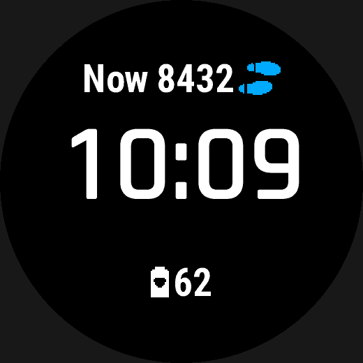

# Data binding, expressions and formats

A watch face reads live data — the time, the wearer's activity, the weather,
a Garmin complication — through typed sources addressed by dotted path, such
as `activity.steps` or `complication.body_battery`. `value:` binds a source
or an [expression](#expressions) over sources to an element; `format:`
controls how the pulled value renders, and `when_absent:`/`placeholder:` say
what to do when a nullable source has nothing to report. `wfb sources` and
`wfb complications` are the authoritative, always-current lists of what you
can bind.


*From [`examples/features/slots`](../../examples/features/slots/face.yaml).*

## At a glance

| Key | Where | Values | Default | Meaning |
|---|---|---|---|---|
| `value:` | any data-bearing element | a source path or [expression](#expressions) | — | what to pull or compute |
| `format:` | `text` | Python-style spec or strftime codes | — | [Formats](#formats) |
| `placeholder:` | element with `when_absent: placeholder` | any string | — | shown while the value is absent |
| `when_absent:` | any nullable binding | `hide` \| `placeholder` \| `fallback` | — (required for a nullable binding) | [Absence is the normal case](#absence-is-the-normal-case) |
| `time.*` | source namespace | — | — | clock and time-of-day readings |
| `date.*` | source namespace | — | — | calendar date, localised weekday/month |
| `activity.*` | source namespace | — | — | steps, calories, distance, floors, and more |
| `weather.*` | source namespace | — | — | condition, temperature, forecast |
| `device.*` | source namespace | — | — | notifications, alarms, do-not-disturb, phone-connected |
| `system.*` | source namespace | — | — | battery, charging |
| `complication.*` | source namespace | — | — | [the `complication.*` namespace](#the-complication-namespace-and-the-one-rule-for-reaching-it) |

## Example

```yaml
static:
  left_card: { type: shape, shape: rounded_rectangle, corner_radius: 3%r,
               at: { anchor: center, dx: -50%r, dy: -23%r },
               size: { width: 42%r, height: 19%r }, color: config.colors.dark }

elements:
  left_register:
    type: complication_slot          # the wearer picks what it shows
    slot: config.data.left_register
    at: { anchor: center, dx: -50%r, dy: -30%r }
    icon_position: top
    icon_color: config.data_color
    when_absent: placeholder
    placeholder: "--"
    on_hold: auto                    # touch and hold opens that complication

  hr_graph:
    type: graph
    series: heart_rate               # `wfb series` lists what can be plotted
    range: 4h
    style: area                      # line | area | bars ([graph styles](progress-and-graphs.md))
    size: { width: 52%r, height: 17%r }
    color: config.data_color
    on_hold: heart_rate
```


- **`static:`** holds things that never change, like the dark cards behind
  each slot. The watch draws them once and copies the result on every update.
- **A `complication_slot`** shows whichever complication the wearer picked for
  it ([configuration](configuration.md)), with that complication's icon and reading. When the reading is
  missing, `when_absent: placeholder` shows the `placeholder:` text instead of
  leaving it blank.
- **`on_hold:`** makes the element a touch-and-hold target that opens a Garmin
  glance. On a slot, `auto` opens the glance for whatever the slot currently
  shows. Elsewhere, name one, such as `heart_rate`; `wfb complications` lists
  the names.
- **A `graph`** plots recent history. Here it is the last four hours of heart
  rate.

## Data binding

Sources are addressed by dotted path and carry a type, a nullability, and any
permission binding it implies.

```yaml
value: activity.steps
value: heart_rate.current
value: system.battery
value: time.clock
value: complication.body_battery
```

**`wfb sources` is the authoritative, always-current list** -- run it rather
than trusting a copy pasted into prose, which goes stale the moment the
catalogue grows. For each path it prints the type, whether it is nullable,
any permission it implies, its conventional `on_hold: auto` target (if it has
one), and the SDK page it was taken from:

```
$ wfb sources
activity
  activity.steps                     number   steps today  [nullable, on_hold: auto -> steps]  (Toybox/ActivityMonitor/Info.html)
  ...
complication
  complication.body_battery          number   a Number representing your current body battery  [nullable, needs ComplicationSubscriber, on_hold: auto -> body_battery]  (Toybox/Complications.html)
  ...
heart_rate
  heart_rate.current                 number   current heart rate  [nullable, on_hold: auto -> heart_rate]  (Toybox/Activity/Info.html)
  ...
```

As of this writing the catalogue covers `time.*`, `date.*` (including the
localised month name and weekday), `device.*` (notification/alarm counts,
do-not-disturb, phone-connected, 24-hour setting), `system.*` (battery,
charging), `activity.*` (steps, calories, distance, floors, move bar,
intensity minutes, stress score, respiration rate, time to recovery),
`heart_rate.current`, `pulse_ox.current`, `ambient.*` (altitude, barometric
pressure), `weather.*` (current condition and temperature, feels-like,
today's high/low and precipitation chance, humidity, wind speed,
today's/tomorrow's forecast condition — see [`icon_for:`](icons.md#a-dynamic-icon-icon_for) for turning a
condition into a drawn icon), `user.*` (running/cycling VO2 max, resting
heart rate, from `Toybox.UserProfile`), and `complication.*` (below).

### The `complication.*` namespace, and the one rule for reaching it

**`complication.<type>` is *always* read through `Toybox.Complications`; every
other catalogue path is *always* a direct API read.** No exceptions, no
overlap. All 42 real `COMPLICATION_TYPE_*` values are exposed
(`COMPLICATION_TYPE_INVALID` is not a real value and is excluded), generated
from one table, `wfb/complications.py`'s `TYPES` — transcribed verbatim from
`Toybox/Complications.html`'s own Type table, not hand-copied, so it cannot
silently drift from what the platform actually offers. `wfb complications`
prints all 42, the Monkey C constant each compiles to, and the API level it
was introduced at.

**A `config: data:` slot is a third thing, distinct from both rules above --
it is not a `catalog.CATALOG` path at all.** Which type it reads is not fixed
at build time (the wearer picks it on-device), so there is no fixed source
for the expression compiler to bind; `type: complication_slot` pulls through
`WfbComplications.valueOf` directly instead, the same underlying mechanism a
`complication.<type>` binding uses, reached a different way. See
[Configuration → The Data axis](configuration.md#the-data-axis).

```yaml
- id: body_battery_reading
  type: text
  value: complication.body_battery
  format: "{:d}"
  font: FONT_SMALL
  when_absent: placeholder
  placeholder: "--"
```

A `complication.*` binding compiles to a plain pull, exactly like any other
source — `WfbComplications.valueOf(new Complications.Id(Complications.
COMPLICATION_TYPE_BODY_BATTERY))` — cast to the source's own type
(`Complications.Complication.value` is a union of `String or Number or Float
or Long or Double or Null`, so the cast is required, not decorative). Binding
one adds the `ComplicationSubscriber` permission. `minApiLevel` itself never
moves for this (`manifest.xml` is one file shared by every target device, so
a per-feature bump would lock out any target that never touches the
feature -- see [What each device does with it](configuration.md#what-each-device-does-with-it)); a target device that
lacks `Toybox.Complications` instead gets the read guarded at runtime and
warned about ([`api-gated`](configuration.md#lint)) rather than being excluded from the build.
`wfb/emit/monkeyc/view.py` also emits one
`WfbComplications.subscribe(...)` per bound type in `onLayout`, whose whole
job is `WatchUi.requestUpdate()` on change — this is *not* a cache (see "How
data is read", below), it exists only so a value that changes after the first
draw is not stuck stale forever.

**Prefer a direct-read source over its complication counterpart whenever both
exist.** `heart_rate.current`, `activity.steps`, `weather.condition` and
around twenty others are also reachable via `complication.*`
(`complication.heart_rate`, `complication.steps`, `complication.
current_weather`, ...), but the direct path is strictly cheaper: no
`ComplicationSubscriber` permission and no subscription (`minApiLevel` is not
a difference between the two routes any more -- neither ever moves it; see
[What each device does with it](configuration.md#what-each-device-does-with-it)). The complication route exists
**only** for values with no
other way in — most usefully `complication.body_battery`
(`Toybox.SensorHistory` is the only other route to Body Battery, and it is a
permission **watch faces are not allowed to declare at all** —
`Core_Topics/Manifest_and_Permissions.html`'s table has a blank Watch Face
column for it), plus `complication.solar_input`, `complication.sunrise`/
`sunset`, `complication.training_status`, `complication.
weekly_run_distance`/`weekly_bike_distance`, `complication.sleep_score` and
`complication.calendar_events`. Binding one of these through a
direct-looking path (`body_battery.current`, `weather.sunrise`, and so on)
raises **`source-renamed`**, naming the `complication.*` replacement.

A device can decline to support a given complication type outright — most
relevantly here, `complication.sleep_score` needs ConnectIQ 6.0.2, above
`fr955`'s own 5.2.0 ceiling (its `compiler.json`), so it will never update
there. `runtime-lib/WfbComplications.mc`'s `subscribe()` absorbs this the
same way every other nullable source is absorbed: `valueOf` just returns
`null` on a device that does not support the type, rather than the
subscription throwing. A design that binds `complication.sleep_score` will
show nothing at all on `fr955` specifically — worth knowing before relying on
it there. This is a **per-device gap that is not itself checked** — see
`docs/limitations.md` §3, "device gating for a source is not enforced".

*Redundant with a direct source and deliberately not added as its own
entry*: a complication duplicating a field already bound directly
(`COMPLICATION_TYPE_STEPS`, `_CALORIES`, `_HEART_RATE`, `_ALTITUDE`,
`_VO2MAX_RUN`, `_VO2MAX_BIKE`, `_RECOVERY_TIME`, `_STRESS`,
`_CURRENT_WEATHER`, `_CURRENT_TEMPERATURE`, and more) is still present as
`complication.*` — the catalogue is complete, all 42 types — but a design
should reach for the cheaper direct path first; `wfb sources`' `on_hold:
auto -> ...` annotation on the direct source is the same hint applied to
launch resolution.

**One thing genuinely still isn't bindable, through either route**: a
running-only *total* distance (as opposed to weekly).
`COMPLICATION_TYPE_WEEKLY_RUN_DISTANCE` is a *weekly* total, not all-time, and
there is no other platform field for it short of aggregating
`UserProfile.getUserActivityHistory()` by hand, which is real computation
ADR 0005 deliberately keeps out of the expression language.
`activity.distance` (today's ambient distance, every activity type) remains
the nearest thing actually bindable.

See `docs/limitations.md` §2 for what is still missing from the catalogue.

### How data is read

**Every binding is a plain read, every frame, unconditionally. Nothing is
cached inside the generated face.** The SDK documents its own calls as
already cached on *its* side -- `Toybox/Weather.html` describes
`getCurrentConditions()` as "get the **most recently cached** weather
conditions", not "fetch weather conditions" -- so a second cache inside the
128 KB watch-face budget would buy nothing but code and memory.
`wfb/emit/monkeyc/readplan.py`'s `ReadPlan` hoists one read per distinct
reader per element method (two elements sharing
`weather.getDailyForecast()` share one call, not one each), and that is the
entire optimisation -- no staleness check, no field, no TTL.

**Consequence: any source, including `weather.*` and `complication.*`, may
be bound from a `low_power` element (or an AMOLED sleep frame's `aod:`
`visible:`).** This does **not** make
reading them free in `onPartialUpdate` -- exceeding that handler's power
budget calls `onPowerBudgetExceeded` and disables partial updates
**permanently, for the rest of the app's lifecycle**. The suppressible
`partial-update-budget` lint is the only thing standing between an author and
an expensive `low_power` read, and a `weather.*` or `complication.*` binding
there is exactly the case its own warning names as the one to check first.
If your design draws in `low_power`, read the [Modes](modes-and-interaction.md#modes) and treat
that warning as load-bearing, not optional.

If a value you want is missing, check the underlying Garmin API page:
`Toybox/ActivityMonitor/Info.html`, `Toybox/System/Stats.html`,
`Toybox/System/DeviceSettings.html`, `Toybox/Activity/Info.html`,
`Toybox/Weather/*.html`, `Toybox/UserProfile/Profile.html` and
`Toybox/Complications.html` are where the current catalogue draws from, and
each has more fields than are exposed today -- adding one is a
`wfb/catalog.py` entry (path, type, nullability, permission, the SDK field it
reads), not a schema change. Before adding one, check the field's own
"Supported Devices" list in the SDK doc against the three targets by name --
several fields on these pages are gated per device even though the class
itself is universal (`ambientPressure`, `vo2maxRunning` and others all needed
this check; `altitude` and `restingHeartRate` turned out not to).

**The compiler derives `manifest.xml` permissions from the bindings.** A missing
permission does not fail loudly on a Garmin device: the API returns null and the
element simply never appears, with no diagnostic. Deriving the permission set
makes that failure structurally impossible.

### Absence is the normal case

Every `ActivityMonitor.Info` field is typed `... or Null`, and sensors are
missing entirely on some devices. So **`when_absent:` is required** for a
nullable binding rather than defaulting silently:

| Policy | Effect |
|---|---|
| `hide` | the element is not drawn |
| `placeholder` | fixed text is drawn instead (needs `placeholder:`) |
| `fallback` | another expression supplies the value (needs `fallback:`, which must not itself be nullable) |

**`when_absent:` covers every nullable binding on the element, not just
`value:`.** A nullable `color:`, `track_color:` or `max:` needs a policy too — a
conditional colour reading `heart_rate.current` makes the whole element depend on
that sensor. A nullable non-value binding always *hides* the element when it is
absent, whichever policy is named, because a colour has no placeholder. If that
makes a declared `placeholder:`/`fallback:` impossible to reach — every nullable
source behind the value is also read by the colour — the compiler says so rather
than letting the substitute sit there as dead text.

**`when_absent:` is about the value, `visible:` is about existence.** A nullable
source read by `visible:` needs no policy and cannot take one: absence there
means hidden, full stop. The two compose independently — an element can be
visible while its value is absent. The one interaction is reported rather than
merged: a `placeholder:` whose nullable sources are *all* also read by
`visible:` can never be drawn, and the compiler says so, exactly as it does for
a nullable `color:`. See [`visible:`](elements.md#visible--draw-this-only-sometimes).

**On a `progress`, `fallback:` supplies the fill fraction (0.0–1.0), not the
value.** This is the one place the policy means something different from `text`,
and it is forced: either `value:` or `max:` can be the absent reading, so the
resulting proportion is the only well-defined thing to substitute. A constant
outside 0.0–1.0 is a build error; a computed one is clamped on device. For "half
full" write `0.5`, not the reading you would have shown.

### Expressions

Compiled to Monkey C. Nothing interprets them on the watch.

```yaml
color: "heart_rate.current > 150 ? palette.hot : palette.text"
value: "percent(activity.steps, activity.step_goal)"
```

Literals; references to sources and palette entries; `+ - * / %`; comparisons;
`and` / `or` / `not`; `cond ? a : b`; and exactly seven functions — `min`, `max`,
`clamp`, `round`, `floor`, `abs`, `percent`.

They compute what the watch computes, because the build folds constants
and the preview draws values with the same rules:

- `round` rounds `.5` up (`round(72.5)` is 73), like `Math.round`.
- `percent(value, goal)` is clamped to 0–100, and a goal of 0 or less gives
  0, not an absent value.
- `clamp(value, lo, hi)` checks `lo` first, then `hi`.
- `%` takes two whole numbers, and its sign follows the left side:
  `-7 % 3` is -1. A Float on either side is an error, because Monkey C has
  no Float remainder; wrap it in `floor()` or `round()`.

One name is bound in one place: **`copy`**, the index of the copy being
drawn, in a `type: pattern`'s colours *and* its parts' `visible:`
(see [`pattern`](patterns.md#pattern)) -- both compile to the same
generated loop index, so it is one binding, not two. Anywhere else it is an
error saying so, including the *element-level* `visible:` on a pattern
itself: that gates the whole element, compiled before the pattern's `copy`
binding even opens, so it sees no more `copy` than a `shape`'s `visible:`
does.

No loops, no user-defined functions, no assignment, no state. Anything beyond
this is a signal to use the escape hatch (ADR 0007), not to grow the language —
growing it is how these formats become unmaintainable.

Constant subexpressions fold at build time; only genuinely dynamic terms survive
into the generated code. Palette references stay *named* in the output, because
inlining the hex would throw away the point of having a palette.

## Formats

Python-style specs, familiar and unambiguous.

| Spec | Renders |
|---|---|
| `{}` | the value's own `toString()` |
| `{:d}`, `{:02d}` | an integer, optionally zero-padded |
| `{:.1f}` | a float |
| `{:d} steps` | literal text around the field |

Date values (`date.today`) use their own codes — separate from the time codes
below, because `%M` means minute and `%m` means month, and silently rendering one
where the other belongs is exactly the confusion the split prevents:

| Code | Renders |
|---|---|
| `%a` | abbreviated weekday, e.g. `Thu` |
| `%b` | abbreviated month, e.g. `Sep` |
| `%e` / `%d` | day of the month, unpadded / zero-padded |
| `%m` | month number, zero-padded |
| `%Y` / `%y` | four- / two-digit year |

`format: "{:%a %e %b}"` renders `Thu 3 Sep`. The weekday and month come back from
the firmware already localised, so a custom font bound to a date is subsetted
with the whole alphabet rather than with the glyphs of one particular day.

Time values use strftime codes, plus one addition:

| Code | Meaning |
|---|---|
| `%H` | hour, 24-hour, zero-padded |
| `%I` / `%l` | hour, 12-hour, padded / unpadded |
| **`%h`** | **the hour the user asked to see** — follows `DeviceSettings.is24Hour` |
| `%M`, `%S` | minute, second |
| `%p` | AM / PM |

`%h` exists because hand-written faces get the 12/24-hour setting wrong
constantly. A builder should get it right once.

The compiler also derives the **widest plausible rendering** of every binding
from its format and the source's documented range — that is what makes "does this
label overflow its slot?" a static check, and what decides a font's glyph set.

## See also

- [`examples/features/slots/face.yaml`](../../examples/features/slots/face.yaml) — two complication slots, per-choice icon overrides, `on_hold: auto`.
- [`examples/features/graph/face.yaml`](../../examples/features/graph/face.yaml) — graph styles and series.
- [Configuration → The Data axis](configuration.md#the-data-axis) — declaring the `config: data:` slots a `complication_slot` draws.
- [Progress and graphs](progress-and-graphs.md) — the `graph`/`progress` element reference.
