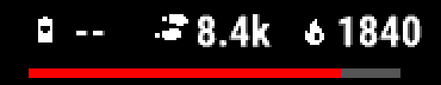

# Elements: common keys and groups

A watch face's design is a tree of **elements**: some draw something (`text`,
the six primitives from `rectangle` to `polygon`, `gauge`, `icon`, `graph`,
`hands`, `pattern`), one draws nothing of its own and only positions others
(`group`), and one shows whatever the wearer picked (`data`). This chapter
covers what every element shares — how to write them, `visible:`,
`static:`, `antialias:`, `min_1px:` — and the `group` container itself. Each element kind's own keys live in its
own chapter, linked below.

## Element types

| Type | Draws | Chapter |
|---|---|---|
| `text` | a string, static or bound to data | [Text](text.md#text) |
| `rectangle`, `circle`, `ellipse`, `polygon`, `line`, `arc` | the primitive itself | [Shapes](shapes.md#shapes) |
| `gauge` | a bar, arc, segments, scale or needle between a value and a max | [Gauges and graphs](progress-and-graphs.md#gauge) |
| `icon` | a glyph from the icon font | [Icons](icons.md#icon) |
| `group` | nothing — a coordinate frame, and optionally a hold target, for its children | [`group`](#group) |
| `graph` | a time series as a line, filled area or bars | [Gauges and graphs](progress-and-graphs.md#graph) |
| `data` | whichever complication the wearer picked for a slot | [On-device configuration](configuration.md#data) |
| `hands` | a named analog hand set, rotated live | [Analog hands](analog-hands.md#analog-hands) |
| `pattern` | one template drawn many times, turned or stepped | [Patterns](patterns.md#pattern) |

## At a glance

Z-order is document order, with an optional `z:` override. Every element takes
`type`, `at`, `sleep_update`, `z`, `visible`, `lint`, `overrides` (per-device
geometry, [Placement](placement.md#per-device-and-per-shape-overrides)) and
`unsupported` (accepted only where something can be unavailable). Its id is its key.

| Key | Where | Values | Default | Meaning |
|---|---|---|---|---|
| (the key) | every element | identifier | required | the element's id |
| `type` | every element | one of the [element types](#element-types) | required | which kind this element is |
| `at` | every element | anchor / `dx`,`dy` / `angle`,`radius` | — | position, axis or origin — see [Placement](placement.md#placement-at-and-align) |
| `align` | kinds with a placement box: `group`, `text`, the primitives (not `polygon`/`line`), `gauge`, `graph`, `icon`, `data` | one of the nine anchor names (`top_left` … `center` … `bottom_right`), or a compass alias | `center` | which point of the box sits at `at:` |
| `color` | most kinds (not `group`) | `color.<name>`, a literal, or a conditional | — | fill/line colour — see each element's own chapter |
| `visible` | every element | boolean expression | — | [draw only while true](#visible--draw-this-only-sometimes); absent means hidden |
| `antialias` | `group`, the primitives, `gauge`, `graph`, `hands`, `pattern`, `icon`, `data` (not `text`) | `true`\|`false` | `defaults:` (`false`) | [soften the edge](#antialias--soften-an-edge) |
| `min_1px` | `group`, the primitives, `gauge`, `graph`, `hands`, `pattern`, and a hand/pattern part (not `text`, `icon`, `data`) | `true`\|`false` | `defaults:` (`false`) | [clamp a length to at least 1px](#min_1px--never-let-a-relative-length-round-to-nothing) |
| `sleep_update` | every element | `true`\|`false` | `false` | also redraw every second while a MIP watch sleeps — see [Power modes](modes-and-interaction.md) |
| `aod` | every element, `group` | `hide`\|`show`\|an override block | inherited | AMOLED sleep frame — see [Always-on display](always-on-display.md) |
| `z` | every element | integer | document order | z-order override; on a `group`, the default for every member |
| `unsupported` | an element anchored to the [subscreen](placement.md#the-subscreen-window), or a `text` with a `face:` font | `error`\|`hide` | `error` (a `text`: its font's own) | what to do on a target that lacks the window, or the face |
| `on_hold` | kinds with a fixed box (not `hands`, not `pattern`) | a complication name, or `auto` | — | touch-and-hold target — see [Interactivity](modes-and-interaction.md#interactivity-on_hold) |
| `lint` | every element | `{allow: [...], reason: ...}` | — | suppress a specific warning — see [Lints](lints.md) |

## Example

```yaml
steps_cluster:
  type: group                        # draws nothing itself; positions its children
  size: { width: 38%r, height: 12%r }
  at: { anchor: top, dy: 75% }
  on_hold: steps                     # one hold target for the whole cluster
  children:
    steps_icon:  { type: icon, icon: steps, size: 9%r, at: { anchor: left }, align: left }
    steps_value: { type: text, text: "{activity.steps / 1000.0:.1f}k",
                   font: FONT_XTINY, at: { anchor: left, dx: 13%r }, align: left }

steps_bar:
  type: gauge
  style: bar
  value: activity.steps
  max: activity.step_goal            # max can be data too
  size: { width: 60%, height: 3%r }
  color: color.accent
  track_color: color.dark
```



A `text:` template's placeholder and a gauge's `value:` take an
**expression**. The compiler turns it into Monkey C, and nothing is
interpreted on the watch. A live watch face gets exactly one
gesture, touch and hold, so `on_hold:` is the only way to interact.

- **`antialias:` at every level.** Set it in `defaults:`, on a group, an
  element, or a font. The nearest setting wins, in either direction. The examples only set
  it per element or per font.
- **`min_1px:`.** Stops a thin relative length (`thickness: 0.4%r`) from
  rounding to 0 px on a smaller screen. It's off by default. You can switch it
  on or off per face, group, element or hand/pattern part. Without it, the
  build warns with `sub-pixel-length`.
  ```yaml
  defaults:
    min_1px: true          # face-wide; a group, element or part can override it
  ```

### Elements are a mapping

`elements:`, `static:` and a `group`'s `children:` are mappings, and the key
*is* the element's id:

```yaml
elements:
  background:
    type: rectangle
    size: { width: 100%, height: 100% }
    color: color.bg
  clock:
    type: text
    text: "{time.clock:%H:%M}"
```

**Order matters.** A YAML mapping is ordered as written, and this compiler
reads it in that order, so document order is draw order — the *second*
element is drawn over the first.

Three things are errors, each reported against your own line:

* writing `id:` inside the body as well — the key already is the id;
* a key that is not a valid identifier (`back-ground:`, `2clock:`);
* the same key twice. YAML itself forbids duplicate keys and the loader
  reports it, so a duplicate id in one mapping is unwriteable rather than
  diagnosed. An id repeated at another level (a group's child named like a
  top-level element) is a `duplicate-id` error.

### `visible:` — draw this only sometimes

```yaml
charging_bolt:
  type: icon
  icon: battery
  at: {anchor: center, dy: 25%}
  visible: "system.charging"
```

An expression that must type as a **boolean** — a comparison, `and`/`or`/`not`,
or a `?:` whose branches are booleans. There is no truthiness rule, so
`visible: activity.steps` is an error naming the type it got: Monkey C has no
truthy Number either, and guessing what the author meant is how a face ends up
showing something nobody asked for.

**Absent means hidden.** If the condition reads a nullable source and the device
cannot supply it, the element is not drawn. There is deliberately **no
`absent:` for visibility**: `absent:` chooses a substitute *value*
(placeholder text, a fallback fraction), and existence has no substitute —
"maybe drawn" is not a thing to fall back to. The two are separate axes and
compose independently: an element can be visible while its value is absent, in
which case `visible:` lets it through and `absent:` decides what it shows.
Concretely, the generated guard is one test:

```monkeyc
// visible: activity.steps > 500 -- absent means hidden
if (activitySteps == null || !(activitySteps > 500)) {
    return;
}
```

**On a `group`, `visible:` gates the whole subtree.** The condition is conjoined
into every element beneath it at build time, so nested groups compose: a child
of a hidden group is hidden no matter what its own `visible:` says, and a child
with its own condition needs both to hold.

A condition that folds to a constant `false` — `visible: "false"`, or something
that reduces to it on a particular device — is the suppressible `dead-element`
warning: the element is generated and never drawn. A constant `true` is not
warned about; it is a normal thing to write while iterating.

Two things `visible:` deliberately does **not** change, both recorded in
[`docs/limitations.md`](../limitations.md):

* the element still occupies its box for the geometry, overlap, safe-area and
  text-overflow checks, because visibility is a runtime fact and the linter
  reasons about build-time geometry;
* it still owns its `on_hold:` hit region. The hit test lives in the delegate,
  which has no access to the frame's readings, and re-reading them at touch time
  would answer about a different moment than the one on screen anyway. A hold on
  a hidden element opens its glance.

### `static:` — draw it once, then blit it

```yaml
static:                     # a top-level block, beside `elements:`
  backdrop:
    type: rectangle
    at: {anchor: center}
    size: {width: 100%, height: 100%}
    color: color.bg
  hour_ticks:
    type: group
    children: { ... }       # twelve tick marks, none of them bound to anything

elements:
  clock:
    type: text
    text: "{time.clock:%H:%M}"
```

Content that never changes is painted **once**, into an offscreen
`Graphics.BufferedBitmap`, and every later frame draws it with a single
`drawBitmap` instead of re-running every primitive. That buffer comes from the
**graphics pool** — 1 MB on every supported target — not from the 128 KB the
watch face itself gets, so a full screen of pixels there costs nothing against
the design's own budget.

**What this buys is CPU and battery, and this repository has not measured it.**
There is no simulator in this container and no watch, so what is verified is
that it compiles, that the fallback path draws the same content, and what it
costs in bytes. See [`docs/limitations.md`](../limitations.md).

A `static:` block may sit at the top level, beside `elements:`, and in each
[layout](styles-and-layouts.md), beside that layout's own `elements:`. The
compiler rewrites each block into one group — the top-level one under the
reserved id `static`, so no element of yours may be called that — and draws
the group from the buffer. An element is static because of where it is
written; there is no per-element flag.

**Static content is always drawn first, wherever you write it.** The buffer is
opaque and covers the whole screen, so its blit erases whatever is under it —
there is no order in which something can be *below* the static content. So the
compiler moves it: every static element is hoisted to the front of draw order,
each `static:` block staying one unbroken run, and everything else draws on
top of the blit. A `z:` inside the block orders the block's own content.

Hoisting swaps elements past each other, and two elements that swap trade which
one is on top. Where that can show — the pair's boxes actually overlap — the
suppressible `static-overlap` warning names it, per device:

```
warning[static-overlap]: 'clock' may draw over 'backdrop' on fenix8solar47mm:
                         hoisting the static content to the front of draw order
                         swapped them round
      confidence: exact -- resolved geometry, but boxes rather than ink: the
                  elements may not overlap where they actually draw
```

Two elements that swap without overlapping — a fixed corner marker and a
centred reading — are silent, because nothing about the picture changed.

Whether a *transparent* buffer would work on these devices could not be
established from the SDK and cannot be tried without a simulator — it is the
only thing standing between this and a static group that can sit anywhere in
draw order.

Everything else the compiler rejects, and why:

| rejected | because |
|---|---|
| any data binding in the subtree, `visible:` included | the buffer is filled once and never refilled; the reading would freeze at whatever it was on the first frame |
| a `graph`, `hands` or `data` element | its content is recomputed or repointed on-device; a buffer filled once would freeze it |
| `sleep_update: true` | `onPartialUpdate` is charged by clip *area*, and the buffer is the whole screen. The AMOLED sleep frame is `aod:`, independent of `sleep_update:` |

A constant expression is fine — it is the *binding* that is rejected, not the
syntax. `color: color.warm` (a swatch) and `visible: "true"` both fold at build time and
are welcome in a static group.

**It always renders, buffer or not.** The generated view allocates behind
`if (Graphics has :createBufferedBitmap)` and null-checks the result, and
`onUpdate` calls the very same `renderStatic(dc)` on the screen's own Dc when
there is no buffer. One method, two call sites, so the buffered and unbuffered
pictures cannot drift apart. `renderStatic` clears to black first: a fresh
buffer's contents are undefined, and since the static content is the first thing
drawn either way, clearing costs nothing and is what makes `wfb preview` — which
also starts from black — agree with the watch.

The `graphics-pool` note reports what the buffer costs, per device, and is
suppressed with `lint: {allow: [graphics-pool]}` on any element inside a
`static:` block:

```
note[graphics-pool]: the static content buffers 67,600 B of the 1,048,576 B
                     graphics pool (6.4%) on fenix8solar47mm
      confidence: estimate -- bytes per pixel for a BufferedBitmap is not
                  published; this uses the display's bitsPerPixel and ignores
                  any per-surface overhead
```

It becomes a warning past half the pool. It is an **estimate** and says so: the
SDK publishes no bytes-per-pixel figure for a `BufferedBitmap`, so this uses the
display's own `bitsPerPixel` from the device files as the nearest honest proxy.

### `antialias:` — soften an edge

```yaml
defaults:
  antialias: true           # face-wide default

resources:
  fonts:
    clock:
      source: assets/OpenSans-Regular.ttf
      size: 68px
      antialias: false      # override: keep the clock crisp

elements:
  dial:
    type: group
    antialias: false        # override: default for this subtree
    children: { ... }
  step_ring:
    type: gauge
    style: arc
    antialias: true
  steps_icon:
    type: icon
    size: 30px              # inherits the face default (true)
```

`defaults: {antialias:}` (default `false`) is the face-wide default,
inherited by every font, icon and primitive-drawing element unless it
overrides it. It reaches two entirely different SDK mechanisms, gated in two
entirely different ways:

* **A bitmap font** (a `fonts:` entry, or the synthetic font an `icon` bakes)
  is a *resource* attribute -- `<font antialias="true">` -- and the resource
  compiler bakes an 8-bit grey ramp instead of a 1-bit mask. No device gating
  is needed: the SDK's own history notes that the toolchain overrides the
  attribute itself on devices too old to render it (Forerunner 45, Forerunner
  920XT, Edge 130), which is not a concern for any of this project's three
  targets in any case.
* **A primitive, `gauge`, `graph`, `hands` or `pattern` element's own drawing** is a
  runtime `Dc` call,
  `setAntiAlias`, gated per device with a `has :setAntiAlias` check --
  `doc/docs/Core_Topics/Graphics.html` gives this idiom verbatim, and the
  generated helper (`applyAntiAlias`, deliberately *not* named `setAntiAlias`:
  `dc has :setAntiAlias` would then resolve against the view's own private
  method, and `monkeyc` warns on every target) is unconditional: a
  build-time gate is not an option, because `wfb` generates one view shared by
  every target device. The face default is reset once at the top of
  `onUpdate` (covering both the awake and asleep branches), `onPartialUpdate`
  and `renderStatic`; an element whose own `antialias:` differs from the face
  default sets and restores it around its own drawing only, so guard early
  returns above it never leave the wrong state behind for the next element.
  `text` and `icon` never emit any of this -- they draw glyphs, and a
  glyph's anti-aliasing is the font-baking half above.

**Inheritance is a default, not a conjunction.** A `group`'s own `antialias:`
becomes what its subtree inherits, and a descendant's own `antialias:` always
wins outright over its enclosing group's -- there is no meaningful "AND" of two
booleans that both just mean "should this look soft", unlike `visible:`, where
conjoining an ancestor's condition into a descendant's is exactly the point.
Leaving it unset anywhere in the chain falls through to the next enclosing
group, and ultimately to the face-wide default.

**Accepted on every element type except `text`**: `group`, the primitives,
`gauge`, `graph`, `hands` and `pattern` (the runtime half), and `icon` and
`data` (the baked-font half, for the icon each draws).
Not on `text`: a `text` element draws through a font named in `fonts:`, and that
font is one bitmap resource shared by every element that references it, so
anti-aliasing cannot vary per element the way it can on a shape's own outline
or an icon's own, per-glyph font. Writing `antialias:` on a `text` element is a
build error pointing at that font's own `antialias:` instead -- naming the
actual font this element uses when it names a custom one, or saying plainly
that a system font has no `antialias:` of its own when it does not.

**Cost is measured, not estimated, on both sides -- but read the caveat under
the tables before comparing any two `.prg` figures of your own.** The two
sides move different numbers, because they are different kinds of thing.

The font side is baked into a *resource*, so it moves the `.prg` and never
`--build-stats`. On the Phase 2 slice (now `ts/test/fixtures/slice/`), all three
targets, output paths held to the same length:

| | `.prg` (fenix8solar47mm) | vs. previous row | `--build-stats` |
|---|---|---|---|
| no `antialias:` anywhere | 96,076 B | — | 833 B data, 1,317 B code |
| the eleven-glyph 68px clock font | 96,732 B | **+656 B** | *unchanged* |
| the 30px `steps` icon as well | 96,988 B | **+256 B** | *unchanged* |

The primitive side is emitted *code*, so it moves both -- and only this side
counts against the 128 KB watch-face budget at all. On `examples/antialias/`
(since removed; `git show a645d64:examples/antialias/face.yaml`), which turns
the face default on and has one element override it back:

| | `--build-stats` | total | `.prg` |
|---|---|---|---|
| no primitive anti-aliasing | 833 B data, 1,317 B code | 2,150 B | 96,876 B |
| the face default on, one override | 842 B data, 1,380 B code | 2,222 B | 97,148 B |

That **+72 B** decomposes as +9 B data and +39 B code for the guarded helper
and its one reset call, plus +24 B code for each element that overrides the
default (the two extra calls bracketing its own drawing).

**Two things these numbers do not tell you, stated rather than implied.**

First, **a `.prg`'s size depends on the path it was built at** -- the same
generated source built to two output directories whose names differ in length
produced files 80 B apart, with byte-identical `source/`. So a `.prg`
comparison is only meaningful between builds whose output paths are the same
length, which is how every figure above was taken; `--build-stats` has no such
problem and is the instrument to prefer wherever it moves at all.

Second, **the runtime RAM the SDK's own Resources page warns font
anti-aliasing costs** ("since bitmap fonts can take a lot of runtime
memory...") **and any CPU or battery cost of the primitive side are measured
by neither `--build-stats` nor the `.prg`, and stay unquantified here** --
there is no simulator or device in this container to read either from
(`docs/limitations.md`). Nor has the visual improvement itself been seen: the
softer edge is what the SDK says these switches do, not something this project
has rendered on a panel.

**A soft edge on a 64-colour panel dithers, and the linter says so.** The
suppressible `antialias-dither` check fires once per device, against the
first element (in draw order) whose `antialias:` resolves to `true` there, on
any device whose panel shows only 64 colours -- all three of this project's
current targets, so it fires on every face that turns the feature on for a
primitive, `gauge`, `graph`, `hands` or `pattern` element. See [Lint suppression](lints.md#lint-suppression) and
`docs/limitations.md`. Accept the tradeoff explicitly with
`lint: {allow: [antialias-dither], reason: ...}`, as the removed
`examples/antialias/` did.

### `min_1px:` — never let a relative length round to nothing

```yaml
defaults:
  min_1px: false             # face-wide default (also the default default)

elements:
  dial:
    type: group
    min_1px: true           # on for this subtree
    children:
      rim:
        type: arc
        radius: 92%r
        thickness: 0.4%r     # inherits true from the group -> clamped to 1px
      tick_ring:
        type: pattern
        min_1px: false       # override back off for this one element
        pattern: radial
        count: 60
        color: color.fg
        parts:
          - type: line
            at: {dy: -90%r}
            to: {dy: -86%r}
            thickness: 0.4%r  # inherits false from the element -> rounds to 0px
          - type: circle
            min_1px: true     # ...but this one part opts back in
            at: {dy: -84%r}
            radius: 0.4%r     # -> clamped to 1px
```

`min_1px:` switches on the clamp described under [Lengths](placement.md#lengths): a
nonzero `%`/`%r` length resolved as a `size:`, `thickness:`, `bar_width:`
or an element/part's own `radius:` is never allowed to round to 0 px. It
defaults to `false` — the platform's own rounding, exactly as every face
has always drawn — because the clamp is a real, visible change to a face's
geometry (a hairline authored to vanish on a small screen now draws a
pixel wide there), not a pure bugfix every existing face should start
applying silently. Turning it on is a decision the author makes on
purpose, for the whole face or for as small a subtree as one element or
one part.

**Inheritance is a default, not a conjunction, identical in shape to
`antialias:`** (see above — the same reasoning applies verbatim): a
face-wide `min_1px:` is the default every group, element and part
inherits; a `group`'s own value becomes the default for its whole subtree;
an element's own value always wins outright over its enclosing group's;
and — one level deeper than `antialias:`, which stops at the element — a
hand or pattern **part**'s own value always wins outright over its owning
element's. Nothing accumulates and nothing is a logical AND: a `false`
written under a `true` ancestor switches the clamp back off exactly as
readily as a `true` written under a `false` ancestor switches it on, at
every one of the four levels. This "both ways" half is the one worth
stating plainly, because it is easy to assume away — it is tempting to
read an inherited switch as "everything under a face-wide `true` is safely
covered," but an override at any level is a plain replacement of whatever
it inherited, not a floor underneath it.

It reaches one level deeper than `antialias:` because that is where the
in-scope lengths actually live: a `rectangle` part's `size:`, a
`line`/`circle`/`arc` part's `thickness:`, a `circle`/`arc` part's
`radius:`. `antialias:` brackets an element's *one* draw call, which a
part does not have on its own — there was never a part-level "should this
look soft" to ask. `min_1px:` is squarely about whether one specific
length rounds to zero, and a hand or pattern template's parts are exactly
where those lengths are authored.

**Accepted on `group`, the primitives, `gauge`, `graph`, `hands` and
`pattern`, and on an individual hand or pattern part.** **Not accepted on
`text`, `icon` or `data`.** Unlike `antialias:`, which needs
a build-error redirect on `text` (there is another key to point the
author at — the font's own `antialias:`), `min_1px:` needs no such
redirect: a font size, including an icon's `size:` (or a `data` element's
`icon: {size:}`), already
resolves through `pixelSize` in `ts/src/units.ts`, which floors at 1 px on its own,
unconditional path. There is nothing left to switch for these three
kinds, so the schema simply does not offer the key there, and writing it
anyway gets the ordinary "unknown key" error every other unrecognised key
already gets.

**A new suppressible lint, `sub-pixel-length`, reports the case the
switch exists for.** With the clamp off at the length's own nearest
declaration — whether because a face never turns it on, or because a
nearer declaration turns it back off — a nonzero `%`/`%r` length that
resolves below 1 px on a given device emits a warning naming the element
(and the part, for a hand/pattern part), the key, the authored length, the
resolved value and the device, with a note on both fixes: turn `min_1px:`
on at whichever level actually needs it, or accept the vanish
deliberately with `lint: {allow: [sub-pixel-length], reason: ...}` on the
owning element. A hand or pattern part has no `lint:` of its own, so a
part's finding is suppressed the same way its `min_1px:` is inherited
when it declares none of its own: through its owning element. See [Lint
suppression](lints.md#lint-suppression) and `docs/limitations.md`.

### `group`

```yaml
hr_group:
  type: group
  size: {width: 60%, height: 20%}
  at: {anchor: center, dy: -20%}
  on_hold: heart_rate      # optional -- see [Interactivity](modes-and-interaction.md#interactivity-on_hold)
  children:
    hr_icon:
      type: icon
      icon: heart
      size: 10%r
      at: {anchor: center, dx: -15%}
    hr_value:
      type: text
      text: "{heart_rate.current:d}"
      absent: hide
      at: {anchor: center, dx: 15%}
```

A container with `children:` and its own `size:`/`at:`. **Percentages inside a
group resolve against the group's own box, not the screen** — `dx: -15%` above
is 15% of the group's 60%-of-screen width, not 15% of the screen. This is what
makes a cluster of elements (an icon plus its reading, a row of stats)
positionable and resizable as one unit: move or resize the group, and every
child's relative position follows without being restated.

A group draws nothing of its own — no fill, no border — it is purely a
coordinate frame and, when it carries `on_hold:`, a hit region. Use a
`rectangle` underneath it for a visible background.

**`on_hold:` on a group covers the group's whole box**, not just one child — the
natural way to make a multi-element cluster (an icon next to its value, as
above) act as a single touch target instead of naming `on_hold:` on each piece
separately. See [Interactivity](modes-and-interaction.md#interactivity-on_hold).

**`visible:` on a group gates every element beneath it**, at any depth. The
group's condition is conjoined into each descendant's own at build time (a group
emits no code of its own, so there is nothing else it could mean), which is why
nesting composes: an inner group's condition and the outer one both have to hold
for a leaf to draw. See "`visible:`" above.

**A group passes `sleep_update:`, `z:`, `antialias:` and `min_1px:` down**
to every member that does not set its own, the nearest group winning; an
explicit `sleep_update: false` keeps one member out of a sleep-updating
group. Its `lint: allow` covers every member too, added to each member's
own. `aod:` merges key by key with the member's own ([Always-on
display](always-on-display.md)), and `visible:` is ANDed in (above).

**`outline:` on a group rings the union of its members**: every member's
ring just before the first member, then the members, so members that touch
share one ring with no seam. See [Outlines](outlines.md#groups).

`align:` follows the one placement rule every accepting kind
shares: [Placement: `at:` and `align:`](placement.md#placement-at-and-align). A group's
placement box is its own `size:`. It defaults to `center`: the box centred
on `at:`. Children then resolve their own
`%`/`%r` positions against whatever box this produces, so moving `align:`
moves every child with it, without restating anything.

```yaml
data_window_right:
  type: group
  at: { anchor: center, dx: 50%r }
  size: { width: 25%r, height: 20%r }
  align: right        # the box's right edge sits at centre + 50%r, not its centre
  children:
    data_r_shadow_dark:
      type: rectangle
      color: color.dark_gray
      at: { anchor: center }
      size: { width: 100%, height: 100% }
```

`left`/`right` put that edge of the box at the point instead of the centre;
`top`/`bottom` do the same vertically, and `top_left` … `bottom_right` both
at once.

**Every kind that has a placement box takes `align:`:** `group`, `text`,
the primitives (not `polygon`/`line`), `gauge`, `graph`, `icon` and
`data` — plus a hand or pattern `rectangle`/`circle` part
(aligned in the part's own frame) and a pattern `type: text` part (aligned
at the anchor only). See the table in
[Placement: `at:` and `align:`](placement.md#placement-at-and-align) for the full list,
and its "Not accepted on" list for the handful of kinds with no single point
to align on, or whose `at:` is a pivot rather than a box (`polygon`,
`line`, the matching part types, and `type: hands`/`type: pattern`
themselves).

## See also

- [`examples/showcase/face.yaml`](../../examples/showcase/face.yaml) — icon/value clusters, a gauge bar, and the `group` above.
- [Placement: `at:` and `align:`](placement.md#placement-at-and-align) — the shared alignment rule.
- [Power modes and touch-and-hold](modes-and-interaction.md) — `sleep_update:` and `on_hold:` in full.
- [Lints and suppression](lints.md) — `lint:` and every suppressible check named in this chapter.
- [`docs/limitations.md`](../limitations.md) — static-buffer transparency, `min_1px:`/`antialias:` measurement caveats, and what is not yet implemented.
