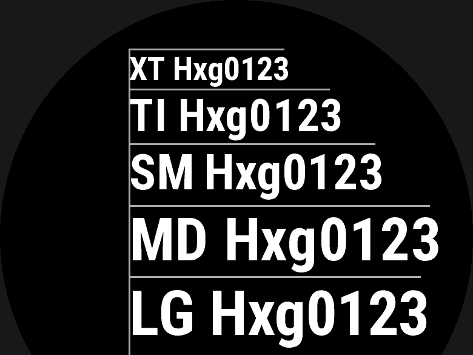

# Fonts

A watch face cannot ship its own TTF/OTF, so `fonts:` is how an author's own
typeface reaches the wrist anyway: name a `.ttf`/`.otf` and a size, and the
compiler bakes it into a bitmap sheet, per device, at build time. An element
then names it with `font.<name>`, or names one of the device's own built-in
`FONT_*` fonts directly, with no `fonts:` entry at all. `wfb fonts
[DEVICE...]` lists a device's fonts — both the system (bitmap) fonts and any
device-resident scalable faces reachable with `face:` (below).


*A monospaced custom font, coloured per digit, from `examples/showcase/face.yaml`.*

## At a glance

| Key | Where | Values | Default | Meaning |
|---|---|---|---|---|
| `fonts.<name>.source:` | top level | path to a `.ttf`/`.otf` | — | [Fonts](#fonts) (baked font, relative to the design file) |
| `fonts.<name>.size:` | top level | `Length` (`px`/`%r`) | — | [`size:` is a `Length`](#size-is-a-length) |
| `fonts.<name>.glyphs:` | top level | a string of characters | derived from the design | [Everything else](#everything-else) |
| `fonts.<name>.antialias:` | top level | `true`/`false` | `false`, or the face-wide `antialias:` default | [Everything else](#everything-else) |
| `fonts.<name>.monospace:` | top level | `true`/`false` | `false` | [`monospace:`](#monospace-stops-a-clock-from-jittering) |
| `fonts.<name>.align:` | top level | `left`/`center`/`right` | `center` | [`monospace:`](#monospace-stops-a-clock-from-jittering) (needs `monospace: true`) |
| `fonts.<name>.face:` | top level | a face name, or a list tried in order | — | [Vector (`face:`) fonts](#vector-face-fonts-device-resident-scalable-and-turnable) |
| `fonts.<name>.if_unavailable:` | top level, or a `text` element | `error`/`hide` | `error` | [`if_unavailable:`](#if_unavailable--and-what-error-actually-promises) |
| `font:` | element | `font.<name>` or a system name (`FONT_MEDIUM`, …) | — | [Fonts](#fonts) |

## Example

```yaml
fonts:
  digitalclock:
    source: assets/ChivoMono-Bold.ttf
    size: 60%r            # scales with each watch's screen
    monospace: true       # "11" and "00" take the same width: no jitter
    antialias: true

elements:
  hours:   { type: text, value: time.hour,   format: "{:02d}", font: font.digitalclock,
             at: { anchor: center, dx: -1%, dy: 7% }, align: right, color: config.colors.fg,
             modes: [active, low_power] }        # also redrawn every second while asleep
  minutes: { type: text, value: time.minute, format: "{:02d}", font: font.digitalclock,
             at: { anchor: center, dx: 1%,  dy: 7% }, align: left,  color: config.accent_color,
             modes: [active, low_power] }
```

`FONT_XTINY` … `FONT_NUMBER_THAI_HOT` name the watch's built-in fonts. A
`font.<name>` reference uses one of your own from `fonts:`.

`modes:` says when an element is redrawn. The default, `[active]`, redraws it
every second while the watch is awake and once a minute while it is asleep.
Adding `low_power` also redraws it every second while asleep. That works on
MIP screens only, and it costs battery, so `wfb` warns when the redrawn area
gets large. See [Power modes and touch and hold](modes-and-interaction.md) for `modes:`.


*`FONT_XTINY` through `FONT_LARGE`, from `examples/system-fonts/text/face.yaml` — a
calibration face with no data bindings, used to check `wfb preview` against a
real device.*

## Fonts

```yaml
fonts:
  clock:
    source: assets/OpenSans-Regular.ttf   # relative to the design file
    size: 18%r                            # or 12px -- see below
    glyphs: "0123456789:"                 # optional -- see below
    antialias: false
    monospace: false                      # one cell width for every glyph
    align: center                         # where the ink sits in that cell
```

The compiler rasterises the TrueType source into a BMFont sheet at build time,
per device.

### `size:` is a `Length`

| Written | Means | Per device |
|---|---|---|
| `size: 18%r` | 18% of **this device's own minor radius** | 23 px on a 260×260 screen, 25 px on a 280×280 one |
| `size: 12px` | exactly twelve pixels | 12 px everywhere |

**Prefer `%r`.** It says the thing a design actually means — "this font is a
fixed fraction of the dial" — directly, per device, in the same unit `at:`,
`radius:` and an `icon`'s `size:` already use, and it scales transparently: a
device joining or leaving the target list never changes what an existing
device renders. `px` is for the rarer case where you deliberately want the
same pixel count everywhere.

A bare number (`size: 68`) is not a length. It is a build error naming the
conversion rule — `size / (smallest target's minor
radius) * 100`, expressed as a `%r` length — since this stage of the compiler
has no device knowledge to compute an actual number from; e.g. 68 on a 130 px
minor radius (the fēnix 8 Solar 47 mm / fr955) is `52.3076923077%r`, carried to
enough decimal places to bake to the identical pixel size on every device.
There is no `scale:` key.

* **Only `px` and `%r` are allowed.** `%` is of a parent box and `pt` is of a
  font, and a sheet is rasterised before any element is placed — there is no box
  yet, and for a font's own size `pt` would be measuring against itself. Both
  are a build error naming `%r`.
* **A font's declared size is the nominal em size**, handed to the rasteriser as
  written. It is deliberately *not* normalised to a measured ink height the way
  an `icon`'s `size:` is: an icon draws one glyph on its own, where ink height
  is the whole of what a size can mean, while a typeface's characters are drawn
  against a shared baseline and their relative proportions are the point.
  See `wfb/icons.py`'s `bake_size` docstring for the full reasoning.

### `monospace:` stops a clock from jittering

```yaml
fonts:
  clock:
    source: assets/OpenSans-Regular.ttf
    size: 22%r
    monospace: true
    align: center      # or left, or right
```

`monospace: true` bakes **every glyph at the same advance** -- the widest the
baked set needs, and never narrower than the widest ink. Nothing changes at
runtime: the device simply reads those advances out of the `.fnt`.

Why it matters: a centred clock in a proportional face **moves as its digits
change**. Measured on Open Sans at 33 px, `Fri 11:11` is 111 px wide and
`Wed 00:00` is 125 px, so a centred element shifts seven pixels between two
Fridays. Monospaced, both are 217 px and every character sits in the same
column it sat in a second ago.

* It works on a **proportional source as well as a monospaced one**, because
  the cell is measured from the glyphs actually baked rather than read off the
  font's own `post` table. A face whose figures are already tabular (Open Sans
  is one -- every digit is exactly the same width) still gains a fixed column
  for the *colon*, which is otherwise about half a digit wide.
* The row gets **wider**, not narrower: the narrow characters are padded up to
  the cell, never the reverse. `wfb`'s text-overflow and safe-area checks
  measure the baked advances, so they see that width without being told about
  it -- but a design that was already close to the bezel may start warning.
* **`align:` places the ink inside the cell** -- `center` (the default) is what
  a digital readout wants; `left` and `right` line up the edges of a column of
  readings. A glyph with no ink at all, such as a space, keeps a zero offset.
* **`align:` without `monospace: true` is a build error.** A proportional font
  has no cell for the ink to sit in, so honouring it would mean doing nothing
  silently.
* This is a **custom-font** feature. A system font (`FONT_NUMBER_HOT`, ...) is
  the device's own, already rasterised, and cannot be rebaked -- see
  `docs/limitations.md`.

Vertical placement is deliberately not part of this: baseline and line height
are the font's own metrics, and a `text` element already has `vertical_align:`.

### Everything else

* **Omit `glyphs` and the compiler derives the set** from every format spec and
  literal string the design can render. The example face's clock font carries
  eleven glyphs rather than a character set — on a 128 KB budget that is the
  difference between a large font fitting and not.
* **Glyphs are rasterised at 16x and averaged down**, not drawn straight at the
  target size. At single-digit sizes FreeType's hinting fits the outline to the
  pixel grid and breaks the shape's own symmetry — measured across 99
  provably-symmetric glyphs from the icon font, **16.8% of ink pixels landed
  asymmetrically**: a plain square baked to 7x7 ink inside an 8x8 tile, and a
  ring came out lopsided in every row. Rasterising large and box-averaging
  recovers real per-pixel coverage before the 1-bit threshold sees it, which
  brings that to **1.1%**. Advances and line metrics are untouched, so this
  changes how a glyph looks, never where it sits.
* **`antialias` defaults to false**, or to the top-level `antialias:` default
  when there is one -- Bitmap fonts are 1-bit by default because anti-aliasing
  costs runtime RAM. See [`antialias:` — soften an edge](elements.md#antialias--soften-an-edge) for the full
  picture, including the icon and primitive-drawing elements that share this
  same key.

A glyph the design can render but the font does not contain is a **build error**,
checked against the baked sheet's own character map.

Alternatively name a system font directly: `font: FONT_MEDIUM`,
`font: FONT_NUMBER_HOT`, and so on.

### Vector (`face:`) fonts: device-resident, scalable, and turnable

A `fonts:` entry can name a **device-resident scalable face** instead of
baking one from your own file — `face:` instead of `source:`:

```yaml
fonts:
  clock:
    source: assets/ChivoMono-Bold.ttf     # unchanged: baked from your own file
    size: 30%r
  bezel:
    face: [RobotoCondensedBold, RobotoCondensedRegular]   # device-resident
    size: 6%r
    if_unavailable: hide                  # default: error -- see below
```

`source:` and `face:` are **mutually exclusive and jointly required** — an
entry naming neither, or both, is rejected naming the missing half rather
than reading as an unknown key.

* **`face:` is a name, or a list of names tried in author order.** It reaches
  `Toybox.Graphics.getVectorFont` at draw time instead of a baked `<font>`
  resource — nothing is rasterised for it at build time. The list is
  resolved **per target device, at build time**, to the one face that
  device actually publishes; `:face` is emitted as that single resolved
  string, never the array. Garmin's own runtime array fallback (trying each
  name in turn on the watch itself) is deliberately not used: it picks a
  face at draw time, so the build could not say which one renders, or
  measure a layout box against it.
* **`size:` works exactly like a baked font's** — `px` or `%r`, resolved per
  device. Unlike a baked font, nothing is rasterised at this size at build
  time: `Graphics.getVectorFont` takes it directly, in pixels, so one face
  serves any number of sizes with no extra sheets.
* **`glyphs:`, `monospace:`, `align:` and `antialias:` are all build errors
  on a `face:` entry**, each naming why: every one of the four is a property
  of baking a bitmap sheet, and a vector font has no sheet.
* **Reach is narrow and cannot be extended.** Only Garmin's own fixed
  catalogue of on-device faces is reachable this way — about 14 Latin ones —
  and only **44 of the 136** watch-face-capable devices in the reference
  publish any scalable face at all. `RobotoCondensedBold`/
  `RobotoCondensedRegular` are on 41 of those 44 and are the closest thing to
  a dependable choice; nothing can add a face to the list, so an author's own
  typeface can never be one. Full measurement: `docs/research/12-vector-fonts.md`.
  `wfb fonts <device>` shows exactly which faces one device publishes and
  whether it can pair `Graphics.getVectorFont` with `curve: {style: radial}`
  or `curve: {style: angled}`.

#### `if_unavailable:` — and what `error` actually promises

`error` (the default) or `hide`, set on a `face:` font entry and,
independently, on any `text` element that uses one — **the element's own
value wins outright** over the font's, the same "a descendant's own value
wins over its group's" rule `antialias:` already follows.

* **`error`**: if *any* target device does not publish one of the requested
  faces, the build fails, naming the device, the face(s) asked for, and the
  faces that device does publish. This is the default because a missing
  clock is not a cosmetic problem.
* **`hide`**: the element simply does not draw on the devices that fail.
  Every other device is unaffected.
* `if_unavailable:` on a **baked** font entry, or on an element whose font is
  baked or a system font, is a build error: there is nothing that can be
  unavailable, so accepting it would promise a check that never runs.

**The honest limit of `error`: it is a build-time guarantee only.**
`Graphics.getVectorFont` can return `null` at runtime even when every
build-time gate passed — the platform offers no way to fail loudly at draw
time — so the generated code *always* null-checks before drawing, in both
modes, and a null font simply draws nothing. `error` guarantees the face was
published at build time; it does not, and cannot, guarantee the element is
never missing from the wrist.

## See also

- [`examples/showcase/face.yaml`](../../examples/showcase/face.yaml) — the two-tone monospaced clock shown above.
- [`examples/system-fonts/text/face.yaml`](../../examples/system-fonts/text/face.yaml) — every system font, one per row.
- [`examples/features/vector-text/face.yaml`](../../examples/features/vector-text/face.yaml) — `face:` fonts paired with `curve:`.
- [Text](text.md#curve--rotated-and-radial-text) — `curve:`, which requires a `face:` font.
- [Elements: common keys and groups](elements.md#antialias--soften-an-edge) — `antialias:`'s face-wide default.
