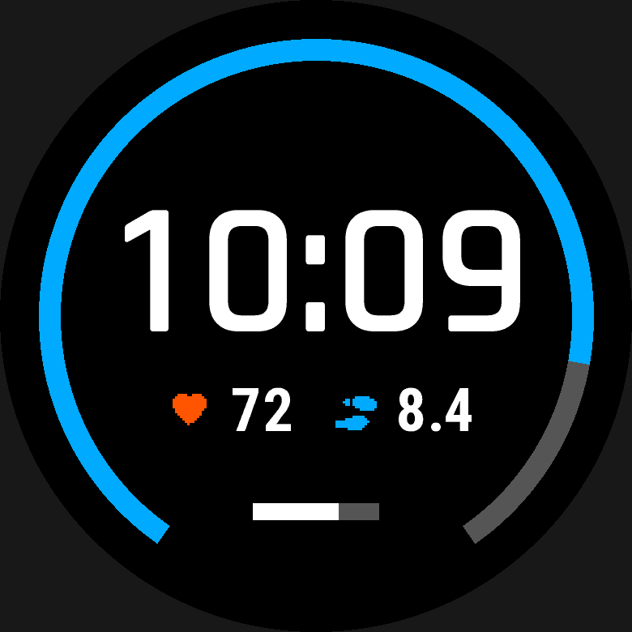
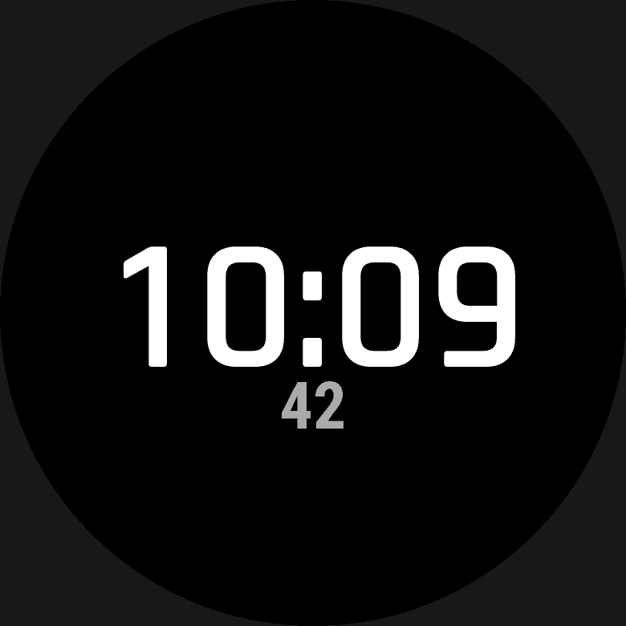

# Getting started

This is the first page to read. It gets you from a clean checkout to a watch
face running on your wrist: installing the toolchain, generating a starter
design, and building and sideloading it. Everything else in the guide builds
on the file `wfb new` writes for you here.

## A few terms used below

| Term | Meaning |
|---|---|
| complication | a piece of data the watch publishes for faces to show, such as Body Battery or sunrise time. A *complication slot* lets the wearer choose which one appears. |
| glance | Garmin's full-screen view of one metric, which a face can open |
| MIP / AMOLED | the two kinds of watch screen. MIP (for example the fēnix Solar models and the Forerunner 245/255/955) is always on and has 64 colours. AMOLED needs a sparse always-on layout to avoid burn-in. |
| active / low power | the watch is *awake* (right after you raise your wrist) or *asleep* (the rest of the time) |
| `%r` | a length as a percentage of the screen's radius ([placement](placement.md)) |

## Walkthrough: zero to a watch face on your wrist

### What you need

| | |
|---|---|
| **Linux** | Tested. `tools/setup-env.sh` installs everything else. You need `bash`, `curl`, `unzip`, `openssl`, Python 3 with `venv` (or `uv`), and Java 21 or newer (Garmin's compiler is a Java program). The script checks for all of these first. |
| **macOS** | Use the Docker image. It is tested with [OrbStack](https://orbstack.dev). `setup-env.sh` fetches the Linux SDK, so it doesn't work on a Mac itself. |
| **Windows** | Not tested. |
| **A Garmin account** | Needed once, to download the device definitions (step 1). |
| **A watch** | any Connect IQ watch that can run a watch face ([which watches](#which-watches)), and its USB cable. |

### Step 1: get the device definitions

The compiler needs Garmin's description of each watch, and a script can't
download it because Garmin's server requires you to sign in. So get it once by
hand:

1. Install Garmin's
   [Connect IQ SDK Manager](https://developer.garmin.com/connect-iq/sdk/), sign
   in, and download the devices you build for.
2. The SDK Manager saves them here:
   - macOS: `~/Library/Application Support/Garmin/ConnectIQ/Devices`
   - Linux: `~/.Garmin/ConnectIQ/Devices`
   - Windows: `%APPDATA%\Garmin\ConnectIQ\Devices`
3. Where to put them depends on how you run `wfb`:
   - **Linux, downloaded on this machine:** nothing to do. `setup-env.sh` finds
     them in `~/.Garmin/ConnectIQ/Devices`.
   - **Linux, downloaded on another machine:** copy that folder's contents
     into `vendor/devices/` in this repository. That folder is gitignored,
     because the files are your licensed copy.
   - **Docker:** nothing to copy. Step 2 mounts the folder into the container.

**Optional:** the same SDK Manager install also has Garmin's own font files
(next to `Devices`, in a `Fonts` directory). Free stand-ins work without
them, but if you have them, put them at `vendor/fonts/` the same way (or
mount `Fonts` at `/fonts` for Docker) — `wfb doctor` says which one a build
would use.

### Step 2: install

**Linux:**

```sh
./tools/setup-env.sh                # SDK, signing key, device files, icon + system fonts, .venv
alias wfb="$PWD/wfb.py"             # put this in your shell profile
```

The script is safe to re-run. It also prints two `export` lines (`CIQ_SDK`
and `PATH`); add them to your shell profile too. `wfb.py` runs
under the project's `.venv` on its own, so you don't need to activate it. Run
`wfb doctor` to check that everything is in place.

**macOS (Docker):**

```sh
docker build -t garmin-wf-builder .
alias wfb='docker run --rm -v "$PWD:/work" -v "$HOME/Library/Application Support/Garmin/ConnectIQ/Devices:/devices:ro" -v wfb-keys:/keys garmin-wf-builder'
```

The container sees only the current directory, so run `wfb` from the folder
that holds your face. The `wfb-keys` volume keeps your signing key between
runs. See [`docs/container.md`](../container.md) for details.

### Step 3: make a face and build it

```sh
wfb new "My Face"                   # writes my-face.yaml from a template (--list for more)
wfb preview my-face.yaml            # draws it to build/preview/<watch>.png
wfb validate my-face.yaml           # schema, semantic checks and lints; no SDK needed
wfb build my-face.yaml              # generate Monkey C and compile
```

| `wfb new "My Face"` | `wfb new "My Face" -t minimal` |
|---|---|
|  |  |

```
generated  /home/you/faces/build/my-face
built      my-face-fenix8solar47mm.prg  2,775 B / 131,072 B (2.1%)
built      my-face-fenix8solar51mm.prg  2,775 B / 131,072 B (2.1%)
built      my-face-fr955.prg            2,775 B / 131,072 B (2.1%)
```

`-d <device>` (repeatable) limits `preview`, `validate` and `build` to the
watches you name. It takes any watch you have definitions for, not only the
ones under `targets:`, so you can try a face on another model without editing
it: `wfb build my-face.yaml -d fenix7pro` builds just that one, with a note
that it isn't a listed target. `wfb devices` lists the watches you can name,
and `wfb fonts [DEVICE...]` lists each one's scalable and system fonts.

While you edit, `wfb preview my-face.yaml --watch` redraws the PNG every time
you save; it keeps running until you press Ctrl-C. Three commands list what a
face can use: `wfb sources` (data you can show), `wfb series` (data you can
plot) and `wfb complications` (what touch-and-hold can open).

The smallest complete face is a clock. Everything else on this page adds to
this:

```yaml
format: 1
face: { id: 6f1c2b7e-3d4a-4e5f-9a1b-2c3d4e5f6a7b, name: Minimal Clock, version: 1.0.0 }
targets: [fenix8solar47mm, fenix8solar51mm, fr955]

palette:
  fg: "#FFFFFF"                      # MIP screens: each channel 00, 55, AA or FF

elements:
  clock:
    type: text
    value: time.clock
    format: "{:%H:%M}"
    font: FONT_NUMBER_HOT
    at: { anchor: center }
    align: center
    vertical_align: center
    color: palette.fg
```

`face.id` identifies the app to the watch: two faces with the same id replace
each other. `wfb new` generates a fresh one for you.

### Step 4: put it on the watch

1. Connect the watch over USB. These watches connect over MTP, not as a USB
   drive. On macOS, use [OpenMTP](https://openmtp.ganeshrvel.com). On Linux,
   your file manager handles MTP.
2. Copy the `.prg` for your model, for example
   `build/my-face/my-face-fenix8solar47mm.prg`, into the watch's
   `GARMIN/APPS/` folder.
3. Unplug the watch, then choose the face in its watch-face list.

To update the face, copy a new build over the old file. To remove it, delete
the file.

**What the build produces** (in `build/<name>/`):

| Output | What it is |
|---|---|
| `<name>-<device>.prg` | the signed face, to copy to `GARMIN/APPS/` |
| `source/*View.mc`, `*Delegate.mc`, `Palette.mc`, … | generated Monkey C, shared by all devices |
| `source-<device>/Layout.mc` | every `%` and `%r` resolved to pixels for that screen |
| `resources-<device>/fonts/` | your TTFs baked to bitmap fonts, holding only the glyphs you use |
| `manifest.xml`, `monkey.jungle` | permissions and API floor, derived from what you bind |
| `runtime-lib/` | only the helper modules the face needs |

The memory figure comes from the compiler's own measurement, not an estimate,
against that watch's own limit: 128 KB on current models, less on older ones
(for example 112 KB on the fēnix 6, 96 KB on the Forerunner 245).

### Which watches

`wfb` isn't tied to particular models. It reads each watch's screen, memory
limit and API list from Garmin's device definitions, resolves the layout for
that screen and checks the face against it. What bounds the range is the
platform, not a list of supported devices:

- **The watch must run watch faces at all.** 28 of the 164 devices in
  Garmin's SDK can't; `wfb` refuses them.
- **Connect IQ 3.1 or newer.** Every generated face declares 3.1.0 as its
  minimum. That covers the fēnix 5 generation and everything since, and an
  older model qualifies if its firmware was updated to 3.1 or later. Below
  that, `wfb` refuses the device with a clear build error rather than
  letting `monkeyc` fail on it.
- **Newer features switch off where the watch lacks them**, rather than
  locking the face out. Complications need Connect IQ 4.2 and the on-device
  face editor needs 5.1 plus Garmin's editor (fēnix 8 and later). On an older
  watch a complication reads as absent, the face keeps its default
  configuration, and the build warns (`api-gated`, `config-unsupported`). Touch-and-hold needs a touchscreen
  (`hold-unsupported` otherwise).
- **Round screens are the home ground.** Rectangular screens get the same
  layout checks. On semi-round and semi-octagon screens the face builds, but
  the visible-area check reports "not checked".
- **MIP and AMOLED screens both work**, but AMOLED watches can't use
  `low_power` updates and need an `aod:` sleep frame instead
  ([always-on display](always-on-display.md)); the lints say so.
- **Memory is the watch's own limit**, measured on every build: 128 KB on
  current models, as little as 96 KB on some older ones.

You need the device definitions for each watch you build for (step 1).

### If something goes wrong

- **Start with `wfb doctor`.** It lists what is installed and what to do about
  anything missing.
- **`Invalid device id specified`** from the compiler means the device
  definitions are missing (step 1).
- **`unknown data source`** from `wfb validate` means a `value:` or `color:`
  names something that doesn't exist. The error suggests close matches, and
  `wfb sources` lists them all.
- **Warnings** fail nothing, but each one explains itself and says how sure
  it is. [Lints and suppressions](lints.md) shows how to keep a design that a warning flags on purpose.

## Working comfortably

**Start from a template rather than a blank file:**

```sh
wfb new "My Face"                 # the dashboard template
wfb new "My Face" -t minimal      # just a background and the time
wfb new --list                    # what else there is
```

- **`wfb new -t <template>`.** Starts from a known-good design (`--list` shows
  the templates).

**Turn on editor autocomplete.** The schema is a shipped artefact, so a YAML
language server will complete keys, document them on hover, and flag mistakes as
you type. Either add a modeline to the file:

```yaml
# yaml-language-server: $schema=https://raw.githubusercontent.com/vvorth/garmin-wf-builder/main/schema/wfb-face-1.schema.json
```

…or map it once in your editor. VS Code, with the `redhat.vscode-yaml`
extension — this repository already ships [`.vscode/settings.json`](../../.vscode/settings.json)
with it configured:

```json
{ "yaml.schemas": { "./schema/wfb-face-1.schema.json": ["*.face.yaml"] } }
```

`wfb schema --path` prints the schema's location if you need to point something
else at it.

One caveat, because it will bite you the first time: the schema describes the
**list form** of `elements:`. The equally-valid mapping form
([Elements](elements.md#two-ways-to-write-a-list-of-elements)) is rewritten by the compiler
before the schema ever sees it, so an editor validating against the schema
alone will mark a mapping-form file invalid. `wfb validate` is the authority,
not the editor.

**Keep a preview open while you edit:**

```sh
wfb preview my-face.yaml --watch
```

It re-renders whenever the file — or a font it uses — changes, so the loop is
edit and look rather than edit, run, look.

## Where to go next

- [The design file](design-file.md) — the top-level keys of a face and its overall shape.
- [Placement](placement.md) — coordinates, units and alignment for every element.
- [Documentation hub](../README.md) — the guide's full table of contents.
