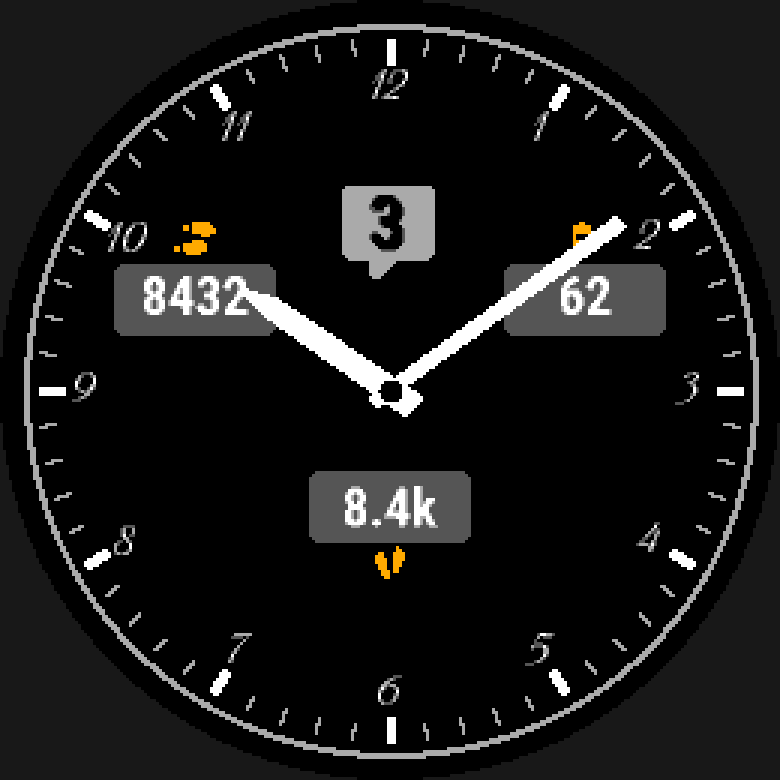

# Power modes and touch-and-hold

**A live watch face gets exactly one gesture: touch and hold.** There is no
tap, no swipe, and the physical keys belong to the system, so `on_hold:` is
the only way any element responds to the wearer. Separately,
`sleep_update: true` says an element is also redrawn every second while a
MIP screen sleeps, because that is a structural choice, not a styling one.
An AMOLED target's own burn-in-constrained sleep frame is a **different,
independent axis**, `aod:`, covered in [Always-on
display](always-on-display.md): overrides on the one design, not a second
element set to opt into.


*From the showcase face — `wfb preview --asleep`, see [Analog hands](analog-hands.md) for `seconds:`.*

## At a glance

| Key | Where | Values | Default | Meaning |
|---|---|---|---|---|
| `sleep_update:` | any element | `true` \| `false` | `false` | [also redraw every second while a MIP screen sleeps](#sleep-updates) |
| `on_hold:` | any element | a complication name (`wfb complications`) or `auto` | — | [touch-and-hold target](#interactivity-on_hold) |

## Sleep updates

```yaml
sleep_update: true     # default: false
```

**Every element is drawn in `onUpdate`**: once a second while the watch is
awake, and once a minute while it sleeps. `sleep_update: true` **also** draws
it in `onPartialUpdate`, once a second while a MIP screen sleeps — a seconds
readout, say. It is structural, not styling, because AMOLED forbids
`onPartialUpdate` entirely while MIP depends on it — which is also why
`sleep_update: true` is a hard build error on an AMOLED target, pointing at
`aod:` instead.

The compiler computes the **tightest `setClip` rectangle** around all
`sleep_update: true` elements, because clip cost is charged by region *area*
— every pixel inside the clip counts as modified whenever any does.

**Any source may be read from a `sleep_update: true` element — there is no
compile-time restriction on which** ([How data is read](data.md#how-data-is-read)). That does
**not** mean every source is equally safe to read there. Exceeding the
`onPartialUpdate` power budget calls `onPowerBudgetExceeded` and disables
partial updates **permanently, for the rest of the app's lifecycle**. The
guard is the suppressible `partial-update-budget` warning, not a build error,
so read it and act on it rather than assuming a green build means a safe
one. A `weather.*` or
`complication.*` read every second while asleep is the case its own message
names as the one to look at first.

## Interactivity: `on_hold:`

Any element can open a glance when it is **touched and held**:

```yaml
hr_icon:
  type: icon
  icon: heart
  at: {anchor: center, dy: -20%}
  on_hold: heart_rate         # run `wfb complications` for the 42 names
```

**A watch face cannot launch an arbitrary app.** The platform offers exactly
one exit — `Complications.exitTo`, documented as "launches the app associated
with the complication" — so an interactive element names a **complication
type** and the watch opens whichever glance or app owns it. `on_hold:
heart_rate` opens the heart-rate glance whether or not the design displays a
heart rate.

`wfb complications` lists every name, the Monkey C constant it compiles to,
the API level that type was introduced at, and the catalogue icon a `data` element's `icon:` draws for it by default.
The list is generated from the SDK's own `COMPLICATION_TYPE_*` table, so it
cannot drift from what the platform actually offers.

**Touch and hold is the only gesture there is — on every device.** This is not
a limitation of the compiler or of one watch. `WatchFaceDelegate.onPress` is
the whole input surface a live watch face receives: there is no swipe on a
watch face, the physical keys belong to the system, and
`WatchFaceDelegate.onTap` — which does exist on the fēnix 8 targets — is
documented **"Only available in WatchFace config mode"**. It is how the
*on-device editor* learns which complication slot you picked; it never fires on
a face you are merely looking at. The compiler therefore emits `onPress` alone.
`docs/research/07-carousel-interaction.md` §1 has the evidence, including the
SDK's own sample.

`wfb validate` warns (`hold-unsupported`) if a target has no `onPress` at all —
resolved against that device's own symbol table rather than its API level,
because an API level does not settle it. All three of this project's targets
have it, `fr955` included.

**The hit region is the element's own drawn box** — what the finger must hit is
what the eye sees, which is checkable in `wfb preview`. Nothing is inflated to
a minimum touch size: Garmin publishes no such number, and inventing one would
silently overlap neighbours on a dense face. For a bigger target, or to make
several elements act as one, put them in a [`group`](elements.md#group) and put `on_hold:`
on the group instead of each child. On a device where the element does not
draw at all -- `unsupported: hide` on a missing `face:` font or subscreen
-- its region is empty there, so a hold never fires on blank screen.

Regions are tested in draw order and the first match wins, so two overlapping
regions make the second unreachable. That is a warning (`hold-overlap`), not
something you have to notice on the wrist. A pair that can never be on
screen together at all -- both belong to a `layouts:` entry, and the two
entries differ -- is not checked regardless of geometry: a digital clock's
hold target and analog hands' can share the exact same region on purpose
(see "Styles and layouts").

Binding `on_hold:` adds the `ComplicationSubscriber` permission.
`minApiLevel` itself never moves for this — `manifest.xml` is one file shared
by every target device, so a per-feature bump would lock out any device that
never touches the feature; a target that lacks `Toybox.Complications` (`exitTo`'s
own module) instead gets the hold guarded at runtime, where it simply does
nothing, with the [`api-gated`](configuration.md#lint) lint warning about it unless
`hold-unsupported` already does (that device also lacks `onPress`). Nothing
emitted references `onTap`, so its 5.1.0 never enters into any of this.

### `on_hold: auto`

Naming a complication type by hand is often redundant with what the element
already displays. `on_hold: auto` resolves the target for you, from the
element's own **value** binding:

```yaml
hr_value:
  type: text
  text: "{heart_rate.current:d}"
  font: FONT_SMALL
  at: {anchor: center, dy: -20%}
  on_hold: auto                # resolves to 'heart_rate' -- same as writing it
```

The compiler looks at the element's value expression(s) only — a `text`'s
placeholder, an `icon`'s `icon: {for:}`, a `gauge`'s `value:` — deliberately
never `color:`, `track_color:` or `max:`, because a conditional colour's own
source reference is not what the element is *about*. It resolves through
`Source.launch_complication`, the same field `wfb sources`' `on_hold: auto ->
...` annotation shows for every source that has one:

* **Exactly one distinct target among the bound source(s)** — `auto` becomes
  that target, same as naming it.
* **None** (including an element with no value binding at all, or one whose
  source has no conventional counterpart) — build error `hold-auto-
  unresolved`, naming the source(s) it looked at and pointing at `wfb
  complications` for a name to write explicitly.
* **More than one distinct target** (an expression combining two sources that
  point at different glances) — build error `hold-auto-ambiguous`, listing
  the candidates.

Both are errors rather than warnings: guessing here would silently open the
wrong glance, which is exactly the class of failure this compiler exists to
prevent.

**A `data` element's `on_hold: auto` does not go through any of this.**
It is the *only* value that element's `on_hold:` accepts (a fixed name is a
build error — see "The Data axis"), and it is never resolved to a fixed
`wfb.complications.TYPES` name at build time at all: the wearer can repoint
the slot at any moment, so the generated code reads the slot's own current
`Complications.Id` field fresh on every hold instead. `Source.
launch_complication` and `hold-auto-unresolved`/`hold-auto-ambiguous` never
apply to it.

## See also

- [`examples/features/complications/face.yaml`](../../examples/features/complications/face.yaml) — `on_hold:` naming a complication type directly, and `on_hold: auto`.
- [Configuration → The Data axis](configuration.md#the-data-axis) — a `data` element's own `on_hold: auto`, resolved on-device rather than at build time.
- [Analog hands](analog-hands.md) — `seconds:`, the other mode-dependent choice on the analog dial.
- [Always-on display](always-on-display.md) — `aod:`, the AMOLED sleep frame.
