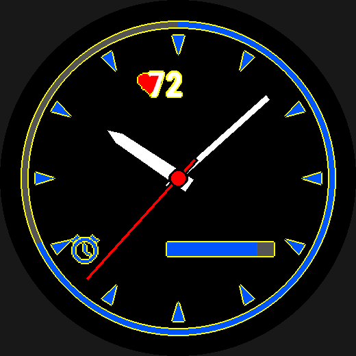

# Outlines

`outline:` draws a ring of 1–3 px in a second colour round whatever an
element draws: text, an icon, any shape, each hand of a `hands` element,
each copy of a `pattern`, a `gauge`, or a whole `group`, where the ring
goes round the members together. The platform has no outline primitive.
The ring is built from ordinary draws, in one of two exact ways chosen per
kind, and the author never picks between them.


*Hands parted by background-coloured rings, a ringed tick pattern, arc and
bar gauges, a group, and an icon whose opening gets a ring of its own, from
`examples/features/rings/face.yaml`.*

## At a glance

```yaml
outline: none                        # the default: no ring
outline: color.ring                  # a colour: a 2 px ring
outline: { color: color.ring, width: 1 }   # 1, 2 or 3 px
```

| Kind | How the ring is drawn |
|---|---|
| `circle`, `rectangle` (filled, square or rounded corners) | one grown copy of the shape, drawn first |
| every other shape, `text`, `icon` | the shape stamped at the ring's offsets |
| `hands` | each hand ringed whole, over the hand beneath it |
| `pattern` | each copy ringed whole |
| `gauge` | `arc`: its track stamped (or, with no track, the lit arc); `bar`: one grown rounded rectangle round the track (or the lit length); `needle`: ringed whole, like a hand; `segments`/`scale`: not yet |
| `group` | round the union of every member |

`outline.color` follows `color:`'s grammar: a `color.<name>`, a literal, or
a conditional expression over them. On a `group` it cannot read data.

## Two exact ways to draw a ring

A ring of width `w` is the set of pixels within `w` of the element: its
*dilation*. The element is then drawn over it.

**Grown copy.** Some shapes have a dilation that is itself one shape:

- a filled circle's is a circle `w` larger;
- a filled rectangle's is a rectangle `w` larger on every side, with
  corners rounded to radius `w`;
- a rounded rectangle's is the same, with its corner radius grown by `w`.

These draw that one grown copy first, which costs one extra draw.

**Stamp.** Everything else is drawn several times in the ring colour, each
time shifted by a few pixels (4, 8 or 16 times at widths 1, 2 and 3), and
then once more in its own colours. The result is exactly the dilation of the
pixels the watch draws, whatever the shape:

- an ellipse, whose grown outline is not an ellipse;
- a stroked shape (`filled: false`), which is ringed on its inner edge too;
- an arc or a line, whose ends are undocumented;
- a polygon with sharp corners;
- a glyph.

Stamping is also why **openings are outlined**. The hole in a stroked
circle, the face of the `alarm` icon, the counter of an `O`: each gets a
ring of its own whenever it is wider than twice the ring. A narrower
opening fills with the ring colour, so a small icon usually wants
`width: 1`.

"Outline" here always means the ring. A shape drawn as a stroke only is
`filled: false`, and it can carry an `outline:` of its own.

## Hands and patterns

A `hands` element rings **each hand as one silhouette**. Every part's ring
is drawn first, then the parts, so the parts of one hand never ring each
other. The hands are drawn in order (hour, minute, second), so each hand's
ring is drawn over the hand beneath it, which separates the two where
they cross:

```yaml
hands:
  type: hands
  set: main
  outline: { color: color.bg, width: 2 }
```

A `pattern` does the same for each copy, and a needle `gauge` for its
needle. A pattern's `type: text` part keeps its own `outline:` as well
([Patterns](patterns.md#text-parts)), but not inside a pattern that has one
too: that needs a stamp inside a stamp, and is refused for now. `outline:`
on any other single part of a hand, needle or pattern is reserved and not
implemented yet.

## Groups

`outline:` on a `group` rings the **union** of its members. Every member's
ring is drawn just before the group's first member, then the members
themselves, so two members that touch or overlap share one ring with no
seam between them. A member's own `outline:` counts as part of the group:
the group's ring goes round it.

```yaml
badge:
  type: group
  at: { anchor: center, dy: 30% }
  outline: { color: color.fg, width: 1 }
  children:
    disc:  { type: circle, at: { anchor: center }, radius: 8%r, color: color.accent }
    label: { type: text, text: "7", font: FONT_XTINY, at: { anchor: center }, color: color.bg }
```

The limits:

- every member must be a kind that carries an outline (`data`, `graph`
  and a `segments`/`scale` gauge do not yet);
- `outline.color` cannot read data, only palette, scheme and `config:`
  colours or literals.

A static group's ring is drawn into the static buffer with it. A member
drawn in `sleep_update:` has its share of the ring redrawn in each partial
update.

## Cost and the always-on frame

- **Draws.** A grown copy is one extra draw. A stamp is 4, 8 or 16 extra
  draws of the element at widths 1, 2 and 3, and the time one takes is not
  known on this platform. That matters most for an element drawn in
  `sleep_update:`, where an overrun disables partial updates for good. A
  1 px ring is the cheapest stamp.
- **Placement.** The ring grows the element's box by `width:`. The clip,
  `off-screen`, `safe-area` and overlap checks all see the ring.
- **AOD.** On an AMOLED target the awake ring is drawn in the always-on
  frame too, dimmed like every AOD colour. Only a `text` element has an
  `aod: {outline: ...}` override of its own
  ([Always-on display](always-on-display.md)).
- **Contrast.** The `contrast` lint checks the ring against the element's
  own colour, since a ring the same colour as its fill is invisible. It
  checks the ring against the backdrop only when the element's own colour
  does not read there (hollow text). A ring in the backdrop's colour round
  something that reads, as on the hands above, is the gap idiom and does
  not warn.

For `text`, including the hollow-text idiom and the `text-outline-interior`
lint, see [Text](text.md#outline--the-stamped-ring). The measurements
behind all of this are in
[`docs/research/19-outline-everything.md`](../research/19-outline-everything.md).
