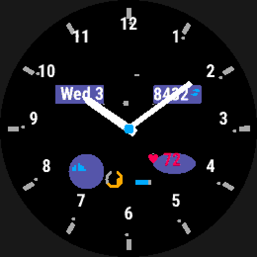
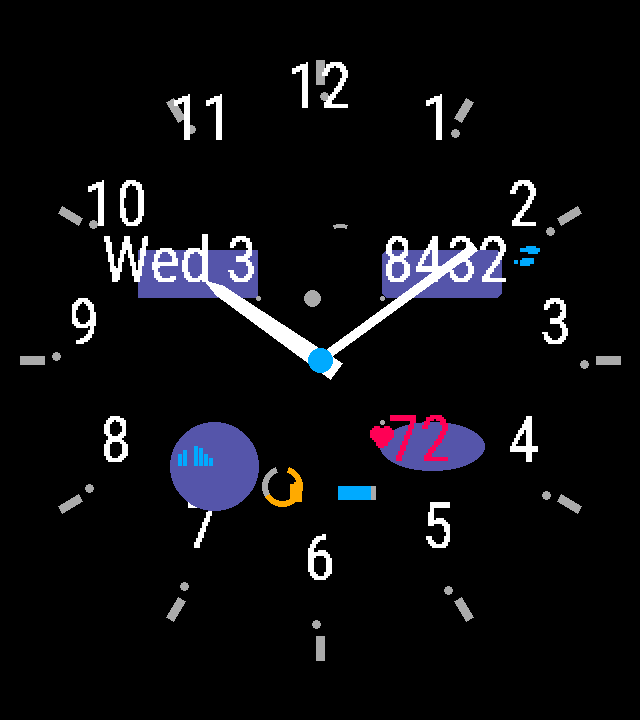
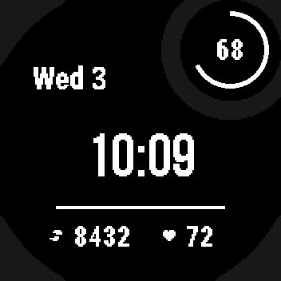

# Placement: coordinates, units and alignment

Every element needs a position. `at:` computes exactly one point relative to
an anchor on the parent box, and `align:` says which point of the element's
own placement box sits there. Lengths are pixels, a
fraction of the parent box, or a fraction of the screen's radius, so a design
stays correct across every screen size and shape.

## At a glance

**`at:`**

| Field | Values | Default | Meaning |
|---|---|---|---|
| `anchor` | `top_left`/`top`/`top_right`/`left`/`center`/`right`/`bottom_left`/`bottom`/`bottom_right`, a [compass alias](#compass-aliases), or `subscreen` | `center` | the point on the parent box the position is relative to; `subscreen` lays a top-level element out in the Instinct's [subscreen window](#the-subscreen-window) |
| `dx`, `dy` | a [length](#lengths) | — | cartesian offset from the anchor |
| `angle`, `radius` | an [angle](#angles), a [length](#lengths) | — | polar offset from the anchor — required together |

**`align:`**

| Key | Values | Default | Meaning |
|---|---|---|---|
| `align` | the same nine names as `anchor`, or a [compass alias](#compass-aliases) | `center` | which point of the [placement box](#placement-at-and-align) sits on `at:` |

**Units**

| Unit | Resolves against |
|---|---|
| `px` | device pixels, verbatim |
| `%` | the parent box, along the axis being resolved — width for `dx`, height for `dy` |
| `%r` | the screen's minor radius (half the smaller dimension) |
| `pt` | multiples of the element's font pixel height on this device |
| `deg` | angle, 12 o'clock = 0, clockwise positive (see [Angles](#angles) for the one exception) |

## Example

```yaml
date_line:
  type: text
  text: "{date.today:%a, %e %b}"
  font: FONT_XTINY
  at: { anchor: top, dy: 10% }     # 10 % of the screen height below the top edge
  color: color.dim

weather_icon:
  type: icon
  icon: { for: weather.condition_today }   # the glyph follows the condition
  size: 16%r
  at: { anchor: top, dy: 20% }
```


*[`examples/showcase`](../../examples/showcase/face.yaml): the date and weather placed from the top anchor.*

- `anchor:` can be `center`, `top`, `bottom`, `left`, `right`, or a corner
  such as `top_left`. `dx`/`dy` offset from it. Polar placement works too:
  `at: { anchor: center, angle: 45deg, radius: 27%r }` ([below](#alignment-around-a-point)).
- `%` is a fraction of the parent box: its width for `dx`, its height for `dy`.
  `%r` is a fraction of the screen's **radius**, so a round dial stays round on
  every watch. `px` also works.
- `align:` chooses which way a box grows from its point
  ([elements](elements.md), [below](#alignment-around-a-point)).
- A value that is absent (no weather yet) shows its `absent:` text. Here that
  is `--°`.

## Coordinates

A position is either cartesian or polar, relative to an anchor on the parent box:

```yaml
at: { anchor: center, dx: 0, dy: -18% }
at: { anchor: center, angle: 45deg, radius: 38%r }
```

Anchors are the nine box positions: `top_left`, `top`, `top_right`, `left`,
`center`, `right`, `bottom_left`, `bottom`, `bottom_right`.

#### Compass aliases

`anchor:` and `align:` also take the eight compass points, uppercase:

| Alias | Means |
|---|---|
| `N`, `NE`, `E`, `SE` | `top`, `top_right`, `right`, `bottom_right` |
| `S`, `SW`, `W`, `NW` | `bottom`, `bottom_left`, `left`, `top_left` |

`center` has no alias. `wfb` reads a bare `N` as the string `N`; an editor
or tool that speaks YAML 1.1 reads it as `false`, so quote it there
(`anchor: "N"`).

### Lengths

| Unit | Resolves against |
|---|---|
| `px` | device pixels, verbatim.  A bare number means `px`. |
| `%` | the parent box, along the axis being resolved — width for `dx`, height for `dy` |
| `%r` | the screen's **minor radius** (half the smaller dimension) |
| `pt` | multiples of the element's font pixel height on this device |

`%r` is what keeps a round design circular. `50%r` is the same physical fraction
of the dial on a 260×260 and a 280×280 screen; `50%` of the width is not, once a
screen stops being square.

**On a rectangle, a round design stays round and centred.** On the 320×360
Venu Sq 2, `%r` is 160 px (half the shorter side), and `%` is 320 px across and
360 px down. A system font does not scale with any of these, though. It is the
device's own size. The Venu Sq 2's `FONT_XTINY` is large for its screen, so the
date and step count outgrow cards sized in `%r`. Check the preview for every
target shape.

 

*[`examples/features/align`](../../examples/features/align/face.yaml) on a
fēnix 8 (260×260) and a Venu Sq 2 (320×360), with no per-device edits.*

**A relative size, thickness or radius can be told never to resolve below
1 px, with `min_1px:`.** `%`/`%r` scale per device, so a hairline such as
`thickness: 0.5%r` can be a full pixel on one screen and round to nothing on
the next — the same design draws on one target and silently vanishes on
another. The switch defaults to **off**: a face that never mentions
`min_1px:` compiles exactly as it always has, rounding included. Switched
on, any nonzero `%`/`%r` length used as a `size:`, `thickness:`,
`bar_width:` or an element/part's own `radius:` (a shape's `radius:`, a
gauge arc's, a hand or pattern part's) is clamped up to 1 px, sign
preserved, if it would otherwise resolve smaller. Writing `0%`/`0%r` still
means exactly zero regardless of the switch — it only ever lifts a nonzero
result. `px` and `pt` lengths are never touched: a `px` value is already
exactly what the author wrote, and a `pt` length is only ever a font size,
which floors at 1 px on its own path whether or not the switch is on. A
position (`at:`/`to:`/polygon `points:`, a linear pattern's `step:`) and a
`corner_radius:` are not sizes and are never clamped either. See
[`min_1px:` — never let a relative length round to nothing](elements.md#min_1px--never-let-a-relative-length-round-to-nothing) for the
four override levels, the both-ways overrides, and the `sub-pixel-length`
lint that reports a length the switch would have clamped, on a device where
it is off.

### Angles

Degrees, **12 o'clock = 0, clockwise positive** — how a watch designer thinks.
Garmin's `drawArc` uses 3 o'clock = 0 and counter-clockwise positive; the
compiler converts, and the generated `Layout` module shows both values in a
comment so the conversion is auditable.

**One deliberate exception: `curve: {style: angled}`'s own `angle:` is a
rotation, not a direction.** Every other angle in the format — this one
included, for `curve: {style: radial}` — answers "which way from the
centre," a position around a circle. `angled`'s `angle:` answers a different
question, "how much is this tilted," where `0deg` means level/unrotated, not
"pointing at 12 o'clock." The two share units (`deg`/`rad`/`turn`) but are
not the same kind of quantity, so `angled` alone uses a rotation's natural
zero instead of the format's shared direction zero — conflating them made
the common cases (a level bezel numeral, a gently tilted ribbon) need
`90deg`, while `0deg`, which reads like "no rotation" for every other key in
the format, stood the text on end. See ["`curve:` — rotated and radial
text"](text.md#curve--rotated-and-radial-text).

Everything relative is resolved to whole pixels at build time. Nothing relative
reaches the device: the watch performs no layout arithmetic.

### Placement: `at:` and `align:`

`at:` computes exactly one point. `align:` says which point of the element's
own **placement box** sits on it: one of the nine box positions, so a
horizontal edge (`left`/`right`), a vertical one (`top`/`bottom`), a corner
(`top_left` …), or the centre. It defaults to `center`, so an element
without it is centred on `at:`.

**The placement box is the element's declared geometry, never its ink.** An
outlined shape's pen straddles its box the same whether the box is centred or
aligned; an arc's `start_angle:`/`sweep:` never move where it sits, because
the box is the full circle, not the swept span. Changing `thickness:` or
`sweep:` never moves an element.

`align:` is accepted on:

| Kind | Placement box |
|---|---|
| `group` | `size:` |
| `text` | the widest rendering × the line height (the same box the `off-screen`/`overlap` lints already check) |
| a pattern's `type: text` part | that copy's own string width × line height, in the pattern's frame |
| `rectangle`, `ellipse` | `size:` |
| `circle`, `arc` | `2·radius` × `2·radius` — the full circle, whatever `start_angle:`/`sweep:` is |
| `gauge` bar | `size:` |
| `gauge` arc | `2·radius` × `2·radius`, same as `type: arc` |
| `graph` | `size:` |
| `icon` | the measured glyph box (the font's own extent for the drawn codepoint) |
| `data` | the icon+reading pair's box, from `wfb.layout.complication_slot_pair_geometry` — estimated at build time, measured on the device |
| a hand or pattern `rectangle` part | `size:`, in the part's own frame |
| a hand or pattern `circle` part | `2·radius` × `2·radius`, in the part's own frame |

**Not accepted on:**

- **`polygon` and `line`** — a polygon has no single `at:` of its own,
  and every vertex is already its own position, so there is no one point to
  align a box on; a line's `at:`/`to:` are already its two ends, so aligning
  would ask "align *what*" a second time.
- **A hand or pattern part's `polygon`, `line`, or (pattern only) `arc`** —
  the same three reasons: a polygon part's vertices are each their own
  position (and the part has no `at:` of its own either); a line part's
  `at:`/`to:` are already its two ends; an arc part is always centred on the
  copy's own origin (`docs/plans/05-patterns.md` D3), so there is no `at:`
  to offset in the first place. A hand never has an `arc` part at all
  (see [Analog hands](analog-hands.md#analog-hands)), so this third case only ever arises
  on a pattern part.
- **`type: hands` and `type: pattern`** — their `at:` is a pivot, not a box:
  a hands element's `at:` is the axis every part turns about, and a
  pattern's `at:` is the origin every copy turns about (radial) or steps
  from (linear). Moving a pivot to "align" it would break the very geometry
  the element draws, so both refuse `align:` outright — align a part
  instead, or move `at:`.

Each of these is a build error naming the reason: the shape and part
rejections go through the same "key not used by this type" check any other
misplaced geometry key goes through (see [Shapes](shapes.md#the-six-types) and
[Analog hands](analog-hands.md#analog-hands)); `hands`/`pattern` refuse it with their
own friendly pre-schema error, never swallowing an unrelated mistake on the
same element.

**A hand or pattern `rectangle`/`circle` part aligns in its own frame, and
the shift turns or steps with the part.** The frame's directions are as the
part is drawn at 12 o'clock (a hand) or as copy 0 is drawn (a pattern):
`left` is `-x`, `top` is `-y` (towards 12 o'clock). For example, a hand
rectangle part with `at: {dy: 0}` and `align: bottom` has its
bottom edge on the axis — it extends from the axis towards the tip, saving
`dy: -length/2`. This is a deliberate contrast with a pattern `type: text`
part (below): a rectangle/circle part's *box* moves in the frame and turns
with the part, while a text part's glyphs stay upright and only its *anchor
point* moves this way before turning or stepping.

A `text` element, an `icon` (fixed or `icon: {for:}`) or a pattern `type: text`
part draws its glyphs through a runtime justify on the device rather than
moving a build-time box (there is no bottom-justify flag on the platform, so
a `bottom` alignment there subtracts the font's own on-device
`getFontHeight` instead) — see [`text`](text.md#text), [`icon`](icons.md#icon) and
[Text parts](patterns.md#text-parts) for the mechanism; the *rule* above is the same
regardless of which mechanism draws it. A `data` element is different
again: its pair is measured and placed on the **device**, at runtime, so its
alignment arithmetic lives there too (ADR 0004's one deliberate exception) —
see [`data`](configuration.md#data); the box in the table above is
still the same build-time *estimate* the geometry lints use.

## Alignment around a point

```yaml
steps_slot:
  type: data
  at: { anchor: center, angle: 45deg, radius: 27%r }   # polar placement
  align: bottom_left       # grow rightwards and upwards from the point
heart_group:
  type: group
  at: { anchor: center, angle: 135deg, radius: 27%r }
  align: top_left          # the lower-right readout grows downwards
```


*[`examples/features/align`](../../examples/features/align/face.yaml): alignment around a point.*

Each diagonal readout sits on a point at the same distance from the centre and
grows away from it, so the four corners stay symmetric whatever their content.
`align:` works on:
- groups, text, gauges, graphs, icons and `data` elements
- the primitives other than `polygon` and `line`
- rectangle, circle and text parts of hands and patterns

## The subscreen window

The Instinct 2, 2X, 3 Solar 45mm and E 45mm have a small round window at the
top right, the subscreen. It is part of the same screen, so a face draws into
it like anywhere else, and stock faces put a gauge or a number there.
`at: { anchor: subscreen }` places an element inside it:

```yaml
battery_ring:
  type: gauge
  style: arc
  at: { anchor: subscreen }       # the centre of the window
  radius: 39%                     # 39 % of the window, not of the screen
  thickness: 3px
  start_angle: 0deg
  sweep: 360deg
  value: system.battery
  max: 100
  color: color.fg
```

- **The window's box becomes the element's parent box.** The anchor is its
  centre, and `%` is a fraction of the window (62×62 px on all four): `dx`,
  `dy`, `size:`, and a `radius:` or `thickness:` in `%`. `%r` is still the
  screen's minor radius, so use `%` or `px` inside the window.
- **Only on a top-level element's own `at:`.** A group anchored there lays its
  children out inside the window, relative to the group, as usual. A child,
  a line's `to:` or a polygon's `points:` cannot name `subscreen` itself.
- **The window is round.** The box is square, and the lint checks the
  element's ink against the round opening (`safe-area`).
- **A target without a subscreen is a build error** naming it, unless the
  element sets `unsupported: hide`. It then does not draw there (nor do a
  group's children), and the build says so in a note. This is the same
  `error`/`hide` choice a [`face:` font](fonts.md) offers, and on a `text`
  element the one key covers both. A device has a subscreen when its
  `simulator.json` declares the box and its symbol table has
  `WatchUi.getSubscreen`: the round AMOLED Instinct 3 declares a box but has
  no such window.



*[`examples/features/instinct`](../../examples/features/instinct/face.yaml):
the battery ring and number anchored to the subscreen.*
