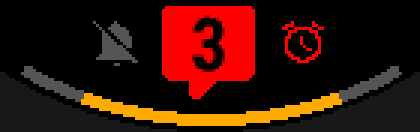
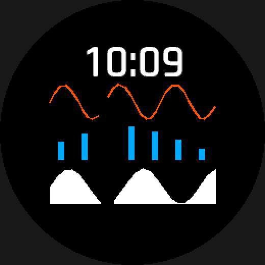

# Gauges and graphs

`gauge` draws a value against a max as a bar, an arc, lit segments, a
pointer on a coloured scale, or a turning needle — a step ring, a battery
level, anything bound to a value and a max. `graph` plots a time series as a line, a
filled area or bars. Both take an expression for their data, and both follow
the same placement rule as every other element with a box.


*Two `style: arc` gauges drawing `system.battery`, from `examples/showcase`.*

## At a glance

### `gauge`

| Key | Values | Default | Meaning |
|---|---|---|---|
| `style` | `arc`\|`bar`\|`needle`\|`segments`\|`scale` | required | ring, bar, [gauge needle](#gauge-needles), or [segments or a scale](#segments-and-scales) |
| `value` | expression | required, unless `slot` | the fill amount |
| `max` | expression | required with `value` | the full-scale amount |
| `slot` | a `config: slots:` name | — | instead of `value`/`max`: the wearer's pick against its own scale ([below](#gauges-on-a-slot)) |
| `radius` | length | required (`arc`; `segments`/`scale` on an arc) | ring radius |
| `thickness` | length | required (`arc`; `segments`/`scale` on an arc) | pen width |
| `start_angle` | angle | required (`arc`, `needle`) | where the ring starts, or where the needle points at 0 |
| `sweep` | angle | required (`arc`, `needle`) | how far the ring sweeps, or the needle turns at full scale |
| `needle` | 1–16 [hand parts](analog-hands.md#analog-hands) | required (`needle`) | the needle, pointing at 12, axis at `at:` |
| `size` | size | required (`bar`; `segments`/`scale` on a bar) | the bar's box |
| `count` | 2–60 | required (`segments`) | how many cells |
| `gap` | length | `2px` (`segments`) | space between two cells |
| `bands` | 1–8 `{to, color}` | — (`scale`) | coloured zones along the track, `to` a fraction 0–1 |
| `pointer` | length | the track's thickness or height (`scale`) | radius of the dot at the value |
| `color` | color expression | — | fill colour |
| `track_color` | color expression | — | the unfilled track |
| `align` | one of the nine anchor names, or a compass alias | `center` | box point at `at:`, not on a needle ([details](placement.md#placement-at-and-align)) |
| `absent` | `hide` \| `{value: <fraction>}` | — | required once `value`/`max` can be absent; `hide` keeps the track ([below](#an-absent-reading-keeps-the-track)) |

### `graph`

| Key | Values | Default | Meaning |
|---|---|---|---|
| `series` | a name from `wfb series` | required | which time series to plot |
| `range` | duration (`30m`/`4h`/`7d`) or a sample count | required | how much history |
| `buckets` | integer | `40` | time bins; `heart_rate` over a duration only |
| `style` | `line`\|`area`\|`bars` | `line` | rendering |
| `thickness` | length | — | pen width, `style: line` only |
| `bar_width` | length | — | `style: bars` only |
| `min` / `max` | `auto`\|number\|expression | `auto` | plotted bounds |
| `size` | size | required | the graph's own box |
| `color` | color expression | — | line/area/bar colour |
| `align` | one of the nine anchor names, or a compass alias | `center` | box point at `at:` ([details](placement.md#placement-at-and-align)) |

Run `wfb series` for the current catalogue of plottable series names.

## Example

```yaml
hr_graph:    { type: graph, series: heart_rate, range: 4h, buckets: 32,
               style: line, thickness: 2px }
steps_graph: { type: graph, series: steps, range: 7d,
               style: bars, bar_width: 6px, min: 0 }
temp_graph:  { type: graph, series: forecast_temperature, range: 24h,
               style: area }
```



Four families of series can be plotted:
- heart-rate history
- daily activity (steps, calories, distance, floors, active minutes)
- the hourly forecast
- the daily forecast

The platform keeps pressure, stress and Body Battery history away from watch
faces. The preview draws a stand-in curve, not real data.

### `gauge`

One element with a `style` discriminator, because the *binding* and *range*
semantics are identical across styles and only the rendering differs.

```yaml
step_ring:
  type: gauge
  style: arc                  # arc | bar | segments | scale | needle
  value: activity.steps
  max: activity.step_goal
  at: { anchor: center }
  radius: 90%r
  thickness: 10px
  start_angle: 180deg
  sweep: 340deg
  color: color.accent
  track_color: color.track
  absent: hide
```

#### An absent reading keeps the track

With `absent: hide`, a gauge whose value or max is absent draws everything
that does not depend on the value, and leaves out only what the value
places:

| Style | Still drawn while absent | Left out |
|---|---|---|
| `arc`, `bar` | the track (`track_color:`) | the fill |
| `segments` | every cell, unlit (`track_color:`) | the lit cells |
| `scale` | the track and every band | the pointer |
| `needle` | nothing: a needle has no track | the needle |

So a face never shows a gap where a gauge was, only an empty one. To hide
a gauge completely while its reading is absent, use `visible:` (absent
means hidden). A nullable `color:` or `track_color:` still hides the whole
gauge, since the track has nothing to be drawn in; `unsupported: hide`
hides it whole too. `absent: {value: …}` is unchanged: it parks the fill
at a fraction instead.

> **`style: arc` is a stroked ring, not a filled sector.** There is no `fillArc`,
> `fillSector` or `drawSector` anywhere in the Connect IQ API. `thickness` is a
> pen width; cap style is not selectable; true annuli and gradient sweeps do not
> exist. The schema deliberately does not offer `inner_radius`/`outer_radius`,
> because promising them would be a lie.

`align:` follows the one placement rule every accepting kind
shares: [Placement: `at:` and `align:`](placement.md#placement-at-and-align) — accepted on
a bar and an arc track: a bar's box is `size:` and an arc's is the full
`2·radius` circle, same as `type: arc`. A needle refuses it (below).

#### Gauge needles

`style: needle` turns a needle about `at:` to show the fraction — the
analog hands' rotation machinery, driven by a reading instead of the
clock:

```yaml
battery_needle:
  type: gauge
  style: needle
  value: system.battery
  max: 100
  at: { anchor: center }               # the axis
  start_angle: 240deg                  # where the needle points at 0%
  sweep: 240deg                        # how far it turns at 100%, clockwise
  color: "system.battery < 20 ? color.low : color.accent"
  needle:                              # authored like an analog hand's parts
    - type: polygon
      points: [{ dx: -3%r, dy: 12%r }, { dy: -74%r }, { dx: 3%r, dy: 12%r }]
    - { type: circle, radius: 5%r, color: color.fg }      # a hub that turns with it
```

The needle points at `start_angle + fraction × sweep`, clockwise from 12,
where the fraction is `value / max` clamped to 0–1 — the same mapping an
`arc` fills with, so a needle and an arc with the same `start_angle` and
`sweep` agree. `needle:` takes exactly what a [hand's
`parts:`](analog-hands.md#analog-hands) takes: `polygon`, `rectangle`, `line`
and `circle`, authored **as they look at 12 o'clock** with the axis at the
origin, so the tip sits at a negative `dy`. A part with no `color:` takes
the element's own, which may read data like any gauge colour; a part's
own colour may not, as on a hand.

The needle's extent is the disc it sweeps (the axis plus its farthest
part), which the visible-area checks read like a hand's. `absent:`
works as on the other styles, except that a needle has no track to keep:
`hide` draws nothing, `{value:}` supplies the fraction to park at. `aod: {color, thickness}` restyles every part.
`radius`, `thickness`, `size`, `track_color` and `align`
are not read by a needle, and each is an error saying so: its length is
its parts, and `at:` is the axis, not a box. Draw the dial itself with a
separate `style: arc` gauge or a radial `pattern` of ticks, sharing the
needle's `start_angle` and `sweep` (`examples/features/gauge/face.yaml`).

#### Segments and scales

Both draw on a track: an **arc** (`radius`, `thickness`, `start_angle`,
`sweep`, exactly as `style: arc`) or a **bar** (`size`, as `style: bar`).
Give one or the other; both, neither, or half an arc is an error.

```yaml
battery_segments:
  type: gauge
  style: segments
  value: system.battery
  max: 100
  at: { anchor: center }
  radius: 84%r
  thickness: 6%r
  start_angle: 210deg
  sweep: 300deg
  count: 10                   # ten cells...
  gap: 3px                    # ...3 px apart, measured along the arc
  color: color.accent         # lit cells
  track_color: color.track    # the rest (omit to draw only the lit ones)

hr_scale:
  type: gauge
  style: scale
  value: heart_rate.current
  max: 200
  at: { anchor: center }
  radius: 58%r
  thickness: 3px
  start_angle: 240deg
  sweep: 240deg
  color: color.fg             # the pointer dot
  bands:                      # zones, as fractions of the full scale
    - { to: 0.6, color: color.ok }
    - { to: 0.8, color: color.warn }
    - { to: 1.0, color: color.bad }
  absent: hide
```

**`segments`** divides the track into `count:` equal cells with `gap:`
between them (a length; on an arc it is measured along the arc at
`radius:`), and lights `round(fraction × count)` of them in `color:` — so
34% of 10 cells lights 3, and 36% lights 4. The rest draw in
`track_color:`, or not at all without one. On an arc each cell is one
`drawArc`, so it follows the whole-degree rule every arc here does; on a
bar, cell edges land on whole pixels the way `style: bar`'s fill does. A
`gap:` so wide that no cell is left on some device is an error
(`progress-segments`), not an empty element.

**`scale`** draws the track in `track_color:`, then each of `bands:` over
it — each band runs from the previous band's `to:` (the first from 0) to
its own, `to:` strictly increasing — then a dot of radius `pointer:` at the
value, in `color:`. The dot defaults to the track's own thickness (arc) or
height (bar), twice as thick as the track, and the element's extent grows
to hold it. A scale draws no ticks of its own: ticks are a radial
`pattern` sharing its `start_angle` and `sweep`, as in the gauge example.

`examples/features/progress/face.yaml` shows both styles on both tracks.

`outline:` rings an `arc`, `bar` or `needle` gauge: the whole track (or,
with none, what is lit), or the needle whole. It is not built yet for
`segments` or `scale`. See [Outlines](outlines.md).

#### Gauges on a slot

`slot:` binds a gauge to a [`config: slots:`](configuration.md#the-data-axis)
slot instead of `value:` and `max:`. It shows whatever the wearer picked,
filled against that metric's own scale, beside the slot's `type: data`
element or on its own:

```yaml
config:
  slots:
    top:
      default: steps
      choices: [date, current_weather, steps, floors_climbed, heart_rate,
                vo2max_run, battery, body_battery, stress, sleep_score]

elements:
  top_ring:
    type: gauge
    slot: top                 # instead of value:/max:
    style: segments           # any style: arc, bar, segments, scale, needle
    at: { anchor: center }
    radius: 46%r
    thickness: 5px
    start_angle: 150deg
    sweep: 240deg
    count: 10
    color: color.accent
    track_color: color.track
    absent: hide
  top_text: { type: data, slot: top, at: { anchor: center, dy: -20% } }
```

The scale is the picked metric's own:

| Picked | Scale |
|---|---|
| battery, Body Battery, stress, pulse ox, solar input, sleep score | 0 to 100 |
| steps, floors, intensity minutes, wheelchair pushes | 0 to the watch's own goal (this week's, for intensity minutes) |
| sunrise, sunset | one day |
| heart rate | the wearer's zone 1 minimum to zone 5 maximum, from their heart-rate zones |
| VO2 max (run, bike) | the wearer's row of Garmin's VO2 max ratings, by sex and age decade, from Poor to Superior |
| a Connect IQ app's complication (`choices: any`) | its own published range, if it publishes one |
| anything else (the date, weather, training status, calories, altitude, ...) | none |

**A pick with no scale hides the whole gauge, track included**: with
`date` picked, the ring above disappears and `top_text` alone shows the
date. So does a goal the watch has not set, a VO2 max of 0 (none
recorded), or, for VO2 max, a wearer with no birth year or sex in their
profile, or an age outside 20–79. **A scaled pick whose reading is missing
for now** (heart rate between readings) follows `absent:` like any gauge:
`hide` keeps the track, `{value: ...}` substitutes a fill fraction. The
fill runs from the scale's own minimum, so a heart rate at the wearer's
zone 1 minimum is an empty gauge, not a fifth of one.

A gauge that can show heart rate or VO2 max adds the `UserProfile`
permission, since the watch reads the zones, sex and birth year from the
wearer's profile. `max:` and `bands:` are refused beside `slot:`: no one
maximum fits every choice, and `bands:` are fractions of one fixed scale.
Colouring a gauge by the metric's own bands (heart-rate zones, Body
Battery levels) is not implemented yet. `on_hold: auto` belongs on the
slot's `type: data` element; on a slot gauge it is not implemented yet.
Like a `data` element, a slot gauge belongs in the shared `elements:`,
never inside a `layouts:` body.

The preview draws the slot's `default:` pick with a sample reading, for
a sample wearer (male, 35, zones 95–190 bpm) and the sample goals.

### `graph`

A time series, drawn as a line, a filled area or bars:

```yaml
hr_graph:
  type: graph
  at: { anchor: center, dy: 22% }
  size: { width: 60%, height: 18% }

  series: heart_rate            # run `wfb series` for the full catalogue
  range: 4h                     # a duration (30m/4h/7d) or a bare sample count
  buckets: 40                   # time-binned series only; default 40

  style: line                   # line | area | bars ; default line
  thickness: 2px                 # style: line only
  bar_width: 3px                 # style: bars only

  min: auto                     # auto (default) | a number | an expression
  max: auto

  color: color.accent
```

`align:` follows the one placement rule every accepting kind
shares: [Placement: `at:` and `align:`](placement.md#placement-at-and-align) — a graph's
placement box is its own `size:`.

**`series:`** names an entry in a second, smaller catalogue than `wfb
sources`' — run `wfb series` for the current list. Four families, all
needing **no permission**: `heart_rate` (`ActivityMonitor.
getHeartRateHistory`); the daily activity family `steps`, `calories`,
`distance`, `floors_climbed`, `active_minutes` (`ActivityMonitor.
getHistory()`, at most 7 days); the hourly forecast family
`forecast_temperature`, `forecast_precipitation_chance`,
`forecast_cloud_cover`, `forecast_uv_index`, `forecast_wind_speed`,
`forecast_humidity`; and the daily forecast family
`daily_high_temperature`, `daily_low_temperature`,
`daily_precipitation_chance` (both `Weather` calls). **Nothing backed by
`Toybox.SensorHistory` — pressure, stress, elevation, Body Battery as a
history — and no solar series exist at all**: see
[`docs/limitations.md`](../limitations.md).

Naming one of those anyway is an error that **says why**, rather than
reporting an unknown name:

```
error[graph]: 'pressure' cannot be plotted on a watch face
  note: Toybox.SensorHistory is the only API that serves it as a history, and a
        watch face may not declare that permission -- Core_Topics/
        Manifest_and_Permissions.html gives SensorHistory an empty
        'Watch Face' column
```

Each of these is a real quantity the watch measures and shows in its own
native widgets, which is exactly why the name gets typed; "unknown series"
would send you hunting for a spelling mistake that does not exist. A genuine
typo still gets the suggestion (`series: step` → *did you mean: steps?*).

**`range:`** is a duration (`30m`, `4h`, `7d`) or a bare integer sample
count. `heart_rate` passes a duration straight through to
`getHeartRateHistory`, which bins it by real time on-device — its own
sample interval is device-dependent, so a build-time sample count cannot be
derived from it. Every other series converts a duration to a count at build
time using its own natural interval (one day for the activity and
daily-forecast families, one hour for the hourly-forecast one); asking for
more than a series' own documented maximum (`steps`, `calories`,
`distance`, `floors_climbed` and `active_minutes` all read the same
`getHistory()`, whose own limit is 7 days) is a **build error**, not a
silent clamp to 7 — silently drawing fewer than asked for is exactly the
class of quiet wrongness this compiler exists to remove. The forecast
families document no such maximum, so a design asking for more than the
provider actually has simply gets fewer, checked at runtime the same
bounds-checked way `weather.condition_today`/`_tomorrow` already are.

**`buckets:`** only means something for `heart_rate` read over a
*duration* — a time-binned series, where a bucket can genuinely have no
sample in it. Naming it on anything else is a build error pointing at the
series that would silently have ignored it. Default 40. It cannot be
derived from the element's resolved width: `wfb/emit/project.py` generates
one view shared across every target device, so a per-device pixel width can
never become a build-time constant in it — the same constraint
`wfb.icons.font_key`'s docstring records for a font's declared, rather than
resolved, size.

**A bucket, or a day/hour with no reading, does not draw** rather than
plotting a zero or a guessed value — a line breaks there instead of joining
straight across, and a bar simply is not drawn. A filled area cannot lift
the pen partway through one `fillPolygon`'s own outline, so `style: area`
draws one filled run per contiguous stretch of present samples instead,
each closed with its own two bottom corners — a gap ends one run and starts
the next, rather than joining straight across it, guessing, or blanking the
whole graph for the sake of one missing sample.

**`style: area` is capped at 62 samples.** `Dc.fillPolygon` is the only fill
`Dc` offers that follows a curve, so a filled graph inherits its 64-point
limit; closing the outline costs two corners, leaving 62 for the series
itself. Exceeding it is a build error naming the cap and `style: line` as
the alternative.

**`min:`/`max:`** are `auto` (the default), a number, or an expression —
the last two compile exactly like any other bound value. `auto` on
`heart_rate` reads the iterator's own `getMin()`/`getMax()`, which is free
and already scoped to the samples in this graph's own range; `auto` on
every other series computes the extent of whatever was actually collected,
skipping gaps. Two fixed bounds with `min >= max` is a build error.

**The series is cached in a private view field and rebuilt only when the
clock minute changes** — one `Number` comparison a frame, not the TTL cache
this project deleted (`wfb/catalog.py`'s module docstring): that deletion
was about re-caching a value Garmin already caches on its own side, and a
graph's own computation over a source whose sample interval is minutes
cannot produce new information by recomputing it every second. **CPU cost
is unmeasured** — see `docs/limitations.md`.

## See also

- [`examples/features/graph/face.yaml`](../../examples/features/graph/face.yaml) — every series family and all three graph styles.
- [`examples/showcase/face.yaml`](../../examples/showcase/face.yaml) — two `style: arc` battery gauges.
- [Placement: `at:` and `align:`](placement.md#placement-at-and-align) — the shared alignment rule.
- [Elements](elements.md) — the common keys every element shares (`sleep_update`, `visible`, `antialias`, `min_1px`, `lint`, `on_hold`).
- [`docs/limitations.md`](../limitations.md) — `SensorHistory`/solar series are not implemented.
- [`examples/features/progress/face.yaml`](../../examples/features/progress/face.yaml) — `segments` and `scale` on an arc and on a bar.
- [`examples/features/gauge/face.yaml`](../../examples/features/gauge/face.yaml) — gauge needles.
- [Configuration: the Data axis](configuration.md#the-data-axis) — declaring the slots a gauge can show.
