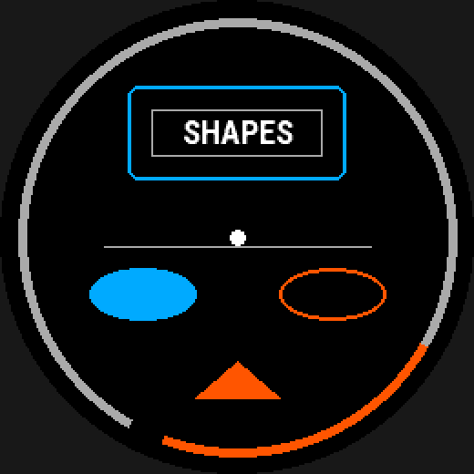

# Shapes

Six element types each draw one primitive from the `Dc` drawing API —
`rectangle`, `circle`, `ellipse`, `arc`, `polygon` and `line` — filled or
outlined. Each reads only the keys its own geometry needs, so a card, a
pill, a chevron and a divider rule are each a few keys, not a
general-purpose shape object.


*Every primitive, from `examples/features/shapes/face.yaml`.*

## At a glance

| `type:` | Keys read | Draws |
|---|---|---|
| `rectangle` | `size`, `corner_radius`, `color`, `filled`, `thickness` | [`fillRectangle` / `drawRectangle`, or the rounded pair](#the-six-types) |
| `circle` | `radius`, `color`, `filled`, `thickness` | [`fillCircle` / `drawCircle`](#the-six-types) |
| `ellipse` | `size`, `color`, `filled`, `thickness` | [`fillEllipse` / `drawEllipse`](#the-six-types) |
| `arc` | `radius`, `start_angle`, `sweep`, `thickness`, `color` | [`setPenWidth` + `drawArc`](#arc) |
| `polygon` | `points`, `color` | [`fillPolygon`](#polygon) |
| `line` | `to`, `thickness`, `color` | [`drawLine`](#the-six-types) |

`filled:` defaults to `true` on the four rows that accept it; `thickness:`
defaults to 1 px. See [below](#the-six-types) for which types reject `filled:`
and why.

## Example

```yaml
card:    { type: rectangle, corner_radius: 6px, filled: false, thickness: 2px }
pill:    { type: ellipse, size: { width: 22%, height: 11% } }
chevron: { type: polygon,
           points: [{ anchor: center, dy: 26% },
                    { anchor: center, dx: -9%, dy: 34% },
                    { anchor: center, dx: 9%, dy: 34% }] }
rule:    { type: line, at: { ... }, to: { ... } }
```

Closed shapes can be filled or outlined (`filled: false` plus
`thickness:`). An arc is a stroke only. The platform has no filled arc, no
rounded caps and no gradients.

### The six types

```yaml
background:
  type: rectangle             # or circle, ellipse, arc, polygon, line
  at: { anchor: center }
  size: { width: 100%, height: 100% }
  color: color.bg
```

Six types, one per native `Dc` drawing call. Each takes `color:`, and each
takes **only** the keys its own geometry needs -- a key from another row is an
error, not a no-op, so `radius:` typed where `corner_radius:` was meant is
reported rather than drawing square corners in silence:

| `type:` | keys | draws |
|---|---|---|
| `rectangle` | `size`, optional `corner_radius` | `fillRectangle` / `drawRectangle`; with `corner_radius:`, `fillRoundedRectangle` / `drawRoundedRectangle` |
| `circle` | `radius` | `fillCircle` / `drawCircle` |
| `ellipse` | `size` | `fillEllipse` / `drawEllipse` |
| `arc` | `radius`, `start_angle`, `sweep` | `setPenWidth` + `drawArc` |
| `polygon` | `points` | `fillPolygon` |
| `line` | `to` | `drawLine` |

`align:` follows the one placement rule every accepting kind
shares: [Placement: `at:` and `align:`](placement.md#placement-at-and-align). Accepted on
every row above except `polygon` and `line`, which reject it with the
reason (no single `at:` to align on; `at:`/`to:` are already the two ends).

**`filled:` (default `true`) is a real switch, not decoration.** `filled: false`
draws the outline at `thickness:` (default 1 px) instead of filling, on
`rectangle`, `circle` and `ellipse`. The outlined shape's
ink straddles the declared box, so the compiler grows the element's extent by
half a pen width for the safe-area and overlap checks -- what you declare is
still the geometry, not the ink.

`thickness:` is checked against `filled:` rather than against the type: a
`line` and an `arc` always draw with it, and any other type uses it only when
outlined, so `thickness:` on a shape left filled is an error too.

Two types reject `filled:`, and both refusals are the platform's, not this
project's:

* **`arc` rejects `filled:` outright.** There is no `fillArc`, `fillSector` or
  `drawSector` anywhere in Connect IQ. An arc is a pen width and nothing else,
  so there is no inner/outer radius, no cap control, and no gradient sweep. For
  a solid disc use `circle`; for a solid wedge, approximate it with `polygon`.
* **`polygon` rejects `filled: false`.** `Dc` has `fillPolygon` and no
  `drawPolygon`. Draw the edges as `line` elements if you want an outline.

`points:`, `start_angle:` and `sweep:` are likewise errors on a type that
cannot use them, rather than being read and quietly dropped.

#### `arc`

```yaml
outer_arc:
  type: arc
  at: { anchor: center }
  radius: 92%r
  thickness: 5px
  start_angle: 210deg       # 12 o'clock is 0, clockwise positive
  sweep: 300deg             # negative sweeps counter-clockwise
  color: color.dim
```

Angles are the format's own convention -- 12 o'clock is 0 and clockwise is
positive -- converted to Garmin's (3 o'clock is 0, counter-clockwise) at build
time. It is **exactly** the conversion a `gauge` with `style: arc` uses; both
call `wfb.layout.garmin_arc` and both draw through the same
`WfbArc.drawSpan`, so the two arcs cannot drift apart.

Use `type: arc` for a fixed decorative span and `type: gauge` /
`style: arc` for one whose length is bound to a reading.

#### `polygon`

```yaml
chevron:
  type: polygon
  points:                             # 3 to 64 of them
    - { anchor: center, dy: 26% }
    - { anchor: center, dx: -9%, dy: 34% }
    - { anchor: center, dx: 9%, dy: 34% }
  color: color.accent
```

Each entry in `points:` is a full `at:`-style position -- anchor, `dx`/`dy`, or
polar `angle`/`radius` -- resolved against the parent box exactly the way a
`line`'s `to:` is. The resolved vertices land in the per-device `Layout` module
as one `Array<Graphics.Point2D>` constant, so the device does no arithmetic
(ADR 0004). `fillPolygon` documents a **64-point limit**, which the schema
enforces.

See `examples/features/shapes/face.yaml` for every type on one face.

Every shape takes `outline:`, a 1px ring in a second colour round it
(not to be confused with `filled: false`, which strokes the shape itself). A
filled circle or rectangle is ringed by one grown copy of itself; every
other shape is stamped. See [Outlines](outlines.md).

## See also

- [`examples/features/shapes/face.yaml`](../../examples/features/shapes/face.yaml) — every primitive on one face.
- [Outlines](outlines.md) — `outline:`, a ring round any shape.
- [Gauges and graphs](progress-and-graphs.md) — `type: gauge` / `style: arc`, for a span bound to a reading instead of a fixed decoration.
- [Placement](placement.md#placement-at-and-align) — `at:` and `align:`.
