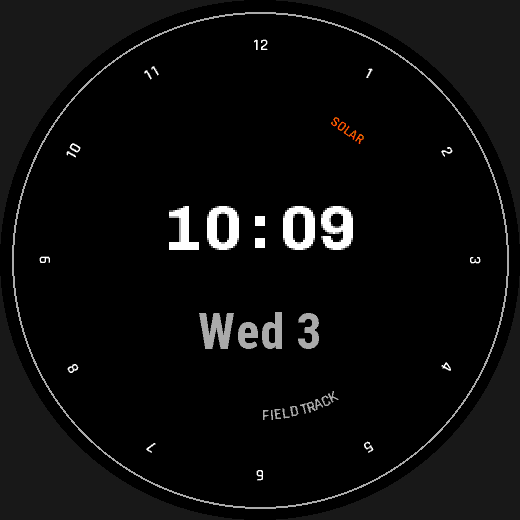
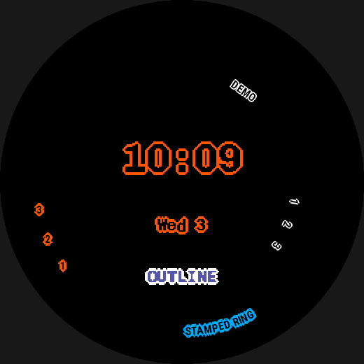

# Text and rotated text

`type: text` draws a data-bound or literal string, upright by default. Give it
a `curve:` and, with a device-resident `face:` font, it bends along a line or
around a circle instead — the only way to get a bezel numeral or a curved
wordmark on this platform.


*Rotated and radial text, from `examples/features/vector-text/face.yaml`.*

## At a glance

| Key | Values | Default | Meaning |
|---|---|---|---|
| `value:` | expression over data sources | — | [`value:` vs `text:`](#text) |
| `text:` | literal string | — | [`value:` vs `text:`](#text) |
| `format:` | Python-style format spec | — | rendering for `value:` — see [Formats](data.md#formats) |
| `font:` | `font.<name>` or a system name | — | [Fonts](fonts.md#fonts) |
| `color:` | colour expression | — | [Colours](colors.md) |
| `align:` | `left`/`center`/`right` | `center` | [Placement: `at:` and `align:`](placement.md#placement-at-and-align) |
| `vertical_align:` | `top`/`center`/`bottom` | `center` | [Placement: `at:` and `align:`](placement.md#placement-at-and-align) |
| `when_absent:` | `hide`/`placeholder`/`fallback` | — | required for a nullable source — see [Data binding](data.md#absence-is-the-normal-case) |
| `placeholder:` | string | — | shown when `when_absent: placeholder` |
| `curve.style:` | `angled`/`radial` | — | [`curve:`](#curve--rotated-and-radial-text) |
| `curve.angle:` | `Angle` | — | rotation (`angled`) or start position (`radial`) — [`curve:`](#curve--rotated-and-radial-text) |
| `curve.radius:` | `Length` | — | `radial` only — [`curve:`](#curve--rotated-and-radial-text) |
| `curve.direction:` | `clockwise`/`counter_clockwise` | `clockwise` | `radial` only — [`curve:`](#curve--rotated-and-radial-text) |
| `if_unavailable:` | `error`/`hide` | inherits the font's own | [Fonts](fonts.md#if_unavailable--and-what-error-actually-promises) |
| `outline:` | `none`, a colour expression, or `{color, width}` | `none` | [`outline:`](#outline--the-stamped-ring) |

## Example

```yaml
fonts:
  clock: { source: assets/ChivoMono-Bold.ttf, size: 24%r }   # baked, as usual
  dial:  { face: [BionicSemiBold, RobotoCondensedBold], size: 8%r }  # device-resident

hour_numerals:                     # a pattern's shape: text part can turn too
  type: pattern
  pattern: radial
  count: 12
  parts:
    - shape: text
      value: "(copy + 11) % 12 + 1"
      font: font.dial
      curve: { style: angled, angle: 90deg }

wordmark:                          # a standalone text element, bent round a circle
  type: text
  text: "FIELD TRACK"
  font: font.dial
  curve: { style: radial, angle: 165deg, radius: 60%r, direction: counter_clockwise }
```

`Dc.drawAngledText`/`Dc.drawRadialText` are the only way to draw text that
rotates, and they refuse a resource font -- so a `fonts:` entry can name a
**device-resident scalable face** with `face:` instead of `source:`, alongside
an ordinary baked font in the same design. `face:` takes a list tried in
author order and resolved per device: `BionicSemiBold` is only on the two
solar fenix targets, so the ring and wordmark render in a different face on
fr955, where the list falls through to `RobotoCondensedBold`. `curve:` bends
a `text` element (`angled`, a straight tilt; `radial`, around a circle) or a
pattern's own `shape: text` part -- twelve hour numerals, each rotated tangent
to its own radius, as one pattern instead of twelve elements. The tilted
"SOLAR" badge uses a face with no fallback at all and `if_unavailable: hide`:
on fr955, which doesn't publish it, the badge is simply absent rather than
failing the build -- fitting, since fr955 isn't a solar watch either.

See [Fonts](fonts.md#vector-face-fonts-device-resident-scalable-and-turnable)
for `face:` fonts, and [Text parts](patterns.md#text-parts) for a pattern's
own `shape: text` part.

### `text`

```yaml
- id: clock
  type: text
  value: time.clock         # a data source or an expression; or use `text:` for a literal
  format: "{:%h:%M}"
  font: font.clock
  at: { anchor: center, dy: -4% }
  color: palette.text
  align: center             # left | center | right   (horizontal)
  vertical_align: center    # top | center | bottom   (vertical)
  when_absent: hide
```

**A text element takes either `value:` or `text:`, never both.**

| | what it is | example |
|---|---|---|
| `value:` | an **expression** over data sources, rendered through `format:` | `value: activity.steps` |
| `text:` | a **literal string**, drawn exactly as written | `text: "XX%"` |

```yaml
- id: unit
  type: text
  text: "XX%"               # literal -- no `value:`, no `format:`
  font: FONT_XTINY
  at: { anchor: center }
  color: palette.text
```

The trap worth knowing: **YAML strips quotes before this compiler sees them**,
so `value: 'XX%'` arrives as a bare `XX%`, which the expression parser reads as
the name `XX` followed by the `%` operator and then nothing -- hence
`expected a value but found 'end of expression'`. Use `text:` for a literal;
`value:` is for data. (A quoted *expression* literal, `value: "'XX%'"`, also
works, but `text:` is what it is for.)

`align`/`vertical_align` follow the one placement rule every accepting kind
shares: [Placement: `at:` and `align:`](placement.md#placement-at-and-align). A `text`
element's placement box is the widest rendering × the line height (the same
box the `off-screen`/`overlap` lints already check); `at`/`anchor`/`dx`/`dy`
only ever compute *one point*, and these two keys say what of that box is
centred, started, or ended there, independently per axis. Both default to
`center`, which is why `at: {anchor: top, dy: 7%}` by itself puts the
*centre* of the text at 7% down from the top, not its edge.

To anchor the text's own **bottom** edge to a point instead (so growing text
extends upward from a fixed point, for instance) -- the case that is not
obvious from `align` alone -- set `vertical_align: bottom`:

```yaml
at: { anchor: top, dy: 7% }
vertical_align: bottom    # the box's bottom edge sits at dy: 7%, not its centre
```

`top` puts the box's top edge at the point instead.

`bottom` is the bottom of the full line box (ascent + descent), not the
typographic baseline glyphs sit on (which excludes a descender like the tail
of a "g" or "y"). `Dc.drawText` has no bottom-justify flag, so it draws by
subtracting the font's own on-device `getFontHeight` from the anchor -- exact
even for a system font, whose pixel height this compiler only knows at build
time from the SDK's published device reference, the installed device's
`simulator.json`, or its `.cft` font. `vertical_align: baseline` is a build
error naming `bottom`.

#### `outline:` — the stamped ring


*The hollow idiom, a solid-interior ring, and outlined upright, angled,
radial and pattern text, from `examples/features/outline/face.yaml`.*

```yaml
- id: clock
  type: text
  value: time.clock
  format: "{:%h:%M}"
  font: font.clock
  color: palette.bg              # interior -- reads as empty against a flat background
  outline: { color: palette.text_outline, width: 2 }
```

There is no filled-outline draw mode on this platform (`Dc.drawText` has no
switch for it, and the one that exists in Garmin's own font engine is not
reachable from Connect IQ — `docs/research/13-outline-vector-text.md`).
`outline:` is the workable substitute this project measured instead: the
string drawn a handful of times at small pixel offsets in the ring colour,
then once more, unshifted, in the element's existing `color:` — the ordinary
fill pass every `text` element already has, doing double duty as the
interior. `none` (the default, and simply omitting the key) draws no ring at
all, byte-identical to plain text.

```yaml
outline: none                        # default -- no ring, today's plain fill

outline: palette.text_outline        # shorthand -- colour only, width: 2 implied

outline:
  color: palette.text_outline        # required in object form -- same grammar as color:
  width: 2                           # px, 1-3, default 2
```

`width:` is always pixels, never `%`/`%r` — a fixed visual stroke weight,
the same way Garmin's own font engine strokes at a fixed 2.0px regardless of
device. It is capped at **3px**: a build error above that, citing the
measured evidence (`docs/research/14-stamped-ring-text.md` §1, §4.1), not a
bare schema bound. `outline.color` follows exactly the same rules as
`color:` — a palette entry, a literal, `config.*`, or a full conditional
expression over any of those, data sources included.

**The interior pass paints over whatever is beneath it — it does not reveal
it.** There is no `background` colour role in this format (a face's
background is an ordinary `shape: rectangle` element with its own `color:`),
so "hollow, reads as the background" means repeating that same palette
reference in `color:`, as the example above does. This works perfectly
wherever the element sits over nothing but that one flat colour — but
`Graphics.BlendMode` has no destination-out formula reachable from
`drawText` (checked directly against the SDK docs), so the moment the same
text crosses a tick ring, a bezel, or another element, the interior paints a
flat-coloured patch shaped like the letterforms on top of it, never like the
earlier content showing through. Choose an interior colour that matches what
is actually underneath *at that position*, not just the face's overall
background — and see the `text-outline-interior` lint ([Lints](lints.md)),
which catches the mechanical half of this. It fires whenever the outlined
element's box overlaps an earlier-drawn one it cannot *prove* is safe: proof
needs the interior colour to be the exact same build-time constant as that
earlier element's own colour, *and* that element to be a filled, box-filling
shape (a `rectangle`/`circle`/…, not another line of text) whose box fully
contains the outlined one's — a colour match against something that only
partly crosses the box (that tick ring) still leaves the rest of the box
unaccounted for, so it still warns. The idiom above (`color:` repeating the
full-screen background's own `color:`) is exactly the case this proves safe
and stays silent about.

**Contrast is judged on the ring, not the interior.** The `contrast` lint
treats an `outline:`-bearing element differently from a plain one: since the
interior is *supposed* to match whatever is underneath it — that is the
entire point of the idiom above — checking *it* for contrast would flag
every correctly hollow element as illegible. Instead the ring is compared
against the backdrop (a poor ring here means the whole character can vanish
into the page, since a hollow interior draws no other ink at all) and
against the element's own interior (a poor ring here means its inner edge
disappears into the fill, so the glyph reads as one soft blob rather than a
crisp outline) — two independent comparisons, either of which can warn on
its own.

**Stamp a non-anti-aliased (1-bit) font.** `outline:` stamps whatever the
referenced font already is, unconditionally — there is no way to force
anti-aliasing off for one element, since a custom font's anti-aliasing is a
*resource* attribute shared by every element that references it (the same
reason `antialias:` itself is not a `text` element key at all). Stacking
several opaque, non-blended stamps of an anti-aliased glyph
(`alphaBlendingSupport: false` on every MIP target) **hardens and thickens
the edge, never softens it**, and then dithers harder on the 64-colour
palette on top of that. This project's own baked-font default is already
1-bit (`antialias: false`), which is exactly the cheap, dither-free input
`outline:` wants — so the practical guidance is simply: don't turn
`antialias:` on for a font you plan to stamp.

`outline:` reaches every draw shape a `text` element can take — plain
upright text, `curve: {style: angled}`, and `curve: {style: radial}` alike
— wrapping whichever single draw call `curve:`/`if_unavailable:` already
selected in one more loop, ahead of the interior pass; it changes nothing
about which call runs or which string is drawn. The element's own
placement box grows by `width:` on every side to cover the ring, so
`off-screen`/`safe-area`/`static-overlap`/the partial-update clip are all
already correct for a ringed element with no separate check of their own.

A pattern's own `shape: text` part accepts `outline:` too (plan 15 slice
2) — see [Text parts](patterns.md#text-parts) for the one thing that
differs there: a radial pattern's per-copy rotation composes with the
ring the same way it already composes with `curve:`, and `outline.color`
may additionally read `copy`.

See [`docs/research/14-stamped-ring-text.md`](../research/14-stamped-ring-text.md)
for the full measurement record this feature is built from.

#### `curve:` — rotated and radial text

```yaml
- id: brand
  type: text
  text: "GARMIN"
  font: font.bezel              # must be a face: (vector) font -- see [Fonts](fonts.md#fonts)
  at: { anchor: center, dy: -30%r }
  curve:
    style: angled
    angle: 45deg                # a rotation from upright: 0 = level, clockwise positive
```

```yaml
- id: bezel_text
  type: text
  text: "BEZEL"
  font: font.bezel
  at: { anchor: center }        # radial: at: is the CENTRE OF THE CIRCLE, not a point the text passes through
  curve:
    style: radial
    angle: 90deg                 # a position: this format's own convention, 12 o'clock = 0, clockwise
    radius: 44%r
    direction: clockwise        # or counter_clockwise; default clockwise
```

Bends a `text` element's content along a straight line (`style: angled`,
`Dc.drawAngledText`) or around a circle (`style: radial`,
`Dc.drawRadialText`), instead of the plain upright `Dc.drawText` every other
`text` element draws through.

* **`curve:` requires a `face:` (vector) font.** A baked or system font
  under `curve:` is a build error quoting the SDK directly: "These APIs
  only support scalable fonts and do not support custom fonts loaded as
  resources" (`$CIQ_SDK/doc/docs/Core_Topics/Graphics.html` §Scalable
  Fonts). See ["Vector (`face:`) fonts"](fonts.md#vector-face-fonts-device-resident-scalable-and-turnable).
* **`style:` is a required discriminator**, the same `progress`-style
  precedent below: the *binding* stays identical and only the rendering
  differs. `radius:`/`direction:` are rejected on `angled` — an angled line
  has no circle for either to describe.
* **`angle:` means something different per `style:`** (see ["Angles"](placement.md#angles)
  above) — never Garmin's 3-o'clock/counter-clockwise one either way; the
  compiler converts, and the generated `Layout` constant carries both values
  in a comment, exactly as `arc` already does.
  * **`radial`: a position**, [this format's own universal direction
    convention](placement.md#angles) (12 o'clock = 0, clockwise positive) — where around
    the circle the text starts, the same convention an arc's `start_angle:`
    or a pattern's `start_angle:` uses.
  * **`angled`: a rotation** — how far the text's own baseline is tilted
    away from level, clockwise positive, where `0deg` means unrotated
    (level text). This is *not* the same zero as every other angle in the
    format: `angle: 0deg` under `curve: {style: angled}` draws level text,
    not text standing on end pointing at 12 o'clock.
* **`style: radial`'s `at:` is the centre of the circle**, not a point the
  text passes through or is anchored to — the one genuinely surprising
  thing in this format, so it bears repeating. This is the same
  reinterpretation `progress`'s own `style: arc` already gives its `at:`
  below.
* **`direction:`** (`radial` only, default `clockwise`) says which way the
  text runs around the circle starting at `angle:`.

`align:` maps straight onto `TEXT_JUSTIFY_LEFT`/`CENTER`/`RIGHT`, the same
device-side justify an upright `text` already uses. `vertical_align: center`
OR's in `TEXT_JUSTIFY_VCENTER` (confirmed against the SDK's own
`TrueTypeFonts` sample, which does the same under both calls); what `top`
and `bottom` mean depends on `style:`:

* **`style: angled`: `top` omits `VCENTER`, and `vertical_align: bottom` is
  a build error.** An upright text's `bottom` is implemented by subtracting
  the font's own on-device height from the anchor *in screen space*, and
  once the baseline is rotated that subtraction no longer points along the
  text's own vertical axis, so the ink would land somewhere this compiler
  cannot predict. Use `top` or `center` instead. (`drawAngledText`'s actual
  no-`VCENTER` device behaviour is otherwise unmeasured — an open question,
  `docs/research/12-vector-fonts.md` §5.3.)
* **`style: radial`: all three values are accepted.** Measured on the real
  simulator (`fenix8solar47mm`, 2026-09-21,
  `docs/research/12-vector-fonts.md` §5.3): without `TEXT_JUSTIFY_VCENTER`,
  `Dc.drawRadialText` puts the text's **baseline** on the circle, and each
  glyph grows toward its own "up" — outward under `direction: clockwise`,
  inward under `counter_clockwise`. That *is* `bottom`, used as-is: the
  ascent lands on the glyphs' "up" side of the circle, the descent on the
  other. `top` hangs the *line box's* top edge on the circle instead, so
  the compiler emits the radius shifted by one `Graphics.getFontAscent`
  toward the glyphs' "down" side (`Layout.<P>_RADIUS -/+
  Graphics.getFontAscent(font)`, minus for clockwise, plus for
  counter_clockwise) rather than the bare radius — the whole line then
  falls on the "down" side, as an upright `top` puts the whole line below
  its anchor. `center` needs no adjustment; it is `VCENTER`, as above.

`if_unavailable:` (`error`/`hide`, see [Fonts](fonts.md#fonts)) works exactly the same
way on a curved element as on any other `face:`-font `text` element, and can
still be set on the element to override the font's own value outright.

**On a round screen, `safe-area` checks the curved run's own real shape, not
its bounding box's corners.** A `style: radial` run's box is a tight annulus
sector, over the angular span the text actually sweeps: `radius:` +/- half a
`line_height` for `vertical_align: center`; the full `line_height` to one
side for `top` (which side set by `direction:`, above); and the ascent
split off from the descent, one on each side, for `bottom` (the device's
own native, un-centred placement — see `direction:` above for which side
gets the ascent). A `style: angled` run's is that sector's or
rectangle's own rotated corners — an axis-aligned box drawn *around* either
shape has corners that are not points on the shape at all once it sits off
a multiple of 90 degrees from the screen centre, and checking those phantom
corners against the visible disc over-warns a run that never actually
reaches the bezel. `off-screen` (the rectangular *framebuffer* check) is
unaffected either way — the framebuffer really is rectangular, so its own
AABB is the right shape to test there.

> **Which way a radial glyph faces.** `direction: clockwise` faces glyphs
> outward and `counter_clockwise` faces inward, so text running along the
> bottom of the dial reads right-side up. Each glyph is rotated
> individually about its own centre, so its own vertical midline lies on
> the radius through that glyph's own centre — a ring of glyphs reads like
> spokes, confirmed against the real simulator on `fenix8solar51mm`
> (2026-09-21) with `examples/showcase`'s large roman numerals. Facing
> itself was confirmed against the real simulator on `fenix8solar47mm`
> (2026-09-21), using this project's own
> `examples/features/vector-text/face.yaml`, which authors **both**
> directions: `wordmark` (`counter_clockwise`) and `left_cw`
> (`clockwise`), plus the controlled pair `top_ccw`/`top_cw` — the same
> `angle:` and `radius:`, opposite `direction:`, isolating facing from
> position. The simulator's rendering agrees with `wfb preview` on facing,
> angular position and the twelve tangent hour numerals, for both
> directions. Evidence and full derivation: `docs/research/12-vector-fonts.md`,
> `docs/research/probes/vector-fonts/README.md`.

Everything else on `text` keeps working untouched under `curve:` —
`value:`/`text:`, `format:`, `color:`, `outline:`, `visible:`,
`when_absent:`, `fallback:`, `modes:`, `on_hold:`, `static:`.

A `pattern`'s own `shape: text` part accepts `curve:` too (plan 11 slice 2) —
see [Text parts](patterns.md#text-parts) for how the authored angle composes with
the copy's own rotation.

## See also

- [`examples/features/vector-text/face.yaml`](../../examples/features/vector-text/face.yaml) — the rotated and radial text shown above.
- [Fonts](fonts.md#vector-face-fonts-device-resident-scalable-and-turnable) — `face:` fonts, required for `curve:`.
- [Patterns](patterns.md#text-parts) — a pattern's own `shape: text` part, which accepts `curve:` too.
- [Placement](placement.md#placement-at-and-align) — `at:`, `align:` and `vertical_align:` for every element kind.
- [Colours](colors.md) — `outline.color`'s own colour rules, identical to `color:`'s.
- [Lints](lints.md) — `text-outline-interior`, the overlap check `outline:` gets for free.
